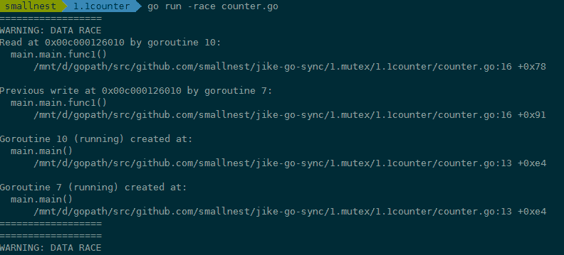
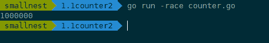

# 01｜Mutex：如何解決資源併發訪問問題？

你好，我是鳥窩。

## 本章導讀

```text
┌──────────────┐      Lock()       ┌──────────────┐
│ goroutine A  │ ────────────────> │   Mutex 鎖   │
└──────────────┘                    └──────┬───────┘
                                           │ 取得鎖
                                           v
                                    ┌──────────────┐
                                    │ 臨界區/共享資源 │
                                    └──────┬───────┘
                                           │ Unlock()
┌──────────────┐      等待/阻塞             │
│ goroutine B  │ ──────────────────────────┘
└──────────────┘
```

今天是我們 Go 併發程式設計實戰課的第一講，我們就直接從解決併發訪問這個棘手問題入手。

說起併發訪問問題，真是太常見了，比如多個 goroutine 併發更新同一個資源，像計數器；同時更新使用者的賬戶資訊；秒殺系統；往同一個 buffer 中併發寫入資料等等。如果沒有互斥控制，就會出現一些異常情況，比如計數器的計數不準確、使用者的賬戶可能出現透支、秒殺系統出現超賣、buffer 中的資料混亂，等等，後果都很嚴重。

這些問題怎麼解決呢？對，用互斥鎖，那在 Go 語言裡，就是 **Mutex。**

這節課，我會帶你詳細瞭解互斥鎖的實作機制，以及 Go 標準庫的互斥鎖 Mutex 的基本使用方法。在後面的 3 節課裡，我還會講解 Mutex 的具體實作原理、易錯場景和一些拓展用法。

好了，我們先來看看互斥鎖的實作機制。

## 互斥鎖的實作機制

互斥鎖是併發控制的一個基本手段，是為了避免競爭而建立的一種併發控制機制。在學習它的具體實作原理前，我們要先搞懂一個概念，就是**臨界區**。

在併發程式設計中，如果程式中的一部分會被併發訪問或修改，那麼，為了避免併發訪問導致的意想不到的結果，這部分程式需要被保護起來，這部分被保護起來的程式，就叫做臨界區。

可以說，臨界區就是一個被共享的資源，或者說是一個整體的一組共享資源，比如對資料庫的訪問、對某一個共享資料結構的操作、對一個 I/O 裝置的使用、對一個連線池中的連線的呼叫，等等。

如果很多執行緒同步訪問臨界區，就會造成訪問或操作錯誤，這當然不是我們希望看到的結果。所以，我們可以**使用互斥鎖，限定臨界區只能同時由一個執行緒持有**。

當臨界區由一個執行緒持有的時候，其它執行緒如果想進入這個臨界區，就會返回失敗，或者是等待。直到持有的執行緒退出臨界區，這些等待執行緒中的某一個才有機會接著持有這個臨界區。


你看，互斥鎖就很好地解決了資源競爭問題，有人也把互斥鎖叫做排它鎖。那在 Go 標準庫中，它提供了 Mutex 來實作互斥鎖這個功能。

根據 2019 年第一篇全面分析 Go 併發 Bug 的論文Understanding Real-World Concurrency Bugs in Go，**Mutex 是使用最廣泛的同步原語**（Synchronization primitives，有人也叫做**併發原語**。我們在這個課程中根據英文直譯優先用同步原語，但是併發原語的指代範圍更大，還可以包括任務編排的型別，所以後面我們講 Channel 或者擴充套件型別時也會用併發原語）。關於同步原語，並沒有一個嚴格的定義，你可以把它看作解決併發問題的一個基礎的資料結構。

在這門課的前兩個模組，我會和你講互斥鎖 Mutex、讀寫鎖 RWMutex、併發編排 WaitGroup、條件變數 Cond、Channel 等同步原語。所以，在這裡，我先和你說一下同步原語的適用場景。

1.  共享資源。併發地讀寫共享資源，會出現資料競爭（data race）的問題，所以需要 Mutex、RWMutex 這樣的併發原語來保護。
2.  任務編排。需要 goroutine 按照一定的規律執行，而 goroutine 之間有相互等待或者依賴的順序關係，我們常常使用 WaitGroup 或者 Channel 來實作。
3.  訊息傳遞。資訊交流以及不同的 goroutine 之間的執行緒安全的資料交流，常常使用 Channel 來實作。

今天這一講，咱們就從公認的使用最廣泛的 Mutex 開始學習吧。是騾子是馬咱得拉出來遛遛，看看我們到底可以怎麼使用 Mutex。

## Mutex 的基本使用方法

在正式看 Mutex 用法之前呢，我想先給你交代一件事：Locker 介面。

在 Go 的標準庫中，package sync 提供了鎖相關的一系列同步原語，這個 package 還定義了一個 Locker 的介面，Mutex 就實作了這個介面。

Locker 的介面定義了鎖同步原語的方法集：

```go
type Locker interface {
    Lock()
    Unlock()
}
```

可以看到，Go 定義的鎖介面的方法集很簡單，就是請求鎖（Lock）和釋放鎖（Unlock）這兩個方法，秉承了 Go 語言一貫的簡潔風格。

但是，這個介面在實際專案應用得不多，因為我們一般會直接使用具體的同步原語，而不是透過介面。

我們這一講介紹的 Mutex 以及後面會介紹的讀寫鎖 RWMutex 都實作了 Locker 介面，所以首先我把這個介面介紹了，讓你做到心中有數。

下面我們直接看 Mutex。

簡單來說，**互斥鎖 Mutex 就提供兩個方法 Lock 和 Unlock：進入臨界區之前呼叫 Lock 方法，退出臨界區的時候呼叫 Unlock 方法**：

```go
  func(m *Mutex)Lock()
  func(m *Mutex)Unlock()
```

**當一個 goroutine 透過呼叫 Lock 方法獲得了這個鎖的擁有權後， 其它請求鎖的 goroutine 就會阻塞在 Lock 方法的呼叫上，直到鎖被釋放並且自己獲取到了這個鎖的擁有權。**

看到這兒，你可能會問，為啥一定要加鎖呢？別急，我帶你來看一個併發訪問場景中不使用鎖的例子，看看實作起來會出現什麼狀況。

在這個例子中，我們建立了 10 個 goroutine，同時不斷地對一個變數（count）進行加 1 操作，每個 goroutine 負責執行 10 萬次的加 1 操作，我們期望的最後計數的結果是 10 \* 100000 = 1000000 (一百萬)。

```go
 import (
        "fmt"
        "sync"
    )
    
    func main() {
        var count = 0
        // 使用WaitGroup等待10個goroutine完成
        var wg sync.WaitGroup
        wg.Add(10)
        for i := 0; i < 10; i++ {
            go func() {
                defer wg.Done()
                // 對變數count執行10次加1
                for j := 0; j < 100000; j++ {
                    count++
                }
            }()
        }
        // 等待10個goroutine完成
        wg.Wait()
        fmt.Println(count)
    }
```

在這段程式碼中，我們使用 sync.WaitGroup 來等待所有的 goroutine 執行完畢後，再輸出最終的結果。sync.WaitGroup 這個同步原語我會在後面的課程中具體介紹，現在你只需要知道，我們使用它來控制等待一組 goroutine 全部做完任務。

但是，每次執行，你都可能得到不同的結果，基本上不會得到理想中的一百萬的結果。


這是為什麼呢？

其實，這是因為，**count++** 不是一個原子操作，它至少包含幾個步驟，比如讀取變數 count 的當前值，對這個值加 1，把結果再儲存到 count 中。因為不是原子操作，就可能有併發的問題。

比如，10 個 goroutine 同時讀取到 count 的值為 9527，接著各自按照自己的邏輯加 1，值變成了 9528，然後把這個結果再寫回到 count 變數。但是，實際上，此時我們增加的總數應該是 10 才對，這裡卻只增加了 1，好多計數都被“吞”掉了。這是併發訪問共享資料的常見錯誤。

```go
 // count++操作的彙編程式碼
    MOVQ    "".count(SB), AX
    LEAQ    1(AX), CX
    MOVQ    CX, "".count(SB)
```

這個問題，有經驗的開發人員還是比較容易發現的，但是，很多時候，併發問題隱藏得非常深，即使是有經驗的人，也不太容易發現或者 Debug 出來。

針對這個問題，Go 提供了一個檢測併發訪問共享資源是否有問題的工具： race detector，它可以幫助我們自動發現程式有沒有 data race 的問題。

**Go race detector** 是基於 Google 的 C/C++ sanitizers 技術實作的，編譯器透過探測所有的記憶體訪問，加入程式碼能監視對這些記憶體地址的訪問（讀還是寫）。在程式碼執行的時候，race detector 就能監控到對共享變數的非同步訪問，出現 race 的時候，就會打印出警告資訊。

這個技術在 Google 內部幫了大忙，探測出了 Chromium 等程式碼的大量併發問題。Go 1.1 中就引入了這種技術，並且一下子就發現了標準庫中的 42 個併發問題。現在，race detector 已經成了 Go 持續整合過程中的一部分。

我們來看看這個工具怎麼用。

在編譯（compile）、測試（test）或者執行（run）Go 程式碼的時候，加上 **race** 引數，就有可能發現併發問題。比如在上面的例子中，我們可以加上 race 引數執行，檢測一下是不是有併發問題。如果你 go run -race counter.go，就會輸出警告資訊。



這個警告不但會告訴你有併發問題，而且還會告訴你哪個 goroutine 在哪一行對哪個變數有寫操作，同時，哪個 goroutine 在哪一行對哪個變數有讀操作，就是這些併發的讀寫訪問，引起了 data race。

例子中的 goroutine 10 對記憶體地址 0x00c000126010 有讀的操作（counter.go 檔案第 16 行），同時，goroutine 7 對記憶體地址 0x00c000126010 有寫的操作（counter.go 檔案第 16 行）。而且還可能有多個 goroutine 在同時進行讀寫，所以，警告資訊可能會很長。

雖然這個工具使用起來很方便，但是，因為它的實作方式，只能透過真正對實際地址進行讀寫訪問的時候才能探測，所以它並不能在編譯的時候發現 data race 的問題。而且，在執行的時候，只有在觸發了 data race 之後，才能檢測到，如果碰巧沒有觸發（比如一個 data race 問題只能在 2 月 14 號零點或者 11 月 11 號零點才出現），是檢測不出來的。

而且，把開啟了 race 的程式部署線上上，還是比較影響效能的。執行 go tool compile -race -S counter.go，可以檢視計數器例子的程式碼，重點關注一下 count++ 前後的編譯後的程式碼：

```go
0x002a 00042 (counter.go:13)    CALL    runtime.racefuncenter(SB)
       ......
        0x0061 00097 (counter.go:14)    JMP     173
        0x0063 00099 (counter.go:15)    MOVQ    AX, "".j+8(SP)
        0x0068 00104 (counter.go:16)    PCDATA  $0, $1
        0x0068 00104 (counter.go:16)    MOVQ    "".&count+128(SP), AX
        0x0070 00112 (counter.go:16)    PCDATA  $0, $0
        0x0070 00112 (counter.go:16)    MOVQ    AX, (SP)
        0x0074 00116 (counter.go:16)    CALL    runtime.raceread(SB)
        0x0079 00121 (counter.go:16)    PCDATA  $0, $1
        0x0079 00121 (counter.go:16)    MOVQ    "".&count+128(SP), AX
        0x0081 00129 (counter.go:16)    MOVQ    (AX), CX
        0x0084 00132 (counter.go:16)    MOVQ    CX, ""..autotmp_8+16(SP)
        0x0089 00137 (counter.go:16)    PCDATA  $0, $0
        0x0089 00137 (counter.go:16)    MOVQ    AX, (SP)
        0x008d 00141 (counter.go:16)    CALL    runtime.racewrite(SB)
        0x0092 00146 (counter.go:16)    MOVQ    ""..autotmp_8+16(SP), AX
       ......
        0x00b6 00182 (counter.go:18)    CALL    runtime.deferreturn(SB)
        0x00bb 00187 (counter.go:18)    CALL    runtime.racefuncexit(SB)
        0x00c0 00192 (counter.go:18)    MOVQ    104(SP), BP
        0x00c5 00197 (counter.go:18)    ADDQ    $112, SP
```

在編譯的程式碼中，增加了 runtime.racefuncenter、runtime.raceread、runtime.racewrite、runtime.racefuncexit 等檢測 data race 的方法。透過這些插入的指令，Go race detector 工具就能夠成功地檢測出 data race 問題了。

總結一下，透過在編譯的時候插入一些指令，在執行時透過這些插入的指令檢測併發讀寫從而發現 data race 問題，就是這個工具的實作機制。

既然這個例子存在 data race 問題，我們就要想辦法來解決它。這個時候，我們這節課的主角 Mutex 就要登場了，它可以輕鬆地消除掉 data race。

具體怎麼做呢？下面，我就結合這個例子，來具體給你講一講 Mutex 的基本用法。

我們知道，這裡的共享資源是 count 變數，臨界區是 count++，只要在臨界區前面獲取鎖，在離開臨界區的時候釋放鎖，就能完美地解決 data race 的問題了。

```go
package main

    import (
        "fmt"
        "sync"
    )

    func main() {
        // 互斥鎖保護計數器
        var mu sync.Mutex
        // 計數器的值
        var count = 0
        
        // 輔助變數，用來確認所有的goroutine都完成
        var wg sync.WaitGroup
        wg.Add(10)

        // 啟動10個gourontine
        for i := 0; i < 10; i++ {
            go func() {
                defer wg.Done()
                // 累加10萬次
                for j := 0; j < 100000; j++ {
                    mu.Lock()
                    count++
                    mu.Unlock()
                }
            }()
        }
        wg.Wait()
        fmt.Println(count)
    }
```

如果你再執行一下程式，就會發現，data race 警告沒有了，系統乾脆地輸出了 1000000：



怎麼樣，使用 Mutex 是不是非常高效？效果很驚喜。

這裡有一點需要注意：Mutex 的零值是還沒有 goroutine 等待的未加鎖的狀態，所以你不需要額外的初始化，直接宣告變數（如 var mu sync.Mutex）即可。

那 Mutex 還有哪些用法呢？

很多情況下，**Mutex 會嵌入到其它 struct 中使用**，比如下面的方式：

```go
type Counter struct {
    mu    sync.Mutex
    Count uint64
}
```

在初始化嵌入的 struct 時，也不必初始化這個 Mutex 欄位，不會因為沒有初始化出現空指標或者是無法獲取到鎖的情況。

有時候，我們還可以**採用嵌入欄位的方式**。透過嵌入欄位，你可以在這個 struct 上直接呼叫 Lock/Unlock 方法。

```go
func main() {
    var counter Counter
    var wg sync.WaitGroup
    wg.Add(10)
    for i := 0; i < 10; i++ {
        go func() {
            defer wg.Done()
            for j := 0; j < 100000; j++ {
                counter.Lock()
                counter.Count++
                counter.Unlock()
            }
        }()
    }
    wg.Wait()
    fmt.Println(counter.Count)
}

type Counter struct {
    sync.Mutex
    Count uint64
}
```

**如果嵌入的 struct 有多個欄位，我們一般會把 Mutex 放在要控制的欄位上面，然後使用空格把欄位分隔開來。**即使你不這樣做，程式碼也可以正常編譯，只不過，用這種風格去寫的話，邏輯會更清晰，也更易於維護。

甚至，你還可以**把獲取鎖、釋放鎖、計數加一的邏輯封裝成一個方法**，對外不需要暴露鎖等邏輯：

```go
func main() {
    // 封裝好的計數器
    var counter Counter

    var wg sync.WaitGroup
    wg.Add(10)

    // 啟動10個goroutine
    for i := 0; i < 10; i++ {
        go func() {
            defer wg.Done()
            // 執行10萬次累加
            for j := 0; j < 100000; j++ {
                counter.Incr() // 受到鎖保護的方法
            }
        }()
    }
    wg.Wait()
    fmt.Println(counter.Count())
}

// 執行緒安全的計數器型別
type Counter struct {
    CounterType int
    Name        string

    mu    sync.Mutex
    count uint64
}

// 加1的方法，內部使用互斥鎖保護
func (c *Counter) Incr() {
    c.mu.Lock()
    c.count++
    c.mu.Unlock()
}

// 得到計數器的值，也需要鎖保護
func (c *Counter) Count() uint64 {
    c.mu.Lock()
    defer c.mu.Unlock()
    return c.count
}總結這節課，我介紹了併發問題的背景知識、標準庫中 Mutex 的使用和最佳實踐、透過 race detector 工具發現計數器程式的問題以及修復方法。相信你已經大致瞭解了 Mutex 這個同步原語。
```

在專案開發的初始階段，我們可能並沒有仔細地考慮資源的併發問題，因為在初始階段，我們還不確定這個資源是否被共享。經過更加深入的設計，或者新功能的增加、程式碼的完善，這個時候，我們就需要考慮共享資源的併發問題了。當然，如果你能在初始階段預見到資源會被共享併發訪問就更好了。

意識到共享資源的併發訪問的早晚不重要，重要的是，一旦你意識到這個問題，你就要及時透過互斥鎖等手段去解決。

比如 Docker issue 37583、35517、32826、30696等、kubernetes issue 72361、71617等，都是後來發現的 data race 而採用互斥鎖 Mutex 進行修復的。

## 思考題

你已經知道，如果 Mutex 已經被一個 goroutine 獲取了鎖，其它等待中的 goroutine 們只能一直等待。那麼，等這個鎖釋放後，等待中的 goroutine 中哪一個會優先獲取 Mutex 呢？

歡迎在留言區寫下你的思考和答案，我們一起交流討論。如果你覺得有所收穫，也歡迎你把今天的內容分享給你的朋友或同事。
