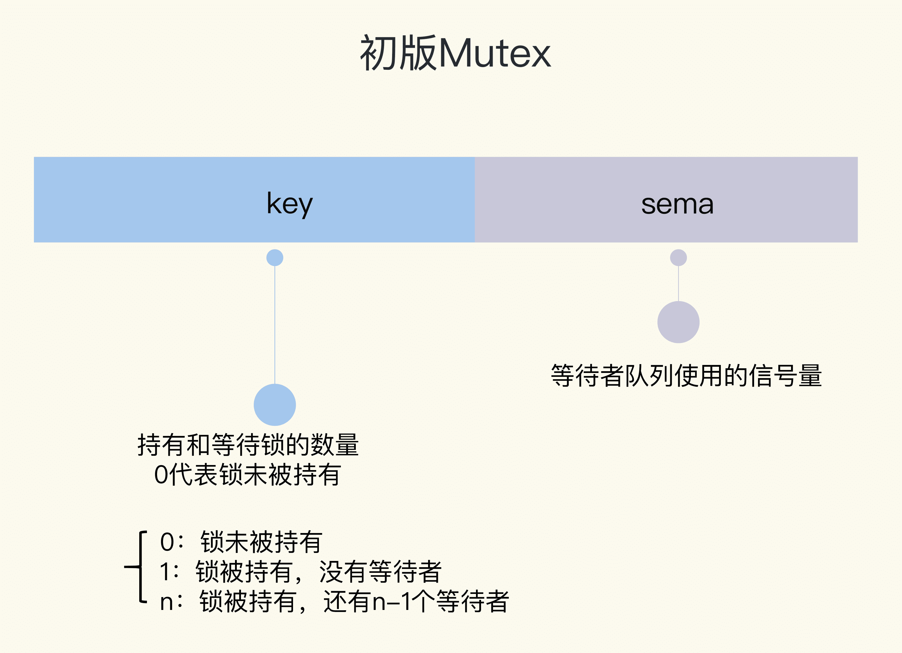
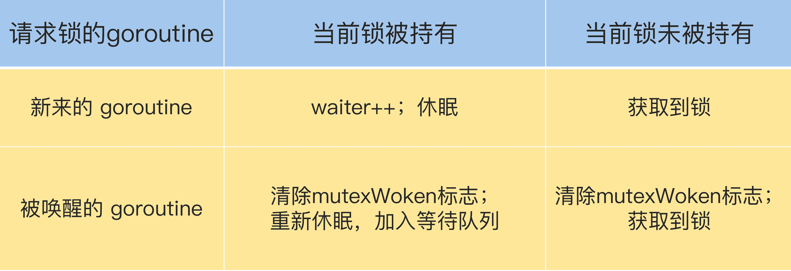

# 02 \| Mutex：庖丁解牛看實現

你好，我是鳥窩。

上一講我們一起體驗了 Mutex 的使用，竟是那麼簡單，只有簡簡單單兩個方法，Lock 和 Unlock，進入臨界區之前調用 Lock 方法，退出臨界區的時候調用 Unlock 方法。這個時候，你一定會有一絲好奇：“它的實現是不是也很簡單呢？”

其實不是的。如果你閱讀 Go 標準庫裡 Mutex 的源代碼，並且追溯 Mutex 的演進歷史，你會發現，從一個簡單易於理解的互斥鎖的實現，到一個非常複雜的數據結構，這是一個逐步完善的過程。Go 開發者們做了種種努力，精心設計。我自己每次看，都會被這種匠心和精益求精的精神打動。

所以，今天我就想帶著你一起去探索 Mutex 的實現及演進之路，希望你能和我一樣體驗到這種技術追求的美妙。我們從 Mutex 的一個簡單實現開始，看看它是怎樣逐步提升性能和公平性的。在這個過程中，我們可以學習如何逐步設計一個完善的同步原語，並能對複雜度、性能、結構設計的權衡考量有新的認識。經過這樣一個學習，我們不僅能通透掌握 Mutex，更好地使用這個工具，同時，對我們自己設計併發數據接口也非常有幫助。

那具體怎麼來講呢？我把 Mutex 的架構演進分成了四個階段，下面給你畫了一張圖來說明。

“**初版**”的 Mutex 使用一個 flag 來表示鎖是否被持有，實現比較簡單；後來照顧到新來的 goroutine，所以會讓新的 goroutine 也儘可能地先獲取到鎖，這是第二個階段，我把它叫作“**給新人機會**”；那麼，接下來就是第三階段“**多給些機會**”，照顧新來的和被喚醒的 goroutine；但是這樣會帶來飢餓問題，所以目前又加入了飢餓的解決方案，也就是第四階段“**解決飢餓**”。

有了這四個階段，我們學習的路徑就清晰了，那接下來我會從代碼層面帶你領略 Go 開發者這些大牛們是如何逐步解決這些問題的。

# 初版的互斥鎖

我們先來看怎麼實現一個最簡單的互斥鎖。在開始之前，你可以先想一想，如果是你，你會怎麼設計呢？

你可能會想到，可以通過一個 flag 變量，標記當前的鎖是否被某個 goroutine 持有。如果這個 flag 的值是 1，就代表鎖已經被持有，那麼，其它競爭的 goroutine 只能等待；如果這個 flag 的值是 0，就可以通過 CAS（compare-and-swap，或者 compare-and-set）將這個 flag 設置為 1，標識鎖被當前的這個 goroutine 持有了。

實際上，Russ Cox 在 2008 年提交的第一版 Mutex 就是這樣實現的。

       // CAS操作，當時還沒有抽象出atomic包
        func cas(val *int32, old, new int32) bool
        func semacquire(*int32)
        func semrelease(*int32)
        // 互斥鎖的結構，包含兩個字段
        type Mutex struct {
            key  int32 // 鎖是否被持有的標識
            sema int32 // 信號量專用，用以阻塞/喚醒goroutine
        }
        
        // 保證成功在val上增加delta的值
        func xadd(val *int32, delta int32) (new int32) {
            for {
                v := *val
                if cas(val, v, v+delta) {
                    return v + delta
                }
            }
            panic("unreached")
        }
        
        // 請求鎖
        func (m *Mutex) Lock() {
            if xadd(&m.key, 1) == 1 { //標識加1，如果等於1，成功獲取到鎖
                return
            }
            semacquire(&m.sema) // 否則阻塞等待
        }
        
        func (m *Mutex) Unlock() {
            if xadd(&m.key, -1) == 0 { // 將標識減去1，如果等於0，則沒有其它等待者
                return
            }
            semrelease(&m.sema) // 喚醒其它阻塞的goroutine
        }    

這裡呢，我先簡單補充介紹下剛剛提到的 CAS。

CAS 指令將**給定的值**和**一個內存地址中的值**進行比較，如果它們是同一個值，就使用新值替換內存地址中的值，這個操作是原子性的。那啥是原子性呢？如果你還不太理解這個概念，那麼在這裡只需要明確一點就行了，那就是**原子性保證這個指令總是基於最新的值進行計算，如果同時有其它線程已經修改了這個值，那麼，CAS 會返回失敗**。

CAS 是實現互斥鎖和同步原語的基礎，我們很有必要掌握它。

好了，我們繼續來分析下剛才的這段代碼。

雖然當時的 Go 語法和現在的稍微有些不同，而且標準庫的佈局、實現和現在的也有很大的差異，但是，這些差異不會影響我們對代碼的理解，因為最核心的結構體（struct）和函數、方法的定義幾乎是一樣的。

Mutex 結構體包含兩個字段：

1.  **字段 key：**是一個 flag，用來標識這個排外鎖是否被某個 goroutine 所持有，如果 key 大於等於 1，說明這個排外鎖已經被持有；
2.  **字段 sema：**是個信號量變量，用來控制等待 goroutine 的阻塞休眠和喚醒。

調用 Lock 請求鎖的時候，通過 xadd 方法進行 CAS 操作（第 24 行），xadd 方法通過循環執行 CAS 操作直到成功，保證對 key 加 1 的操作成功完成。如果比較幸運，鎖沒有被別的 goroutine 持有，那麼，Lock 方法成功地將 key 設置為 1，這個 goroutine 就持有了這個鎖；如果鎖已經被別的 goroutine 持有了，那麼，當前的 goroutine 會把 key 加 1，而且還會調用 semacquire 方法（第 27 行），使用信號量將自己休眠，等鎖釋放的時候，信號量會將它喚醒。

持有鎖的 goroutine 調用 Unlock 釋放鎖時，它會將 key 減 1（第 31 行）。如果當前沒有其它等待這個鎖的 goroutine，這個方法就返回了。但是，如果還有等待此鎖的其它 goroutine，那麼，它會調用 semrelease 方法（第 34 行），利用信號量喚醒等待鎖的其它 goroutine 中的一個。

所以，到這裡，我們就知道了，初版的 Mutex 利用 CAS 原子操作，對 key 這個標誌量進行設置。key 不僅僅標識了鎖是否被 goroutine 所持有，還記錄了當前持有和等待獲取鎖的 goroutine 的數量。

Mutex 的整體設計非常簡潔，學習起來一點也沒有障礙。但是，注意，我要劃重點了。

**Unlock 方法可以被任意的 goroutine 調用釋放鎖，即使是沒持有這個互斥鎖的 goroutine，也可以進行這個操作。這是因為，Mutex 本身並沒有包含持有這把鎖的 goroutine 的信息，所以，Unlock 也不會對此進行檢查。Mutex 的這個設計一直保持至今。**

這就帶來了一個有趣而危險的功能。為什麼這麼說呢？

你看，其它 goroutine 可以強制釋放鎖，這是一個非常危險的操作，因為在臨界區的 goroutine 可能不知道鎖已經被釋放了，還會繼續執行臨界區的業務操作，這可能會帶來意想不到的結果，因為這個 goroutine 還以為自己持有鎖呢，有可能導致 data race 問題。

所以，我們在使用 Mutex 的時候，必須要保證 goroutine 儘可能不去釋放自己未持有的鎖，一定要遵循“**誰申請，誰釋放**”的原則。在真實的實踐中，我們使用互斥鎖的時候，很少在一個方法中單獨申請鎖，而在另外一個方法中單獨釋放鎖，一般都會在同一個方法中獲取鎖和釋放鎖。

如果你接觸過其它語言（比如 Java 語言）的互斥鎖的實現，就會發現這一點和其它語言的互斥鎖不同，所以，如果是從其它語言轉到 Go 語言開發的同學，一定要注意。

以前，我們經常會基於性能的考慮，及時釋放掉鎖，所以在一些 if-else 分支中加上釋放鎖的代碼，代碼看起來很臃腫。而且，在重構的時候，也很容易因為誤刪或者是漏掉而出現死鎖的現象。

    type Foo struct {
        mu    sync.Mutex
        count int
    }

    func (f *Foo) Bar() {
        f.mu.Lock()

        if f.count < 1000 {
            f.count += 3
            f.mu.Unlock() // 此處釋放鎖
            return
        }

        f.count++
        f.mu.Unlock() // 此處釋放鎖
        return
    }

從 1.14 版本起，Go 對 defer 做了優化，採用更有效的內聯方式，取代之前的生成 defer 對象到 defer chain 中，defer 對耗時的影響微乎其微了，所以基本上修改成下面簡潔的寫法也沒問題：

    func (f *Foo) Bar() {
        f.mu.Lock()
        defer f.mu.Unlock()

        if f.count < 1000 {
            f.count += 3
            return
        }

        f.count++
        return
    }

這樣做的好處就是 Lock/Unlock 總是成對緊湊出現，不會遺漏或者多調用，代碼更少。

但是，如果臨界區只是方法中的一部分，為了儘快釋放鎖，還是應該第一時間調用 Unlock，而不是一直等到方法返回時才釋放。

初版的 Mutex 實現之後，Go 開發組又對 Mutex 做了一些微調，比如把字段類型變成了 uint32 類型；調用 Unlock 方法會做檢查；使用 atomic 包的同步原語執行原子操作等等，這些小的改動，都不是核心功能，你簡單知道就行了，我就不詳細介紹了。

但是，初版的 Mutex 實現有一個問題：請求鎖的 goroutine 會排隊等待獲取互斥鎖。雖然這貌似很公平，但是從性能上來看，卻不是最優的。因為如果我們能夠把鎖交給正在佔用 CPU 時間片的 goroutine 的話，那就不需要做上下文的切換，在高併發的情況下，可能會有更好的性能。

接下來，我們就繼續探索 Go 開發者是怎麼解決這個問題的。

# 給新人機會

Go 開發者在 2011 年 6 月 30 日的 commit 中對 Mutex 做了一次大的調整，調整後的 Mutex 實現如下：

       type Mutex struct {
            state int32
            sema  uint32
        }

        const (
            mutexLocked = 1 << iota // mutex is locked
            mutexWoken
            mutexWaiterShift = iota
        )

雖然 Mutex 結構體還是包含兩個字段，但是第一個字段已經改成了 state，它的含義也不一樣了。

state 是一個複合型的字段，一個字段包含多個意義，這樣可以通過儘可能少的內存來實現互斥鎖。這個字段的第一位（最小的一位）來表示這個鎖是否被持有，第二位代表是否有喚醒的 goroutine，剩餘的位數代表的是等待此鎖的 goroutine 數。所以，state 這一個字段被分成了三部分，代表三個數據。

請求鎖的方法 Lock 也變得複雜了。複雜之處不僅僅在於對字段 state 的操作難以理解，而且代碼邏輯也變得相當複雜。

       func (m *Mutex) Lock() {
            // Fast path: 幸運case，能夠直接獲取到鎖
            if atomic.CompareAndSwapInt32(&m.state, 0, mutexLocked) {
                return
            }

            awoke := false
            for {
                old := m.state
                new := old | mutexLocked // 新狀態加鎖
                if old&mutexLocked != 0 {
                    new = old + 1<<mutexWaiterShift //等待者數量加一
                }
                if awoke {
                    // goroutine是被喚醒的，
                    // 新狀態清除喚醒標誌
                    new &^= mutexWoken
                }
                if atomic.CompareAndSwapInt32(&m.state, old, new) {//設置新狀態
                    if old&mutexLocked == 0 { // 鎖原狀態未加鎖
                        break
                    }
                    runtime.Semacquire(&m.sema) // 請求信號量
                    awoke = true
                }
            }
        }

首先是通過 CAS 檢測 state 字段中的標誌（第 3 行），如果沒有 goroutine 持有鎖，也沒有等待持有鎖的 gorutine，那麼，當前的 goroutine 就很幸運，可以直接獲得鎖，這也是註釋中的 Fast path 的意思。

如果不夠幸運，state 不是零值，那麼就通過一個循環進行檢查。接下來的第 7 行到第 26 行這段代碼雖然只有幾行，但是理解起來卻要費一番功夫，因為涉及到對 state 不同標誌位的操作。這裡的位操作以及操作後的結果和數值比較，並沒有明確的解釋，有時候你需要根據後續的處理進行推斷。所以說，如果你充分理解了這段代碼，那麼對最新版的 Mutex 也會比較容易掌握了，因為你已經清楚了這些位操作的含義。

我們先前知道，如果想要獲取鎖的 goroutine 沒有機會獲取到鎖，就會進行休眠，但是在鎖釋放喚醒之後，它並不能像先前一樣直接獲取到鎖，還是要和正在請求鎖的 goroutine 進行競爭。這會給後來請求鎖的 goroutine 一個機會，也讓 CPU 中正在執行的 goroutine 有更多的機會獲取到鎖，在一定程度上提高了程序的性能。

for 循環是不斷嘗試獲取鎖，如果獲取不到，就通過 runtime.Semacquire(&m.sema) 休眠，休眠醒來之後 awoke 置為 true，嘗試爭搶鎖。

代碼中的第 10 行將當前的 flag 設置為加鎖狀態，如果能成功地通過 CAS 把這個新值賦予 state（第 19 行和第 20 行），就代表搶奪鎖的操作成功了。

不過，需要注意的是，如果成功地設置了 state 的值，但是之前的 state 是有鎖的狀態，那麼，state 只是清除 mutexWoken 標誌或者增加一個 waiter 而已。

請求鎖的 goroutine 有兩類，一類是新來請求鎖的 goroutine，另一類是被喚醒的等待請求鎖的 goroutine。鎖的狀態也有兩種：加鎖和未加鎖。我用一張表格，來說明一下 goroutine 不同來源不同狀態下的處理邏輯。

剛剛說的都是獲取鎖，接下來，我們再來看看釋放鎖。釋放鎖的 Unlock 方法也有些複雜，我們來看一下。

       func (m *Mutex) Unlock() {
            // Fast path: drop lock bit.
            new := atomic.AddInt32(&m.state, -mutexLocked) //去掉鎖標誌
            if (new+mutexLocked)&mutexLocked == 0 { //本來就沒有加鎖
                panic("sync: unlock of unlocked mutex")
            }
        
            old := new
            for {
                if old>>mutexWaiterShift == 0 || old&(mutexLocked|mutexWoken) != 0 { // 沒有等待者，或者有喚醒的waiter，或者鎖原來已加鎖
                    return
                }
                new = (old - 1<<mutexWaiterShift) | mutexWoken // 新狀態，準備喚醒goroutine，並設置喚醒標誌
                if atomic.CompareAndSwapInt32(&m.state, old, new) {
                    runtime.Semrelease(&m.sema)
                    return
                }
                old = m.state
            }
        }

下面我來給你解釋一下這個方法。

第 3 行是嘗試將持有鎖的標識設置為未加鎖的狀態，這是通過減 1 而不是將標誌位置零的方式實現。第 4 到 6 行還會檢測原來鎖的狀態是否已經未加鎖的狀態，如果是 Unlock 一個未加鎖的 Mutex 會直接 panic。

不過，即使將加鎖置為未加鎖的狀態，這個方法也不能直接返回，還需要一些額外的操作，因為還可能有一些等待這個鎖的 goroutine（有時候我也把它們稱之為 waiter）需要通過信號量的方式喚醒它們中的一個。所以接下來的邏輯有兩種情況。

第一種情況，如果沒有其它的 waiter，說明對這個鎖的競爭的 goroutine 只有一個，那就可以直接返回了；如果這個時候有喚醒的 goroutine，或者是又被別人加了鎖，那麼，無需我們操勞，其它 goroutine 自己幹得都很好，當前的這個 goroutine 就可以放心返回了。

第二種情況，如果有等待者，並且沒有喚醒的 waiter，那就需要喚醒一個等待的 waiter。在喚醒之前，需要將 waiter 數量減 1，並且將 mutexWoken 標誌設置上，這樣，Unlock 就可以返回了。

通過這樣複雜的檢查、判斷和設置，我們就可以安全地將一把互斥鎖釋放了。

**相對於初版的設計，這次的改動主要就是，新來的 goroutine 也有機會先獲取到鎖，甚至一個 goroutine 可能連續獲取到鎖，打破了先來先得的邏輯。但是，代碼複雜度也顯而易見。**

雖然這一版的 Mutex 已經給新來請求鎖的 goroutine 一些機會，讓它參與競爭，沒有空閒的鎖或者競爭失敗才加入到等待隊列中。但是其實還可以進一步優化。我們接著往下看。

# 多給些機會

在 2015 年 2 月的改動中，如果新來的 goroutine 或者是被喚醒的 goroutine 首次獲取不到鎖，它們就會通過自旋（spin，通過循環不斷嘗試，spin 的邏輯是在runtime 實現的）的方式，嘗試檢查鎖是否被釋放。在嘗試一定的自旋次數後，再執行原來的邏輯。

       func (m *Mutex) Lock() {
            // Fast path: 幸運之路，正好獲取到鎖
            if atomic.CompareAndSwapInt32(&m.state, 0, mutexLocked) {
                return
            }

            awoke := false
            iter := 0
            for { // 不管是新來的請求鎖的goroutine, 還是被喚醒的goroutine，都不斷嘗試請求鎖
                old := m.state // 先保存當前鎖的狀態
                new := old | mutexLocked // 新狀態設置加鎖標誌
                if old&mutexLocked != 0 { // 鎖還沒被釋放
                    if runtime_canSpin(iter) { // 還可以自旋
                        if !awoke && old&mutexWoken == 0 && old>>mutexWaiterShift != 0 &&
                            atomic.CompareAndSwapInt32(&m.state, old, old|mutexWoken) {
                            awoke = true
                        }
                        runtime_doSpin()
                        iter++
                        continue // 自旋，再次嘗試請求鎖
                    }
                    new = old + 1<<mutexWaiterShift
                }
                if awoke { // 喚醒狀態
                    if new&mutexWoken == 0 {
                        panic("sync: inconsistent mutex state")
                    }
                    new &^= mutexWoken // 新狀態清除喚醒標記
                }
                if atomic.CompareAndSwapInt32(&m.state, old, new) {
                    if old&mutexLocked == 0 { // 舊狀態鎖已釋放，新狀態成功持有了鎖，直接返回
                        break
                    }
                    runtime_Semacquire(&m.sema) // 阻塞等待
                    awoke = true // 被喚醒
                    iter = 0
                }
            }
        }

這次的優化，增加了第 13 行到 21 行、第 25 行到第 27 行以及第 36 行。我來解釋一下主要的邏輯，也就是第 13 行到 21 行。

如果可以 spin 的話，第 9 行的 for 循環會重新檢查鎖是否釋放。對於臨界區代碼執行非常短的場景來說，這是一個非常好的優化。因為臨界區的代碼耗時很短，鎖很快就能釋放，而搶奪鎖的 goroutine 不用通過休眠喚醒方式等待調度，直接 spin 幾次，可能就獲得了鎖。

# 解決飢餓

經過幾次優化，Mutex 的代碼越來越複雜，應對高併發爭搶鎖的場景也更加公平。但是你有沒有想過，因為新來的 goroutine 也參與競爭，有可能每次都會被新來的 goroutine 搶到獲取鎖的機會，在極端情況下，等待中的 goroutine 可能會一直獲取不到鎖，這就是**飢餓問題**。

說到這兒，我突然想到了最近看到的一種叫做鸛的鳥。如果鸛媽媽尋找食物很艱難，找到的食物只夠一個幼鳥吃的，鸛媽媽就會把食物給最強壯的一隻，這樣一來，飢餓弱小的幼鳥總是得不到食物吃，最後就會被啄出巢去。

先前版本的 Mutex 遇到的也是同樣的困境，“悲慘”的 goroutine 總是得不到鎖。

Mutex 不能容忍這種事情發生。所以，2016 年 Go 1.9 中 Mutex 增加了飢餓模式，讓鎖變得更公平，不公平的等待時間限制在 1 毫秒，並且修復了一個大 Bug：總是把喚醒的 goroutine 放在等待隊列的尾部，會導致更加不公平的等待時間。

之後，2018 年，Go 開發者將 fast path 和 slow path 拆成獨立的方法，以便內聯，提高性能。2019 年也有一個 Mutex 的優化，雖然沒有對 Mutex 做修改，但是，對於 Mutex 喚醒後持有鎖的那個 waiter，調度器可以有更高的優先級去執行，這已經是很細緻的性能優化了。

為了避免代碼過多，這裡只列出當前的 Mutex 實現。想要理解當前的 Mutex，我們需要好好泡一杯茶，仔細地品一品了。

當然，現在的 Mutex 代碼已經複雜得接近不可讀的狀態了，而且代碼也非常長，刪減後佔了幾乎三頁紙。但是，作為第一個要詳細介紹的同步原語，我還是希望能更清楚地剖析 Mutex 的實現，向你展示它的演化和為了一個貌似很小的 feature 不得不將代碼變得非常複雜的原因。

當然，你也可以暫時略過這一段，以後慢慢品，**只需要記住，Mutex 絕不容忍一個 goroutine 被落下，永遠沒有機會獲取鎖。不拋棄不放棄是它的宗旨，而且它也儘可能地讓等待較長的 goroutine 更有機會獲取到鎖**。

       type Mutex struct {
            state int32
            sema  uint32
        }
        
        const (
            mutexLocked = 1 << iota // mutex is locked
            mutexWoken
            mutexStarving // 從state字段中分出一個飢餓標記
            mutexWaiterShift = iota
        
            starvationThresholdNs = 1e6
        )
        
        func (m *Mutex) Lock() {
            // Fast path: 幸運之路，一下就獲取到了鎖
            if atomic.CompareAndSwapInt32(&m.state, 0, mutexLocked) {
                return
            }
            // Slow path：緩慢之路，嘗試自旋競爭或飢餓狀態下飢餓goroutine競爭
            m.lockSlow()
        }
        
        func (m *Mutex) lockSlow() {
            var waitStartTime int64
            starving := false // 此goroutine的飢餓標記
            awoke := false // 喚醒標記
            iter := 0 // 自旋次數
            old := m.state // 當前的鎖的狀態
            for {
                // 鎖是非飢餓狀態，鎖還沒被釋放，嘗試自旋
                if old&(mutexLocked|mutexStarving) == mutexLocked && runtime_canSpin(iter) {
                    if !awoke && old&mutexWoken == 0 && old>>mutexWaiterShift != 0 &&
                        atomic.CompareAndSwapInt32(&m.state, old, old|mutexWoken) {
                        awoke = true
                    }
                    runtime_doSpin()
                    iter++
                    old = m.state // 再次獲取鎖的狀態，之後會檢查是否鎖被釋放了
                    continue
                }
                new := old
                if old&mutexStarving == 0 {
                    new |= mutexLocked // 非飢餓狀態，加鎖
                }
                if old&(mutexLocked|mutexStarving) != 0 {
                    new += 1 << mutexWaiterShift // waiter數量加1
                }
                if starving && old&mutexLocked != 0 {
                    new |= mutexStarving // 設置飢餓狀態
                }
                if awoke {
                    if new&mutexWoken == 0 {
                        throw("sync: inconsistent mutex state")
                    }
                    new &^= mutexWoken // 新狀態清除喚醒標記
                }
                // 成功設置新狀態
                if atomic.CompareAndSwapInt32(&m.state, old, new) {
                    // 原來鎖的狀態已釋放，並且不是飢餓狀態，正常請求到了鎖，返回
                    if old&(mutexLocked|mutexStarving) == 0 {
                        break // locked the mutex with CAS
                    }
                    // 處理飢餓狀態

                    // 如果以前就在隊列裡面，加入到隊列頭
                    queueLifo := waitStartTime != 0
                    if waitStartTime == 0 {
                        waitStartTime = runtime_nanotime()
                    }
                    // 阻塞等待
                    runtime_SemacquireMutex(&m.sema, queueLifo, 1)
                    // 喚醒之後檢查鎖是否應該處於飢餓狀態
                    starving = starving || runtime_nanotime()-waitStartTime > starvationThresholdNs
                    old = m.state
                    // 如果鎖已經處於飢餓狀態，直接搶到鎖，返回
                    if old&mutexStarving != 0 {
                        if old&(mutexLocked|mutexWoken) != 0 || old>>mutexWaiterShift == 0 {
                            throw("sync: inconsistent mutex state")
                        }
                        // 有點繞，加鎖並且將waiter數減1
                        delta := int32(mutexLocked - 1<<mutexWaiterShift)
                        if !starving || old>>mutexWaiterShift == 1 {
                            delta -= mutexStarving // 最後一個waiter或者已經不飢餓了，清除飢餓標記
                        }
                        atomic.AddInt32(&m.state, delta)
                        break
                    }
                    awoke = true
                    iter = 0
                } else {
                    old = m.state
                }
            }
        }
        
        func (m *Mutex) Unlock() {
            // Fast path: drop lock bit.
            new := atomic.AddInt32(&m.state, -mutexLocked)
            if new != 0 {
                m.unlockSlow(new)
            }
        }
        
        func (m *Mutex) unlockSlow(new int32) {
            if (new+mutexLocked)&mutexLocked == 0 {
                throw("sync: unlock of unlocked mutex")
            }
            if new&mutexStarving == 0 {
                old := new
                for {
                    if old>>mutexWaiterShift == 0 || old&(mutexLocked|mutexWoken|mutexStarving) != 0 {
                        return
                    }
                    new = (old - 1<<mutexWaiterShift) | mutexWoken
                    if atomic.CompareAndSwapInt32(&m.state, old, new) {
                        runtime_Semrelease(&m.sema, false, 1)
                        return
                    }
                    old = m.state
                }
            } else {
                runtime_Semrelease(&m.sema, true, 1)
            }
        }

跟之前的實現相比，當前的 Mutex 最重要的變化，就是增加飢餓模式。第 12 行將飢餓模式的最大等待時間閾值設置成了 1 毫秒，這就意味著，一旦等待者等待的時間超過了這個閾值，Mutex 的處理就有可能進入飢餓模式，優先讓等待者先獲取到鎖，新來的同學主動謙讓一下，給老同志一些機會。

通過加入飢餓模式，可以避免把機會全都留給新來的 goroutine，保證了請求鎖的 goroutine 獲取鎖的公平性，對於我們使用鎖的業務代碼來說，不會有業務一直等待鎖不被處理。

那麼，接下來的部分就是選學內容了。如果你還有精力，並且對飢餓模式很感興趣，那就跟著我一起繼續來挑戰吧。如果你現在理解起來覺得有困難，也沒關係，後面可以隨時回來複習。

## 飢餓模式和正常模式

Mutex 可能處於兩種操作模式下：**正常模式**和**飢餓模式**。

接下來我們分析一下 Mutex 對飢餓模式和正常模式的處理。

請求鎖時調用的 Lock 方法中一開始是 fast path，這是一個幸運的場景，當前的 goroutine 幸運地獲得了鎖，沒有競爭，直接返回，否則就進入了 lockSlow 方法。這樣的設計，方便編譯器對 Lock 方法進行內聯，你也可以在程序開發中應用這個技巧。

正常模式下，waiter 都是進入先入先出隊列，被喚醒的 waiter 並不會直接持有鎖，而是要和新來的 goroutine 進行競爭。新來的 goroutine 有先天的優勢，它們正在 CPU 中運行，可能它們的數量還不少，所以，在高併發情況下，被喚醒的 waiter 可能比較悲劇地獲取不到鎖，這時，它會被插入到隊列的前面。如果 waiter 獲取不到鎖的時間超過閾值 1 毫秒，那麼，這個 Mutex 就進入到了飢餓模式。

在飢餓模式下，Mutex 的擁有者將直接把鎖交給隊列最前面的 waiter。新來的 goroutine 不會嘗試獲取鎖，即使看起來鎖沒有被持有，它也不會去搶，也不會 spin，它會乖乖地加入到等待隊列的尾部。

如果擁有 Mutex 的 waiter 發現下面兩種情況的其中之一，它就會把這個 Mutex 轉換成正常模式:

1.  此 waiter 已經是隊列中的最後一個 waiter 了，沒有其它的等待鎖的 goroutine 了；
2.  此 waiter 的等待時間小於 1 毫秒。

正常模式擁有更好的性能，因為即使有等待搶鎖的 waiter，goroutine 也可以連續多次獲取到鎖。

飢餓模式是對公平性和性能的一種平衡，它避免了某些 goroutine 長時間的等待鎖。在飢餓模式下，優先對待的是那些一直在等待的 waiter。

接下來，**我們逐步分析下 Mutex 代碼的關鍵行，徹底搞清楚飢餓模式的細節**。

我們從請求鎖（lockSlow）的邏輯看起。

第 9 行對 state 字段又分出了一位，用來標記鎖是否處於飢餓狀態。現在一個 state 的字段被劃分成了阻塞等待的 waiter 數量、飢餓標記、喚醒標記和持有鎖的標記四個部分。

第 25 行記錄此 goroutine 請求鎖的初始時間，第 26 行標記是否處於飢餓狀態，第 27 行標記是否是喚醒的，第 28 行記錄 spin 的次數。

第 31 行到第 40 行和以前的邏輯類似，只不過加了一個不能是飢餓狀態的邏輯。它會對正常狀態搶奪鎖的 goroutine 嘗試 spin，和以前的目的一樣，就是在臨界區耗時很短的情況下提高性能。

第 42 行到第 44 行，非飢餓狀態下搶鎖。怎麼搶？就是要把 state 的鎖的那一位，置為加鎖狀態，後續 CAS 如果成功就可能獲取到了鎖。

第 46 行到第 48 行，如果鎖已經被持有或者鎖處於飢餓狀態，我們最好的歸宿就是等待，所以 waiter 的數量加 1。

第 49 行到第 51 行，如果此 goroutine 已經處在飢餓狀態，並且鎖還被持有，那麼，我們需要把此 Mutex 設置為飢餓狀態。

第 52 行到第 57 行，是清除 mutexWoken 標記，因為不管是獲得了鎖還是進入休眠，我們都需要清除 mutexWoken 標記。

第 59 行就是嘗試使用 CAS 設置 state。如果成功，第 61 行到第 63 行是檢查原來的鎖的狀態是未加鎖狀態，並且也不是飢餓狀態的話就成功獲取了鎖，返回。

第 67 行判斷是否第一次加入到 waiter 隊列。到這裡，你應該就能明白第 25 行為什麼不對 waitStartTime 進行初始化了，我們需要利用它在這裡進行條件判斷。

第 72 行將此 waiter 加入到隊列，如果是首次，加入到隊尾，先進先出。如果不是首次，那麼加入到隊首，這樣等待最久的 goroutine 優先能夠獲取到鎖。此 goroutine 會進行休眠。

第 74 行判斷此 goroutine 是否處於飢餓狀態。注意，執行這一句的時候，它已經被喚醒了。

第 77 行到第 88 行是對鎖處於飢餓狀態下的一些處理。

第 82 行設置一個標誌，這個標誌稍後會用來加鎖，而且還會將 waiter 數減 1。

第 84 行，設置標誌，在沒有其它的 waiter 或者此 goroutine 等待還沒超過 1 毫秒，則會將 Mutex 轉為正常狀態。

第 86 行則是將這個標識應用到 state 字段上。

釋放鎖（Unlock）時調用的 Unlock 的 fast path 不用多少，所以我們主要看 unlockSlow 方法就行。

如果 Mutex 處於飢餓狀態，第 123 行直接喚醒等待隊列中的 waiter。

如果 Mutex 處於正常狀態，如果沒有 waiter，或者已經有在處理的情況了，那麼釋放就好，不做額外的處理（第 112 行到第 114 行）。

否則，waiter 數減 1，mutexWoken 標誌設置上，通過 CAS 更新 state 的值（第 115 行到第 119 行）。

# 總結

“羅馬不是一天建成的”，Mutex 的設計也是從簡單設計到複雜處理逐漸演變的。初版的 Mutex 設計非常簡潔，充分展示了 Go 創始者的簡單、簡潔的設計哲學。但是，隨著大家的使用，逐漸暴露出一些缺陷，為了彌補這些缺陷，Mutex 不得不越來越複雜。

有一點值得我們學習的，同時也體現了 Go 創始者的哲學，就是他們強調 GO 語言和標準庫的穩定性，新版本要向下兼容，用新的版本總能編譯老的代碼。Go 語言從出生到現在已經 10 多年了，這個 Mutex 對外的接口卻沒有變化，依然向下兼容，即使現在 Go 出了兩個版本，每個版本也會向下兼容，保持 Go 語言的穩定性，你也能領悟他們軟件開發和設計的思想。

還有一點，你也可以觀察到，為了一個程序 20% 的特性，你可能需要添加 80% 的代碼，這也是程序越來越複雜的原因。所以，最開始的時候，如果能夠有一個清晰而且易於擴展的設計，未來增加新特性時，也會更加方便。

# 思考題

最後，給你留兩個小問題：

1.  目前 Mutex 的 state 字段有幾個意義，這幾個意義分別是由哪些字段表示的？
2.  等待一個 Mutex 的 goroutine 數最大是多少？是否能滿足現實的需求？

歡迎在留言區寫下你的思考和答案，我們一起交流討論。如果你覺得有所收穫，也歡迎你把今天的內容分享給你的朋友或同事。
