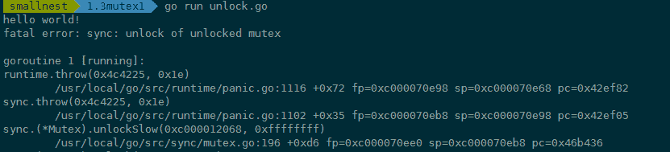
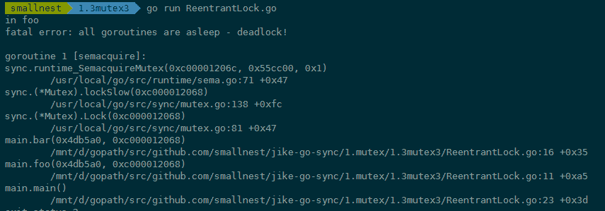
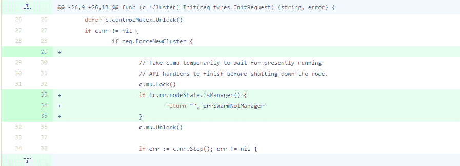
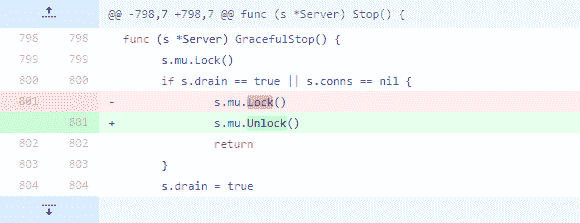

# 03｜Mutex：4種易錯場景大盤點

你好，我是鳥窩。

## 本章導讀

```text
            Mutex 常見踩坑（問題定位圖）

┌────────────────┐
│ Lock / Unlock 使用 │
└───────┬────────┘
        │
  ┌─────┼───────────────┬───────────────┬──────────────┐
  ▼     ▼               ▼               ▼              ▼
忘記解鎖  重複解鎖         重入鎖死鎖        複製已使用 Mutex   鎖範圍過大
  │       │               │               │              │
  └───────┴───────┬───────┴───────┬───────┴───────┬──────┘
                  ▼               ▼               ▼
              卡住/ panic      行為異常        效能下降/難除錯
```

上一講，我帶你一起領略了 Mutex 的架構演進之美，現在我們已經清楚 Mutex 的實作細節了。當前 Mutex 的實作貌似非常複雜，其實主要還是針對飢餓模式和公平性問題，做了一些額外處理。但是，我們在第一講中已經體驗過了，Mutex 使用起來還是非常簡單的，畢竟，它只有 Lock 和 Unlock 兩個方法，使用起來還能複雜到哪裡去？

正常使用 Mutex 時，確實是這樣的，很簡單，基本不會有什麼錯誤，即使出現錯誤，也是在一些複雜的場景中，比如跨函式呼叫 Mutex 或者是在重構或者修補 Bug 時誤操作。但是，我們使用 Mutex 時，確實會出現一些 Bug，比如說忘記釋放鎖、重入鎖、複製已使用了的 Mutex 等情況。那在這一講中，我們就一起來看看使用 Mutex 常犯的幾個錯誤，做到“Bug 提前知，後面早防範”。

# 常見的 4 種錯誤場景

我總結了一下，使用 Mutex 常見的錯誤場景有 4 類，分別是 Lock/Unlock 不是成對出現、Copy 已使用的 Mutex、重入和死鎖。下面我們一一來看。

## Lock/Unlock 不是成對出現

Lock/Unlock 沒有成對出現，就意味著會出現死鎖的情況，或者是因為 Unlock 一個未加鎖的 Mutex 而導致 panic。

我們先來看看缺少 Unlock 的場景，常見的有三種情況：

1.  程式碼中有太多的 if-else 分支，可能在某個分支中漏寫了 Unlock；
2.  在重構的時候把 Unlock 給刪除了；
3.  Unlock 誤寫成了 Lock。

在這種情況下，鎖被獲取之後，就不會被釋放了，這也就意味著，其它的 goroutine 永遠都沒機會獲取到鎖。

我們再來看缺少 Lock 的場景，這就很簡單了，一般來說就是誤操作刪除了 Lock。 比如先前使用 Mutex 都是正常的，結果後來其他人重構程式碼的時候，由於對程式碼不熟悉，或者由於開發者的馬虎，把 Lock 呼叫給刪除了，或者註釋掉了。比如下面的程式碼，mu.Lock() 一行程式碼被刪除了，直接 Unlock 一個未加鎖的 Mutex 會 panic：

```go
func foo() {
    var mu sync.Mutex
    defer mu.Unlock()
    fmt.Println("hello world!")
}
```

執行的時候 panic：



## Copy 已使用的 Mutex

第二種誤用是 Copy 已使用的 Mutex。在正式分析這個錯誤之前，我先交代一個小知識點，那就是 Package sync 的同步原語在使用後是不能複製的。我們知道 Mutex 是最常用的一個同步原語，那它也是不能複製的。為什麼呢？

原因在於，Mutex 是一個有狀態的物件，它的 state 欄位記錄這個鎖的狀態。如果你要複製一個已經加鎖的 Mutex 給一個新的變數，那麼新的剛初始化的變數居然被加鎖了，這顯然不符合你的期望，因為你期望的是一個零值的 Mutex。關鍵是在併發環境下，你根本不知道要複製的 Mutex 狀態是什麼，因為要複製的 Mutex 是由其它 goroutine 併發訪問的，狀態可能總是在變化。

當然，你可能說，你說的我都懂，你的警告我都記下了，但是實際在使用的時候，一不小心就踩了這個坑，我們來看一個例子。

```go
type Counter struct {
    sync.Mutex
    Count int
}

func main() {
    var c Counter
    c.Lock()
    defer c.Unlock()
    c.Count++
    foo(c) // 複製鎖
}

// 這裡Counter的引數是透過複製的方式傳入的
func foo(c Counter) {
    c.Lock()
    defer c.Unlock()
    fmt.Println("in foo")
}
```

第 12 行在呼叫 foo 函式的時候，呼叫者會複製 Mutex 變數 c 作為 foo 函式的引數，不幸的是，複製之前已經使用了這個鎖，這就導致，複製的 Counter 是一個帶狀態 Counter。

怎麼辦呢？Go 在執行時，有**死鎖的檢查機制**（checkdead() 方法），它能夠發現死鎖的 goroutine。這個例子中因為複製了一個使用了的 Mutex，導致鎖無法使用，程式處於死鎖的狀態。程式執行的時候，死鎖檢查機制能夠發現這種死鎖情況並輸出錯誤資訊，如下圖中錯誤資訊以及錯誤堆疊：


你肯定不想執行的時候才發現這個因為複製 Mutex 導致的死鎖問題，那麼你怎麼能夠及時發現問題呢？可以使用 **vet 工具**，把檢查寫在 Makefile 檔案中，在持續整合的時候跑一跑，這樣可以及時發現問題，及時修復。我們可以使用 go vet 檢查這個 Go 檔案：


你看，使用這個工具就可以發現 Mutex 複製的問題，錯誤資訊顯示得很清楚，是在呼叫 foo 函式的時候發生了 lock value 複製的情況，還告訴我們出問題的程式碼行數以及 copy lock 導致的錯誤。

那麼，vet 工具是怎麼發現 Mutex 複製使用問題的呢？我帶你簡單分析一下。

檢查是透過copylock分析器靜態分析實作的。這個分析器會分析函式呼叫、range 遍歷、複製、宣告、函式返回值等位置，有沒有鎖的值 copy 的情景，以此來判斷有沒有問題。可以說，只要是實作了 Locker 介面，就會被分析。我們看到，下面的程式碼就是確定什麼型別會被分析，其實就是實作了 Lock/Unlock 兩個方法的 Locker 介面：

```go
var lockerType *types.Interface
  
  // Construct a sync.Locker interface type.
  func init() {
    nullary := types.NewSignature(nil, nil, nil, false) // func()
    methods := []*types.Func{
      types.NewFunc(token.NoPos, nil, "Lock", nullary),
      types.NewFunc(token.NoPos, nil, "Unlock", nullary),
    }
    lockerType = types.NewInterface(methods, nil).Complete()
  }
```

其實，有些沒有實作 Locker 介面的同步原語（比如 WaitGroup），也能被分析。我先賣個關子，後面我們會介紹這種情況是怎麼實作的。

## 重入

接下來，我們來討論“重入”這個問題。在說這個問題前，我先解釋一下個概念，叫“可重入鎖”。

如果你學過 Java，可能會很熟悉 ReentrantLock，就是可重入鎖，這是 Java 併發包中非常常用的一個同步原語。它的基本行為和互斥鎖相同，但是加了一些擴充套件功能。

如果你沒接觸過 Java，也沒關係，這裡只是提一下，幫助會 Java 的同學對比來學。那下面我來具體講解可重入鎖是咋回事兒。

當一個執行緒獲取鎖時，如果沒有其它執行緒擁有這個鎖，那麼，這個執行緒就成功獲取到這個鎖。之後，如果其它執行緒再請求這個鎖，就會處於阻塞等待的狀態。但是，如果擁有這把鎖的執行緒再請求這把鎖的話，不會阻塞，而是成功返回，所以叫可重入鎖（有時候也叫做遞迴鎖）。只要你擁有這把鎖，你可以可著勁兒地呼叫，比如透過遞迴實作一些演算法，呼叫者不會阻塞或者死鎖。

瞭解了可重入鎖的概念，那我們來看 Mutex 使用的錯誤場景。劃重點了：**Mutex 不是可重入的鎖。**

想想也不奇怪，因為 Mutex 的實作中沒有記錄哪個 goroutine 擁有這把鎖。理論上，任何 goroutine 都可以隨意地 Unlock 這把鎖，所以沒辦法計算重入條件，畢竟，“臣妾做不到啊”！

所以，一旦誤用 Mutex 的重入，就會導致報錯。下面是一個誤用 Mutex 的重入例子：

```go
func foo(l sync.Locker) {
    fmt.Println("in foo")
    l.Lock()
    bar(l)
    l.Unlock()
}

func bar(l sync.Locker) {
    l.Lock()
    fmt.Println("in bar")
    l.Unlock()
}

func main() {
    l := &sync.Mutex{}
    foo(l)
}
```

寫完這個 Mutex 重入的例子後，執行一下，你會發現類似下面的錯誤。程式一直在請求鎖，但是一直沒有辦法獲取到鎖，結果就是 Go 執行時發現死鎖了，沒有其它地方能夠釋放鎖讓程式執行下去，你透過下面的錯誤堆疊資訊就能定位到哪一行阻塞請求鎖：



學到這裡，你可能要問了，雖然標準庫 Mutex 不是可重入鎖，但是如果我就是想要實作一個可重入鎖，可以嗎？

可以，那我們就自己實作一個。這裡的關鍵就是，實作的鎖要能記住當前是哪個 goroutine 持有這個鎖。我來提供兩個方案。

1.  方案一：透過 hacker 的方式獲取到 goroutine id，記錄下獲取鎖的 goroutine id，它可以實作 Locker 介面。
2.  方案二：呼叫 Lock/Unlock 方法時，由 goroutine 提供一個 token，用來標識它自己，而不是我們透過 hacker 的方式獲取到 goroutine id，但是，這樣一來，就不滿足 Locker 介面了。

可重入鎖（遞迴鎖）解決了程式碼重入或者遞迴呼叫帶來的死鎖問題，同時它也帶來了另一個好處，就是我們可以要求，只有持有鎖的 goroutine 才能 unlock 這個鎖。這也很容易實作，因為在上面這兩個方案中，都已經記錄了是哪一個 goroutine 持有這個鎖。

下面我們具體來看這兩個方案怎麼實作。

**方案一**：**goroutine id**

這個方案的關鍵第一步是獲取 goroutine id，方式有兩種，分別是簡單方式和 hacker 方式。

簡單方式，就是透過 runtime.Stack 方法獲取棧幀資訊，棧幀資訊裡包含 goroutine id。你可以看看上面 panic 時候的貼圖，goroutine id 明明白白地顯示在那裡。runtime.Stack 方法可以獲取當前的 goroutine 資訊，第二個引數為 true 會輸出所有的 goroutine 資訊，資訊的格式如下：

```go
goroutine 1 [running]:
main.main()
        ....../main.go:19 +0xb1
```

第一行格式為 goroutine xxx，其中 xxx 就是 goroutine id，你只要解析出這個 id 即可。解析的方法可以採用下面的程式碼：

```go
func GoID() int {
    var buf [64]byte
    n := runtime.Stack(buf[:], false)
    // 得到id字串
    idField := strings.Fields(strings.TrimPrefix(string(buf[:n]), "goroutine "))[0]
    id, err := strconv.Atoi(idField)
    if err != nil {
        panic(fmt.Sprintf("cannot get goroutine id: %v", err))
    }
    return id
}
```

瞭解了簡單方式，接下來我們來看 hacker 的方式，這也是我們方案一採取的方式。

首先，我們獲取執行時的 g 指標，反解出對應的 g 的結構。每個執行的 goroutine 結構的 g 指標儲存在當前 goroutine 的一個叫做 TLS 物件中。

第一步：我們先獲取到 TLS 物件；

第二步：再從 TLS 中獲取 goroutine 結構的 g 指標；

第三步：再從 g 指標中取出 goroutine id。

需要注意的是，不同 Go 版本的 goroutine 的結構可能不同，所以需要根據 Go 的不同版本進行調整。當然了，如果想要搞清楚各個版本的 goroutine 結構差異，所涉及的內容又過於底層而且複雜，學習成本太高。怎麼辦呢？我們可以重點關注一些庫。我們沒有必要重複發明輪子，直接使用第三方的庫來獲取 goroutine id 就可以了。

好訊息是現在已經有很多成熟的方法了，可以支援多個 Go 版本的 goroutine id，給你推薦一個常用的庫：petermattis/goid。

知道了如何獲取 goroutine id，接下來就是最後的關鍵一步了，我們實作一個可以使用的可重入鎖：

```go
// RecursiveMutex 包裝一個Mutex,實作可重入
type RecursiveMutex struct {
    sync.Mutex
    owner     int64 // 當前持有鎖的goroutine id
    recursion int32 // 這個goroutine 重入的次數
}

func (m *RecursiveMutex) Lock() {
    gid := goid.Get()
    // 如果當前持有鎖的goroutine就是這次呼叫的goroutine,說明是重入
    if atomic.LoadInt64(&m.owner) == gid {
        m.recursion++
        return
    }
    m.Mutex.Lock()
    // 獲得鎖的goroutine第一次呼叫，記錄下它的goroutine id,呼叫次數加1
    atomic.StoreInt64(&m.owner, gid)
    m.recursion = 1
}

func (m *RecursiveMutex) Unlock() {
    gid := goid.Get()
    // 非持有鎖的goroutine嘗試釋放鎖，錯誤的使用
    if atomic.LoadInt64(&m.owner) != gid {
        panic(fmt.Sprintf("wrong the owner(%d): %d!", m.owner, gid))
    }
    // 呼叫次數減1
    m.recursion--
    if m.recursion != 0 { // 如果這個goroutine還沒有完全釋放，則直接返回
        return
    }
    // 此goroutine最後一次呼叫，需要釋放鎖
    atomic.StoreInt64(&m.owner, -1)
    m.Mutex.Unlock()
}
```

上面這段程式碼你可以拿來即用。我們一起來看下這個實作，真是非常巧妙，它相當於給 Mutex 打一個補丁，解決了記錄鎖的持有者的問題。可以看到，我們用 owner 欄位，記錄當前鎖的擁有者 goroutine 的 id；recursion 是輔助欄位，用於記錄重入的次數。

有一點，我要提醒你一句，儘管擁有者可以多次呼叫 Lock，但是也必須呼叫相同次數的 Unlock，這樣才能把鎖釋放掉。這是一個合理的設計，可以保證 Lock 和 Unlock 一一對應。

**方案二**：**token**

方案一是用 goroutine id 做 goroutine 的標識，我們也可以讓 goroutine 自己來提供標識。不管怎麼說，Go 開發者不期望你利用 goroutine id 做一些不確定的東西，所以，他們沒有暴露獲取 goroutine id 的方法。

下面的程式碼是第二種方案。呼叫者自己提供一個 token，獲取鎖的時候把這個 token 傳入，釋放鎖的時候也需要把這個 token 傳入。透過使用者傳入的 token 替換方案一中 goroutine id，其它邏輯和方案一一致。

```go
// Token方式的遞迴鎖
type TokenRecursiveMutex struct {
    sync.Mutex
    token     int64
    recursion int32
}

// 請求鎖，需要傳入token
func (m *TokenRecursiveMutex) Lock(token int64) {
    if atomic.LoadInt64(&m.token) == token { //如果傳入的token和持有鎖的token一致，說明是遞迴呼叫
        m.recursion++
        return
    }
    m.Mutex.Lock() // 傳入的token不一致，說明不是遞迴呼叫
    // 搶到鎖之後記錄這個token
    atomic.StoreInt64(&m.token, token)
    m.recursion = 1
}

// 釋放鎖
func (m *TokenRecursiveMutex) Unlock(token int64) {
    if atomic.LoadInt64(&m.token) != token { // 釋放其它token持有的鎖
        panic(fmt.Sprintf("wrong the owner(%d): %d!", m.token, token))
    }
    m.recursion-- // 當前持有這個鎖的token釋放鎖
    if m.recursion != 0 { // 還沒有回退到最初的遞迴呼叫
        return
    }
    atomic.StoreInt64(&m.token, 0) // 沒有遞迴呼叫了，釋放鎖
    m.Mutex.Unlock()
}
死鎖接下來，我們來看第四種錯誤場景：死鎖。
```

我先解釋下什麼是死鎖。兩個或兩個以上的程式（或執行緒，goroutine）在執行過程中，因爭奪共享資源而處於一種互相等待的狀態，如果沒有外部干涉，它們都將無法推進下去，此時，我們稱系統處於死鎖狀態或系統產生了死鎖。

我們來分析一下死鎖產生的必要條件。如果你想避免死鎖，只要破壞這四個條件中的一個或者幾個，就可以了。

1.  **互斥**： 至少一個資源是被排他性獨享的，其他執行緒必須處於等待狀態，直到資源被釋放。
2.  **持有和等待**：goroutine 持有一個資源，並且還在請求其它 goroutine 持有的資源，也就是咱們常說的“吃著碗裡，看著鍋裡”的意思。
3.  **不可剝奪**：資源只能由持有它的 goroutine 來釋放。
4.  **環路等待**：一般來說，存在一組等待程式，P={P1，P2，…，PN}，P1 等待 P2 持有的資源，P2 等待 P3 持有的資源，依此類推，最後是 PN 等待 P1 持有的資源，這就形成了一個環路等待的死結。


你看，死鎖問題還真是挺有意思的，所以有很多人研究這個事兒。一個經典的死鎖問題就是哲學家就餐問題，我不做介紹了，你可以點選連結進一步瞭解。其實，死鎖問題在現實生活中也比比皆是。

舉個例子。有一次我去派出所開證明，派出所要求物業先證明我是本物業的業主，但是，物業要我提供派出所的證明，才能給我開物業證明，結果就陷入了死鎖狀態。你可以把派出所和物業看成兩個 goroutine，派出所證明和物業證明是兩個資源，雙方都持有自己的資源而要求對方的資源，而且自己的資源自己持有，不可剝奪。

這是一個最簡單的只有兩個 goroutine 相互等待的死鎖的例子，轉化成程式碼如下：

```go
package main

import (
    "fmt"
    "sync"
    "time"
)

func main() {
    // 派出所證明
    var psCertificate sync.Mutex
    // 物業證明
    var propertyCertificate sync.Mutex

    var wg sync.WaitGroup
    wg.Add(2) // 需要派出所和物業都處理

    // 派出所處理goroutine
    go func() {
        defer wg.Done() // 派出所處理完成

        psCertificate.Lock()
        defer psCertificate.Unlock()

        // 檢查材料
        time.Sleep(5 * time.Second)
        // 請求物業的證明
        propertyCertificate.Lock()
        propertyCertificate.Unlock()
    }()

    // 物業處理goroutine
    go func() {
        defer wg.Done() // 物業處理完成

        propertyCertificate.Lock()
        defer propertyCertificate.Unlock()

        // 檢查材料
        time.Sleep(5 * time.Second)
        // 請求派出所的證明
        psCertificate.Lock()
        psCertificate.Unlock()
    }()

    wg.Wait()
    fmt.Println("成功完成")
}
```

這個程式沒有辦法執行成功，因為派出所的處理和物業的處理是一個環路等待的死結。


Go 執行時，有死鎖探測的功能，能夠檢查出是否出現了死鎖的情況，如果出現了，這個時候你就需要調整策略來處理了。

你可以引入一個第三方的鎖，大家都依賴這個鎖進行業務處理，比如現在政府推行的一站式政務服務中心。或者是解決持有等待問題，物業不需要看到派出所的證明才給開物業證明，等等。

好了，到這裡，我給你講了使用 Mutex 常見的 4 類問題。你是不是覺得，哎呀，這幾類問題也太不應該了吧，真的會有人犯這麼基礎的錯誤嗎？

還真是有。雖然 Mutex 使用起來很簡單，但是，仍然可能出現使用錯誤的問題。而且，就連一些經驗豐富的開發人員，也會出現一些 Mutex 使用的問題。接下來，我就帶你圍觀幾個非常流行的 Go 開發專案，看看這些錯誤是怎麼產生和修復的。

# 流行的 Go 開發專案踩坑記

## Docker

Docker 容器是一個開源的應用容器引擎，開發者可以以統一的方式，把他們的應用和依賴包打包到一個可移植的容器中，然後釋出到任何安裝了 docker 引擎的伺服器上。

Docker 是使用 Go 開發的，也算是 Go 的一個殺手級產品了，它的 Mutex 相關的 Bug 也不少，我們來看幾個典型的 Bug。

### issue 36114

Docker 的issue 36114 是一個死鎖問題。

原因在於，hotAddVHDsAtStart 方法執行的時候，執行了加鎖 svm 操作。但是，在其中呼叫 hotRemoveVHDsAtStart 方法時，這個 hotRemoveVHDsAtStart 方法也是要加鎖 svm 的。很不幸，Go 標準庫中的 Mutex 是不可重入的，所以，程式碼執行到這裡，就出現了死鎖的現象。


針對這個問題，解決辦法就是，再提供一個不需要鎖的 hotRemoveVHDsNoLock 方法，避免 Mutex 的重入。

### issue 34881

issue 34881本來是修復 Docker 的一個簡單問題，如果節點在初始化的時候，發現自己不是一個 swarm mananger，就快速返回，這個修復就幾行程式碼，你看出問題來了嗎？



在第 34 行，節點發現不滿足條件就返回了，但是，c.mu 這個鎖沒有釋放！為什麼會出現這個問題呢？其實，這是在重構或者新增新功能的時候經常犯的一個錯誤，因為不太瞭解上下文，或者是沒有仔細看函式的邏輯，從而導致鎖沒有被釋放。現在的 Docker 當然已經沒有這個問題了。


這樣的 issue 還有很多，我就不一一列舉了。我給你推薦幾個關於 Mutex 的 issue 或者 pull request，你可以關注一下，分別是 36840、37583、35517、35482、33305、32826、30696、29554、29191、28912、26507 等。

## Kubernetes

### issue 72361

issue 72361 增加 Mutex 為了保護資源。這是為瞭解決 data race 問題而做的一個修復，修復方法也很簡單，使用互斥鎖即可，這也是我們解決 data race 時常用的方法。


### issue 45192

issue 45192也是一個返回時忘記 Unlock 的典型例子，和 docker issue 34881 犯的錯誤都是一樣的。

兩大知名專案的開發者都犯了這個錯誤，所以，你就可以知道，引入這個 Bug 是多麼容易，記住晁老師這句話：**保證 Lock/Unlock 成對出現，儘可能採用 defer mutex.Unlock 的方式，把它們成對、緊湊地寫在一起**。


除了這些，我也建議你關注一下其它的 Mutex 相關的 issue，比如 71617、70605 等。

## **gRPC**

gRPC 是 Google 發起的一個開源遠端過程呼叫 （Remote procedure call）系統。該系統基於 HTTP/2 協議傳輸，使用 Protocol Buffers 作為介面描述語言。它提供 Go 語言的實作。

即使是 Google 官方出品的系統，也有一些 Mutex 的 issue。

### issue 795

issue 795是一個你可能想不到的 bug，那就是將 Unlock 誤寫成了 Lock。



關於這個專案，還有一些其他的為了保護共享資源而新增 Mutex 的 issue，比如 1318、2074、2542 等。

## etcd

etcd 是一個非常知名的分散式一致性的 key-value 儲存技術， 被用來做配置共享和服務發現。

## issue 10419

issue 10419是一個鎖重入導致的問題。 Store 方法內對請求了鎖，而呼叫的 Compact 的方法內又請求了鎖，這個時候，會導致死鎖，一直等待，解決辦法就是提供不需要加鎖的 Compact 方法。


# 總結

這節課，我們學習了 Mutex 的一些易錯場景，而且，我們還分析了流行的 Go 開源專案的錯誤，我也給你分享了我自己在開發中的經驗總結。需要強調的是，**手誤和重入導致的死鎖，是最常見的使用 Mutex 的 Bug**。

Go 死鎖探測工具只能探測整個程式是否因為死鎖而凍結了，不能檢測出一組 goroutine 死鎖導致的某一塊業務凍結的情況。你還可以透過 Go 執行時自帶的死鎖檢測工具，或者是第三方的工具（比如go-deadlock、go-tools）進行檢查，這樣可以儘早發現一些死鎖的問題。不過，有些時候，死鎖在某些特定情況下才會被觸發，所以，如果你的測試或者短時間的執行沒問題，不代表程式一定不會有死鎖問題。

併發程式最難跟蹤除錯的就是很難重現，因為併發問題不是按照我們指定的順序執行的，由於計算機排程的問題和事件觸發的時機不同，死鎖的 Bug 可能會在極端的情況下出現。透過搜尋日誌、檢視日誌，我們能夠知道程式有異常了，比如某個流程一直沒有結束。這個時候，可以透過 Go pprof 工具分析，它提供了一個 block profiler 監控阻塞的 goroutine。除此之外，我們還可以檢視全部的 goroutine 的堆疊資訊，透過它，你可以檢視阻塞的 groutine 究竟阻塞在哪一行哪一個物件上了。

# 思考題

查詢知名的資料庫系統 TiDB 的 issue，看看有沒有 Mutex 相關的 issue，看看它們都是哪些相關的 Bug。

歡迎在留言區寫下你的思考和答案，我們一起交流討論。如果你覺得有所收穫，也歡迎你把今天的內容分享給你的朋友或同事。
