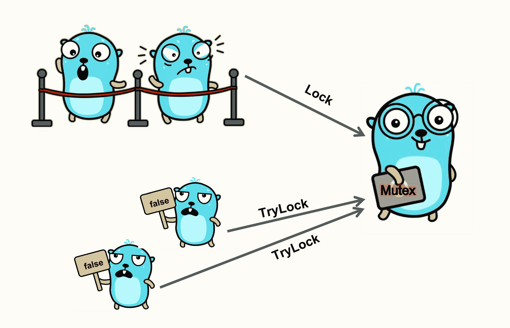
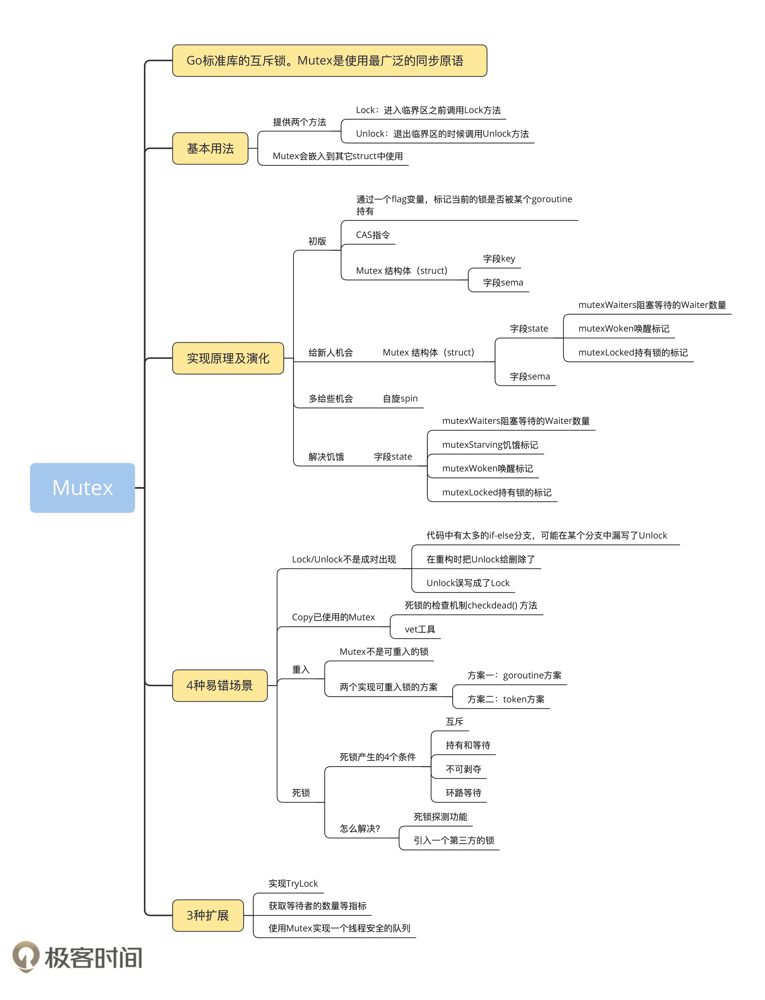

# 04｜ Mutex：駭客程式設計，如何拓展額外功能？

你好，我是鳥窩。

## 本章導讀

```text
        以 Mutex 為核心做功能擴充（包裝器概念）

┌──────────────┐      包裝/組合      ┌─────────────────────┐
│ sync.Mutex   │ ─────────────────> │ 自訂鎖型別/工具函式   │
└──────────────┘                    └─────────┬───────────┘
                                               │
               ┌───────────────────────────────┼──────────────────────────────┐
               ▼                               ▼                              ▼
        TryLock 風格能力                  超時控制/取消                     統計/除錯資訊
```

前面三講，我們學習了互斥鎖 Mutex 的基本用法、實作原理以及易錯場景，可以說是涵蓋了互斥鎖的方方面面。如果你能熟練掌握這些內容，那麼，在大多數的開發場景中，你都可以得心應手。

但是，在一些特定的場景中，這些基礎功能是不足以應對的。這個時候，我們就需要開發一些擴充套件功能了。我來舉幾個例子。

比如說，我們知道，如果互斥鎖被某個 goroutine 獲取了，而且還沒有釋放，那麼，其他請求這把鎖的 goroutine，就會阻塞等待，直到有機會獲得這把鎖。有時候阻塞並不是一個很好的主意，比如你請求鎖更新一個計數器，如果獲取不到鎖的話沒必要等待，大不了這次不更新，我下次更新就好了，如果阻塞的話會導致業務處理能力的下降。

再比如，如果我們要監控鎖的競爭情況，一個監控指標就是，等待這把鎖的 goroutine 數量。我們可以把這個指標推送到時間序列資料庫中，再透過一些監控系統（比如 Grafana）展示出來。要知道，**鎖是效能下降的“罪魁禍首”之一，所以，有效地降低鎖的競爭，就能夠很好地提高效能。因此，監控關鍵互斥鎖上等待的 goroutine 的數量，是我們分析鎖競爭的激烈程度的一個重要指標**。

實際上，不論是不希望鎖的 goroutine 繼續等待，還是想監控鎖，我們都可以基於標準庫中 Mutex 的實作，透過 Hacker 的方式，為 Mutex 增加一些額外的功能。這節課，我就來教你實作幾個擴充套件功能，包括實作 TryLock，獲取等待者的數量等指標，以及實作一個執行緒安全的佇列。

# TryLock

我們可以為 Mutex 新增一個 TryLock 的方法，也就是嘗試獲取排外鎖。

這個方法具體是什麼意思呢？我來解釋一下這裡的邏輯。當一個 goroutine 呼叫這個 TryLock 方法請求鎖的時候，如果這把鎖沒有被其他 goroutine 所持有，那麼，這個 goroutine 就持有了這把鎖，並返回 true；如果這把鎖已經被其他 goroutine 所持有，或者是正在準備交給某個被喚醒的 goroutine，那麼，這個請求鎖的 goroutine 就直接返回 false，不會阻塞在方法呼叫上。

如下圖所示，如果 Mutex 已經被一個 goroutine 持有，呼叫 Lock 的 goroutine 阻塞排隊等待，呼叫 TryLock 的 goroutine 直接得到一個 false 返回。



在實際開發中，如果要更新配置資料，我們通常需要加鎖，這樣可以避免同時有多個 goroutine 併發修改資料。有的時候，我們也會使用 TryLock。這樣一來，當某個 goroutine 想要更改配置資料時，如果發現已經有 goroutine 在更改了，其他的 goroutine 呼叫 TryLock，返回了 false，這個 goroutine 就會放棄更改。

很多語言（比如 Java）都為鎖提供了 TryLock 的方法，但是，Go 官方issue 6123有一個討論（後來一些 issue 中也提到過），標準庫的 Mutex 不會新增 TryLock 方法。雖然透過 Go 的 Channel 我們也可以實作 TryLock 的功能，但是基於 Channel 的實作我們會放在 Channel 那一講中去介紹，這一次我們還是基於 Mutex 去實作，畢竟大部分的程式設計師還是熟悉傳統的同步原語，而且傳統的同步原語也不容易出錯。所以這節課，還是希望帶你掌握基於 Mutex 實作的方法。

那怎麼實作一個擴充套件 TryLock 方法的 Mutex 呢？我們直接來看程式碼。

```go
// 複製Mutex定義的常量
const (
    mutexLocked = 1 << iota // 加鎖標識位置
    mutexWoken              // 喚醒標識位置
    mutexStarving           // 鎖飢餓標識位置
    mutexWaiterShift = iota // 標識waiter的起始bit位置
)

// 擴充套件一個Mutex結構
type Mutex struct {
    sync.Mutex
}

// 嘗試獲取鎖
func (m *Mutex) TryLock() bool {
    // 如果能成功搶到鎖
    if atomic.CompareAndSwapInt32((*int32)(unsafe.Pointer(&m.Mutex)), 0, mutexLocked) {
        return true
    }

    // 如果處於喚醒、加鎖或者飢餓狀態，這次請求就不參與競爭了，返回false
    old := atomic.LoadInt32((*int32)(unsafe.Pointer(&m.Mutex)))
    if old&(mutexLocked|mutexStarving|mutexWoken) != 0 {
        return false
    }

    // 嘗試在競爭的狀態下請求鎖
    new := old | mutexLocked
    return atomic.CompareAndSwapInt32((*int32)(unsafe.Pointer(&m.Mutex)), old, new)
}
```

第 17 行是一個 fast path，如果幸運，沒有其他 goroutine 爭這把鎖，那麼，這把鎖就會被這個請求的 goroutine 獲取，直接返回。

如果鎖已經被其他 goroutine 所持有，或者被其他喚醒的 goroutine 準備持有，那麼，就直接返回 false，不再請求，程式碼邏輯在第 23 行。

如果沒有被持有，也沒有其它喚醒的 goroutine 來競爭鎖，鎖也不處於飢餓狀態，就嘗試獲取這把鎖（第 29 行），不論是否成功都將結果返回。因為，這個時候，可能還有其他的 goroutine 也在競爭這把鎖，所以，不能保證成功獲取這把鎖。

我們可以寫一個簡單的測試程式，來測試我們的 TryLock 的機制是否工作。

這個測試程式的工作機制是這樣子的：程式執行時會啟動一個 goroutine 持有這把我們自己實作的鎖，經過隨機的時間才釋放。主 goroutine 會嘗試獲取這把鎖。如果前一個 goroutine 一秒內釋放了這把鎖，那麼，主 goroutine 就有可能獲取到這把鎖了，輸出“got the lock”，否則沒有獲取到也不會被阻塞，會直接輸出“`can't get the lock`”。

```go
func try() {
    var mu Mutex
    go func() { // 啟動一個goroutine持有一段時間的鎖
        mu.Lock()
        time.Sleep(time.Duration(rand.Intn(2)) * time.Second)
        mu.Unlock()
    }()

    time.Sleep(time.Second)

    ok := mu.TryLock() // 嘗試獲取到鎖
    if ok { // 獲取成功
        fmt.Println("got the lock")
        // do something
        mu.Unlock()
        return
    }

    // 沒有獲取到
    fmt.Println("can't get the lock")
}獲取等待者的數量等指標接下來，我想和你聊聊怎麼獲取等待者數量等指標。
```

第二講中，我們已經學習了 Mutex 的結構。先來回顧一下 Mutex 的資料結構，如下面的程式碼所示。它包含兩個欄位，state 和 sema。前四個位元組（int32）就是 state 欄位。

```go
type Mutex struct {
    state int32
    sema  uint32
}
```

Mutex 結構中的 state 欄位有很多個含義，透過 state 欄位，你可以知道鎖是否已經被某個 goroutine 持有、當前是否處於飢餓狀態、是否有等待的 goroutine 被喚醒、等待者的數量等資訊。但是，state 這個欄位並沒有暴露出來，所以，我們需要想辦法獲取到這個欄位，並進行解析。

怎麼獲取未暴露的欄位呢？很簡單，我們可以透過 unsafe 的方式實作。我來舉一個例子，你一看就明白了。

```go
const (
    mutexLocked = 1 << iota // mutex is locked
    mutexWoken
    mutexStarving
    mutexWaiterShift = iota
)

type Mutex struct {
    sync.Mutex
}

func (m *Mutex) Count() int {
    // 獲取state欄位的值
    v := atomic.LoadInt32((*int32)(unsafe.Pointer(&m.Mutex)))
    v = v >> mutexWaiterShift //得到等待者的數值
    v = v + (v & mutexLocked) //再加上鎖持有者的數量，0或者1
    return int(v)
}
```

這個例子的第 14 行透過 unsafe 操作，我們可以得到 state 欄位的值。第 15 行我們右移三位（這裡的常量 mutexWaiterShift 的值為 3），就得到了當前等待者的數量。如果當前的鎖已經被其他 goroutine 持有，那麼，我們就稍微調整一下這個值，加上一個 1（第 16 行），你基本上可以把它看作是當前持有和等待這把鎖的 goroutine 的總數。

state 這個欄位的第一位是用來標記鎖是否被持有，第二位用來標記是否已經喚醒了一個等待者，第三位標記鎖是否處於飢餓狀態，透過分析這個 state 欄位我們就可以得到這些狀態資訊。我們可以為這些狀態提供查詢的方法，這樣就可以即時地知道鎖的狀態了。

```go
// 鎖是否被持有
func (m *Mutex) IsLocked() bool {
    state := atomic.LoadInt32((*int32)(unsafe.Pointer(&m.Mutex)))
    return state&mutexLocked == mutexLocked
}

// 是否有等待者被喚醒
func (m *Mutex) IsWoken() bool {
    state := atomic.LoadInt32((*int32)(unsafe.Pointer(&m.Mutex)))
    return state&mutexWoken == mutexWoken
}

// 鎖是否處於飢餓狀態
func (m *Mutex) IsStarving() bool {
    state := atomic.LoadInt32((*int32)(unsafe.Pointer(&m.Mutex)))
    return state&mutexStarving == mutexStarving
}
```

我們可以寫一個程式測試一下，比如，在 1000 個 goroutine 併發訪問的情況下，我們可以把鎖的狀態資訊輸出出來：

```go
func count() {
    var mu Mutex
    for i := 0; i < 1000; i++ { // 啟動1000個goroutine
        go func() {
            mu.Lock()
            time.Sleep(time.Second)
            mu.Unlock()
        }()
    }

    time.Sleep(time.Second)
    // 輸出鎖的資訊
    fmt.Printf("waitings: %d, isLocked: %t, woken: %t,  starving: %t\n", mu.Count(), mu.IsLocked(), mu.IsWoken(), mu.IsStarving())
}
```

有一點你需要注意一下，在獲取 state 欄位的時候，並沒有透過 Lock 獲取這把鎖，所以獲取的這個 state 的值是一個瞬態的值，可能在你解析出這個欄位之後，鎖的狀態已經發生了變化。不過沒關係，因為你檢視的就是呼叫的那一時刻的鎖的狀態。

# 使用 Mutex 實作一個執行緒安全的佇列

最後，我們來討論一下，如何使用 Mutex 實作一個執行緒安全的佇列。

為什麼要討論這個話題呢？因為 Mutex 經常會和其他非執行緒安全（對於 Go 來說，我們其實指的是 goroutine 安全）的資料結構一起，組合成一個執行緒安全的資料結構。新資料結構的業務邏輯由原來的資料結構提供，而 **Mutex 提供了鎖的機制，****來****保證執行緒安全**。

比如佇列，我們可以透過 Slice 來實作，但是透過 Slice 實作的佇列不是執行緒安全的，出隊（Dequeue）和入隊（Enqueue）會有 data race 的問題。這個時候，Mutex 就要隆重出場了，透過它，我們可以在出隊和入隊的時候加上鎖的保護。

```go
type SliceQueue struct {
    data []interface{}
    mu   sync.Mutex
}

func NewSliceQueue(n int) (q *SliceQueue) {
    return &SliceQueue{data: make([]interface{}, 0, n)}
}

// Enqueue 把值放在隊尾
func (q *SliceQueue) Enqueue(v interface{}) {
    q.mu.Lock()
    q.data = append(q.data, v)
    q.mu.Unlock()
}

// Dequeue 移去隊頭並返回
func (q *SliceQueue) Dequeue() interface{} {
    q.mu.Lock()
    if len(q.data) == 0 {
        q.mu.Unlock()
        return nil
    }
    v := q.data[0]
    q.data = q.data[1:]
    q.mu.Unlock()
    return v
}
```

因為標準庫中沒有執行緒安全的佇列資料結構的實作，所以，你可以透過 Mutex 實作一個簡單的佇列。透過 Mutex 我們就可以為一個非執行緒安全的 data interface{}實作執行緒安全的訪問。

# 總結

好了，我們來做個總結。

Mutex 是 package sync 的基石，其他的一些同步原語也是基於它實作的，所以，我們“隆重”地用了四講來深度學習它。學到後面，你一定能感受到，多花些時間來完全掌握 Mutex 是值得的。

今天這一講我和你分享了幾個 Mutex 的拓展功能，這些方法是不是給你帶來了一種“駭客”的程式設計體驗呢，透過 Hacker 的方式，我們真的可以讓 Mutex 變得更強大。

我們學習了基於 Mutex 實作 TryLock，透過 unsafe 的方式讀取到 Mutex 內部的 state 欄位，這樣，我們就解決了開篇列舉的問題，一是不希望鎖的 goroutine 繼續等待，一是想監控鎖。

另外，使用 Mutex 組合成更豐富的資料結構是我們常見的場景，今天我們就實作了一個執行緒安全的佇列，未來我們還會講到實作執行緒安全的 map 物件。

到這裡，Mutex 我們就係統學習完了，最後給你總結了一張 Mutex 知識地圖，幫你複習一下。



# 思考題

你可以為 Mutex 獲取鎖時加上 Timeout 機制嗎？會有什麼問題嗎？

歡迎在留言區寫下你的思考和答案，我們一起交流討論。如果你覺得有所收穫，也歡迎你把今天的內容分享給你的朋友或同事。
