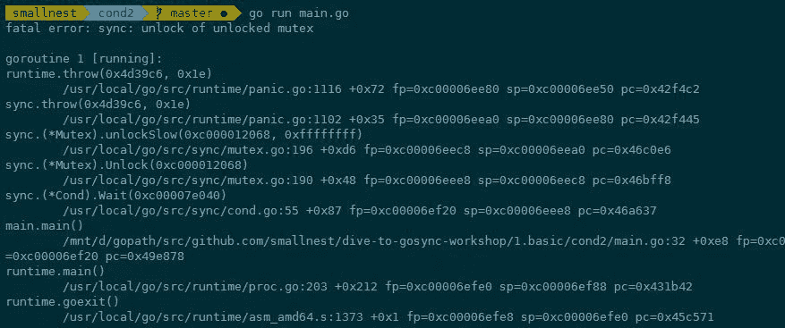
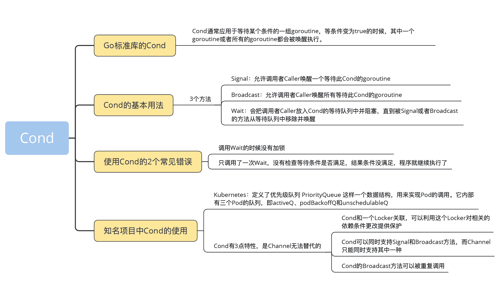

# 07 \| Cond：條件變量的實現機制及避坑指南

你好，我是鳥窩。

在寫 Go 程序之前，我曾經寫了 10 多年的 Java 程序，也面試過不少 Java 程序員。在 Java 面試中，經常被問到的一個知識點就是等待 / 通知（wait/notify）機制。面試官經常會這樣考察候選人：請實現一個限定容量的隊列（queue），當隊列滿或者空的時候，利用等待 / 通知機制實現阻塞或者喚醒。

在 Go 中，也可以實現一個類似的限定容量的隊列，而且實現起來也比較簡單，只要用條件變量（Cond）併發原語就可以。Cond 併發原語相對來說不是那麼常用，但是在特定的場景使用會事半功倍，比如你需要在喚醒一個或者所有的等待者做一些檢查操作的時候。

那麼今天這一講，我們就學習下 Cond 這個併發原語。

## Go 標準庫的 Cond

Go 標準庫提供 Cond 原語的目的是，為等待 / 通知場景下的併發問題提供支持。Cond 通常應用於等待某個條件的一組 goroutine，等條件變為 true 的時候，其中一個 goroutine 或者所有的 goroutine 都會被喚醒執行。

顧名思義，Cond 是和某個條件相關，這個條件需要一組 goroutine 協作共同完成，在條件還沒有滿足的時候，所有等待這個條件的 goroutine 都會被阻塞住，只有這一組 goroutine 通過協作達到了這個條件，等待的 goroutine 才可能繼續進行下去。

那這裡等待的條件是什麼呢？等待的條件，可以是某個變量達到了某個閾值或者某個時間點，也可以是一組變量分別都達到了某個閾值，還可以是某個對象的狀態滿足了特定的條件。總結來講，等待的條件是一種可以用來計算結果是 true 還是 false 的條件。

從開發實踐上，我們真正使用 Cond 的場景比較少，因為一旦遇到需要使用 Cond 的場景，我們更多地會使用 Channel 的方式（我會在第 12 和第 13 講展開 Channel 的用法）去實現，因為那才是更地道的 Go 語言的寫法，甚至 Go 的開發者有個“把 Cond 從標準庫移除”的提議（issue 21165）。而有的開發者認為，Cond 是唯一難以掌握的 Go 併發原語。至於其中原因，我先賣個關子，到這一講的後半部分我再和你解釋。

今天，這一講我們就帶你仔細地學一學 Cond 這個併發原語吧。

## Cond 的基本用法

標準庫中的 Cond 併發原語初始化的時候，需要關聯一個 Locker 接口的實例，一般我們使用 Mutex 或者 RWMutex。

我們看一下 Cond 的實現：

```go
type Cond
  func NeWCond(l Locker) *Cond
  func (c *Cond) Broadcast()
  func (c *Cond) Signal()
  func (c *Cond) Wait()
```

首先，Cond 關聯的 Locker 實例可以通過 c.L 訪問，它內部維護著一個先入先出的等待隊列。

然後，我們分別看下它的三個方法 Broadcast、Signal 和 Wait 方法。

**Signal 方法**，允許調用者 Caller 喚醒一個等待此 Cond 的 goroutine。如果此時沒有等待的 goroutine，顯然無需通知 waiter；如果 Cond 等待隊列中有一個或者多個等待的 goroutine，則需要從等待隊列中移除第一個 goroutine 並把它喚醒。在其他編程語言中，比如 Java 語言中，Signal 方法也被叫做 notify 方法。

調用 Signal 方法時，不強求你一定要持有 c.L 的鎖。

**Broadcast 方法**，允許調用者 Caller 喚醒所有等待此 Cond 的 goroutine。如果此時沒有等待的 goroutine，顯然無需通知 waiter；如果 Cond 等待隊列中有一個或者多個等待的 goroutine，則清空所有等待的 goroutine，並全部喚醒。在其他編程語言中，比如 Java 語言中，Broadcast 方法也被叫做 notifyAll 方法。

同樣地，調用 Broadcast 方法時，也不強求你一定持有 c.L 的鎖。

**Wait 方法**，會把調用者 Caller 放入 Cond 的等待隊列中並阻塞，直到被 Signal 或者 Broadcast 的方法從等待隊列中移除並喚醒。

調用 Wait 方法時必須要持有 c.L 的鎖。

Go 實現的 sync.Cond 的方法名是 Wait、Signal 和 Broadcast，這是計算機科學中條件變量的通用方法名。比如，C 語言中對應的方法名是 pthread_cond_wait、pthread_cond_signal 和 pthread_cond_broadcast。

知道了 Cond 提供的三個方法後，我們再通過一個百米賽跑開始時的例子，來學習下 **Cond 的使用方法**。10 個運動員進入賽場之後需要先做拉伸活動活動筋骨，向觀眾和粉絲招手致敬，在自己的賽道上做好準備；等所有的運動員都準備好之後，裁判員才會打響發令槍。

每個運動員做好準備之後，將 ready 加一，表明自己做好準備了，同時調用 Broadcast 方法通知裁判員。因為裁判員只有一個，所以這裡可以直接替換成 Signal 方法調用。調用 Broadcast 方法的時候，我們並沒有請求 c.L 鎖，只是在更改等待變量的時候才使用到了鎖。

裁判員會等待運動員都準備好（第 22 行）。雖然每個運動員準備好之後都喚醒了裁判員，但是裁判員被喚醒之後需要檢查等待條件是否滿足（**運動員都準備好了**）。可以看到，裁判員被喚醒之後一定要檢查等待條件，如果條件不滿足還是要繼續等待。

```go
func main() {
    c := sync.NewCond(&sync.Mutex{})
    var ready int

    for i := 0; i < 10; i++ {
        go func(i int) {
            time.Sleep(time.Duration(rand.Int63n(10)) * time.Second)

            // 加鎖更改等待條件
            c.L.Lock()
            ready++
            c.L.Unlock()

            log.Printf("運動員#%d 已準備就緒\n", i)
            // 廣播喚醒所有的等待者
            c.Broadcast()
        }(i)
    }

    c.L.Lock()
    for ready != 10 {
        c.Wait()
        log.Println("裁判員被喚醒一次")
    }
    c.L.Unlock()

    //所有的運動員是否就緒
    log.Println("所有運動員都準備就緒。比賽開始，3，2，1, ......")
}
```

你看，Cond 的使用其實沒那麼簡單。它的複雜在於：一，這段代碼有時候需要加鎖，有時候可以不加；二，Wait 喚醒後需要檢查條件；三，條件變量的更改，其實是需要原子操作或者互斥鎖保護的。所以，有的開發者會認為，Cond 是唯一難以掌握的 Go 併發原語。

我們繼續看看 Cond 的實現原理。

## Cond 的實現原理

其實，Cond 的實現非常簡單，或者說複雜的邏輯已經被 Locker 或者 runtime 的等待隊列實現了。我們直接看看 Cond 的源碼吧。

```go
type Cond struct {
    noCopy noCopy

    // 當觀察或者修改等待條件的時候需要加鎖
    L Locker

    // 等待隊列
    notify  notifyList
    checker copyChecker
}

func NewCond(l Locker) *Cond {
    return &Cond{L: l}
}

func (c *Cond) Wait() {
    c.checker.check()
    // 增加到等待隊列中
    t := runtime_notifyListAdd(&c.notify)
    c.L.Unlock()
    // 阻塞休眠直到被喚醒
    runtime_notifyListWait(&c.notify, t)
    c.L.Lock()
}

func (c *Cond) Signal() {
    c.checker.check()
    runtime_notifyListNotifyOne(&c.notify)
}

func (c *Cond) Broadcast() {
    c.checker.check()
    runtime_notifyListNotifyAll(&c.notify）
}
```

這部分源碼確實很簡單，我來帶你學習下其中比較關鍵的邏輯。

runtime_notifyListXXX 是運行時實現的方法，實現了一個等待 / 通知的隊列。如果你想深入學習這部分，可以再去看看 runtime/sema.go 代碼中。

copyChecker 是一個輔助結構，可以在運行時檢查 Cond 是否被複制使用。

Signal 和 Broadcast 只涉及到 notifyList 數據結構，不涉及到鎖。

Wait 把調用者加入到等待隊列時會釋放鎖，在被喚醒之後還會請求鎖。在阻塞休眠期間，調用者是不持有鎖的，這樣能讓其他 goroutine 有機會檢查或者更新等待變量。

我們繼續看看使用 Cond 常見的兩個錯誤，一個是調用 Wait 的時候沒有加鎖，另一個是沒有檢查條件是否滿足程序就繼續執行了。

## 使用 Cond 的 2 個常見錯誤

我們先看 **Cond 最常見的使用錯誤，也就是調用 Wait 的時候沒有加鎖**。

以前面百米賽跑的程序為例，在調用 cond.Wait 時，把前後的 Lock/Unlock 註釋掉，如下面的代碼中的第 20 行和第 25 行：

```go
func main() {
    c := sync.NewCond(&sync.Mutex{})
    var ready int

    for i := 0; i < 10; i++ {
        go func(i int) {
            time.Sleep(time.Duration(rand.Int63n(10)) * time.Second)

            // 加鎖更改等待條件
            c.L.Lock()
            ready++
            c.L.Unlock()

            log.Printf("運動員#%d 已準備就緒\n", i)
            // 廣播喚醒所有的等待者
            c.Broadcast()
        }(i)
    }

    // c.L.Lock()
    for ready != 10 {
        c.Wait()
        log.Println("裁判員被喚醒一次")
    }
    // c.L.Unlock()

    //所有的運動員是否就緒
    log.Println("所有運動員都準備就緒。比賽開始，3，2，1, ......")
}
```

再運行程序，就會報釋放未加鎖的 panic：



出現這個問題的原因在於，cond.Wait 方法的實現是，把當前調用者加入到 notify 隊列之中後會釋放鎖（如果不釋放鎖，其他 Wait 的調用者就沒有機會加入到 notify 隊列中了），然後一直等待；等調用者被喚醒之後，又會去爭搶這把鎖。如果調用 Wait 之前不加鎖的話，就有可能 Unlock 一個未加鎖的 Locker。所以切記，**調用 cond.Wait 方法之前一定要加鎖**。

使用 Cond 的另一個常見錯誤是，只調用了一次 Wait，沒有檢查等待條件是否滿足，結果條件沒滿足，程序就繼續執行了。出現這個問題的原因在於，誤以為 Cond 的使用，就像 WaitGroup 那樣調用一下 Wait 方法等待那麼簡單。比如下面的代碼中，把第 21 行和第 24 行註釋掉：

```go
func main() {
    c := sync.NewCond(&sync.Mutex{})
    var ready int

    for i := 0; i < 10; i++ {
        go func(i int) {
            time.Sleep(time.Duration(rand.Int63n(10)) * time.Second)

            // 加鎖更改等待條件
            c.L.Lock()
            ready++
            c.L.Unlock()

            log.Printf("運動員#%d 已準備就緒\n", i)
            // 廣播喚醒所有的等待者
            c.Broadcast()
        }(i)
    }

    c.L.Lock()
    // for ready != 10 {
    c.Wait()
    log.Println("裁判員被喚醒一次")
    // }
    c.L.Unlock()

    //所有的運動員是否就緒
    log.Println("所有運動員都準備就緒。比賽開始，3，2，1, ......")
}
```

運行這個程序，你會發現，可能只有幾個運動員準備好之後程序就運行完了，而不是我們期望的所有運動員都準備好才進行下一步。原因在於，每一個運動員準備好之後都會喚醒所有的等待者，也就是這裡的裁判員，比如第一個運動員準備好後就喚醒了裁判員，結果這個裁判員傻傻地沒做任何檢查，以為所有的運動員都準備好了，就繼續執行了。

所以，我們一定要**記住**，waiter goroutine 被喚醒**不等於**等待條件被滿足，只是有 goroutine 把它喚醒了而已，等待條件有可能已經滿足了，也有可能不滿足，我們需要進一步檢查。你也可以理解為，等待者被喚醒，只是得到了一次檢查的機會而已。

到這裡，我們小結下。如果你想在使用 Cond 的時候避免犯錯，只要時刻記住調用 cond.Wait 方法之前一定要加鎖，以及 waiter goroutine 被喚醒不等於等待條件被滿足這兩個知識點。

## 知名項目中 Cond 的使用

Cond 在實際項目中被使用的機會比較少，原因總結起來有兩個。

第一，同樣的場景我們會使用其他的併發原語來替代。Go 特有的 Channel 類型，有一個應用很廣泛的模式就是通知機制，這個模式使用起來也特別簡單。所以很多情況下，我們會使用 Channel 而不是 Cond 實現 wait/notify 機制。

第二，對於簡單的 wait/notify 場景，比如等待一組 goroutine 完成之後繼續執行餘下的代碼，我們會使用 WaitGroup 來實現。因為 WaitGroup 的使用方法更簡單，而且不容易出錯。比如，上面百米賽跑的問題，就可以很方便地使用 WaitGroup 來實現。

所以，我在這一講開頭提到，Cond 的使用場景很少。先前的標準庫內部有幾個地方使用了 Cond，比如 io/pipe.go 等，後來都被其他的併發原語（比如 Channel）替換了，sync.Cond 的路越走越窄。但是，還是有一批忠實的“粉絲”堅持在使用 Cond，原因在於 Cond 有三點特性是 Channel 無法替代的：

1.  Cond 和一個 Locker 關聯，可以利用這個 Locker 對相關的依賴條件更改提供保護。
2.  Cond 可以同時支持 Signal 和 Broadcast 方法，而 Channel 只能同時支持其中一種。
3.  Cond 的 Broadcast 方法可以被重複調用。等待條件再次變成不滿足的狀態後，我們又可以調用 Broadcast 再次喚醒等待的 goroutine。這也是 Channel 不能支持的，Channel 被 close 掉了之後不支持再 open。

開源項目中使用 sync.Cond 的代碼少之又少，包括標準庫原先一些使用 Cond 的代碼也改成使用 Channel 實現了，所以別說找 Cond 相關的使用 Bug 了，想找到的一個使用的例子都不容易，我找了 Kubernetes 中的一個例子，我們一起看看它是如何使用 Cond 的。

Kubernetes 項目中定義了優先級隊列 PriorityQueue 這樣一個數據結構，用來實現 Pod 的調用。它內部有三個 Pod 的隊列，即 activeQ、podBackoffQ 和 unschedulableQ，其中 activeQ 就是用來調度的活躍隊列（heap）。

Pop 方法調用的時候，如果這個隊列為空，並且這個隊列沒有 Close 的話，會調用 Cond 的 Wait 方法等待。

你可以看到，調用 Wait 方法的時候，調用者是持有鎖的，並且被喚醒的時候檢查等待條件（隊列是否為空）。

```go
// 從隊列中取出一個元素
func (p *PriorityQueue) Pop() (*framework.QueuedPodInfo, error) {
    p.lock.Lock()
    defer p.lock.Unlock()
    for p.activeQ.Len() == 0 { // 如果隊列為空
      if p.closed {
        return nil, fmt.Errorf(queueClosed)
      }
      p.cond.Wait() // 等待，直到被喚醒
    }
    ......
    return pInfo, err
  }
```

當 activeQ 增加新的元素時，會調用條件變量的 Boradcast 方法，通知被 Pop 阻塞的調用者。

```go
// 增加元素到隊列中
func (p *PriorityQueue) Add(pod *v1.Pod) error {
    p.lock.Lock()
    defer p.lock.Unlock()
    pInfo := p.newQueuedPodInfo(pod)
    if err := p.activeQ.Add(pInfo); err != nil {//增加元素到隊列中
      klog.Errorf("Error adding pod %v to the scheduling queue: %v", nsNameForPod(pod), err)
      return err
    }
    ......
    p.cond.Broadcast() //通知其它等待的goroutine，隊列中有元素了

    return nil
  }
```

這個優先級隊列被關閉的時候，也會調用 Broadcast 方法，避免被 Pop 阻塞的調用者永遠 hang 住。

```go
func (p *PriorityQueue) Close() {
    p.lock.Lock()
    defer p.lock.Unlock()
    close(p.stop)
    p.closed = true
    p.cond.Broadcast() //關閉時通知等待的goroutine，避免它們永遠等待
}
```

你可以思考一下，這裡為什麼使用 Cond 這個併發原語，能不能換成 Channel 實現呢？

## 總結

好了，我們來做個總結。

Cond 是為等待 / 通知場景下的併發問題提供支持的。它提供了條件變量的三個基本方法 Signal、Broadcast 和 Wait，為併發的 goroutine 提供等待 / 通知機制。

在實踐中，處理等待 / 通知的場景時，我們常常會使用 Channel 替換 Cond，因為 Channel 類型使用起來更簡潔，而且不容易出錯。但是對於需要重複調用 Broadcast 的場景，比如上面 Kubernetes 的例子，每次往隊列中成功增加了元素後就需要調用 Broadcast 通知所有的等待者，使用 Cond 就再合適不過了。

使用 Cond 之所以容易出錯，就是 Wait 調用需要加鎖，以及被喚醒後一定要檢查條件是否真的已經滿足。你需要牢記這兩點。

雖然我們講到的百米賽跑的例子，也可以通過 WaitGroup 來實現，但是本質上 WaitGroup 和 Cond 是有區別的：WaitGroup 是主 goroutine 等待確定數量的子 goroutine 完成任務；而 Cond 是等待某個條件滿足，這個條件的修改可以被任意多的 goroutine 更新，而且 Cond 的 Wait 不關心也不知道其他 goroutine 的數量，只關心等待條件。而且 Cond 還有單個通知的機制，也就是 Signal 方法。



## 思考題

1.  一個 Cond 的 waiter 被喚醒的時候，為什麼需要再檢查等待條件，而不是喚醒後進行下一步？
2.  你能否利用 Cond 實現一個容量有限的 queue？

歡迎在留言區寫下你的思考和答案，我們一起交流討論。如果你覺得有所收穫，也歡迎你把今天的內容分享給你的朋友或同事。
