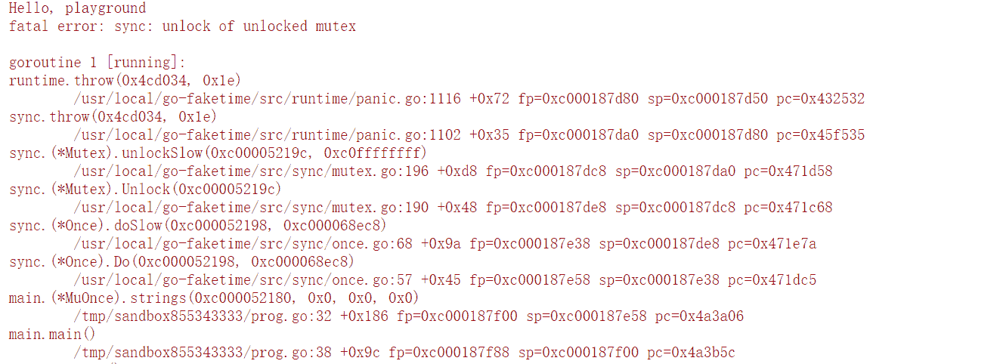

# 08｜Once：一個簡約而不簡單的併發原語

你好，我是鳥窩。

## 本章導讀

```text
                  sync.Once 執行一次模型

多個 goroutine 同時呼叫 once.Do(init)
          │
          ▼
    ┌──────────────┐
    │   sync.Once  │
    └──────┬───────┘
           │
   ┌───────┴──────────────┐
   ▼                      ▼
第一次進入             後續進入
執行 init()            直接略過
   │                      │
   └──────────┬───────────┘
              ▼
         全部返回（初始化只做一次）
```

這一講我來講一個簡單的併發原語：Once。為什麼要學習 Once 呢？我先給你答案：**Once 可以用來執行且僅僅執行一次動作，常常用於單例物件的初始化場景。**

那這節課，我們就從對單例物件進行初始化這件事兒說起。

初始化單例資源有很多方法，比如定義 package 級別的變數，這樣程式在啟動的時候就可以初始化：

```go
package abc

import time

var startTime = time.Now()
```

或者在 init 函式中進行初始化：

```go
package abc

var startTime time.Time

func init() {
  startTime = time.Now()
}
```

又或者在 main 函式開始執行的時候，執行一個初始化的函式：

```go
package abc

var startTime time.Tim

func initApp() {
    startTime = time.Now()
}
func main() {
  initApp()
}
```

這三種方法都是執行緒安全的，並且後兩種方法還可以根據傳入的引數實作定製化的初始化操作。

但是很多時候我們是要延遲進行初始化的，所以有時候單例資源的初始化，我們會使用下面的方法：

```go
package main

import (
    "net"
    "sync"
    "time"
)

// 使用互斥鎖保證執行緒(goroutine)安全
var connMu sync.Mutex
var conn net.Conn

func getConn() net.Conn {
    connMu.Lock()
    defer connMu.Unlock()

    // 返回已建立好的連線
    if conn != nil {
        return conn
    }

    // 建立連線
    conn, _ = net.DialTimeout("tcp", "baidu.com:80", 10*time.Second)
    return conn
}

// 使用連線
func main() {
    conn := getConn()
    if conn == nil {
        panic("conn is nil")
    }
}
```

這種方式雖然實作起來簡單，但是有效能問題。一旦連線建立好，每次請求的時候還是得競爭鎖才能讀取到這個連線，這是比較浪費資源的，因為連線如果建立好之後，其實就不需要鎖的保護了。怎麼辦呢？

這個時候就可以使用這一講要介紹的 Once 併發原語了。接下來我會詳細介紹 Once 的使用、實作和易錯場景。

# Once 的使用場景

**sync.Once 只暴露了一個方法 Do，你可以多次呼叫 Do 方法，但是隻有第一次呼叫 Do 方法時 f 引數才會執行，這裡的 f 是一個無引數無返回值的函式。**

```go
func (o *Once) Do(f func())
```

因為當且僅當第一次呼叫 Do 方法的時候引數 f 才會執行，即使第二次、第三次、第 n 次呼叫時 f 引數的值不一樣，也不會被執行，比如下面的例子，雖然 f1 和 f2 是不同的函式，但是第二個函式 f2 就不會執行。

```go
package main

import (
    "fmt"
    "sync"
)

func main() {
    var once sync.Once

    // 第一個初始化函式
    f1 := func() {
        fmt.Println("in f1")
    }
    once.Do(f1) // 打印出 in f1

    // 第二個初始化函式
    f2 := func() {
        fmt.Println("in f2")
    }
    once.Do(f2) // 無輸出
}
```

因為這裡的 f 引數是一個無引數無返回的函式，所以你可能會透過閉包的方式引用外面的引數，比如：

```go
    var addr = "baidu.com"

    var conn net.Conn
    var err error

    once.Do(func() {
        conn, err = net.Dial("tcp", addr)
    })
```

而且在實際的使用中，絕大多數情況下，你會使用閉包的方式去初始化外部的一個資源。

你看，Once 的使用場景很明確，所以，在標準庫內部實作中也常常能看到 Once 的身影。

比如標準庫內部cache的實作上，就使用了 Once 初始化 Cache 資源，包括 defaultDir 值的獲取：

```go
    func Default() *Cache { // 獲取預設的Cache
    defaultOnce.Do(initDefaultCache) // 初始化cache
    return defaultCache
  }
  
    // 定義一個全域性的cache變數，使用Once初始化，所以也定義了一個Once變數
  var (
    defaultOnce  sync.Once
    defaultCache *Cache
  )

    func initDefaultCache() { //初始化cache,也就是Once.Do使用的f函式
    ......
    defaultCache = c
  }

    // 其它一些Once初始化的變數，比如defaultDir
    var (
    defaultDirOnce sync.Once
    defaultDir     string
    defaultDirErr  error
  )
```

還有一些測試的時候初始化測試的資源（export_windows_test）：

```go
    // 測試window系統呼叫時區相關函式
    func ForceAusFromTZIForTesting() {
    ResetLocalOnceForTest()
        // 使用Once執行一次初始化
    localOnce.Do(func() { initLocalFromTZI(&aus) })
  }
```

除此之外，還有保證只呼叫一次 copyenv 的 envOnce，strings 包下的 Replacer，time 包中的測試，Go 拉取庫時的proxy，net.pipe，crc64，Regexp，…，數不勝數。我給你重點介紹一下很值得我們學習的 math/big/sqrt.go 中實作的一個資料結構，它透過 Once 封裝了一個只初始化一次的值：

```go
   // 值是3.0或者0.0的一個資料結構
   var threeOnce struct {
    sync.Once
    v *Float
  }
  
    // 返回此資料結構的值，如果還沒有初始化為3.0，則初始化
  func three() *Float {
    threeOnce.Do(func() { // 使用Once初始化
      threeOnce.v = NewFloat(3.0)
    })
    return threeOnce.v
  }
```

它將 sync.Once 和 \*Float 封裝成一個物件，提供了只初始化一次的值 v。 你看它的 three 方法的實作，雖然每次都呼叫 threeOnce.Do 方法，但是引數只會被呼叫一次。

當你使用 Once 的時候，你也可以嘗試採用這種結構，將值和 Once 封裝成一個新的資料結構，提供只初始化一次的值。

總結一下 Once 併發原語解決的問題和使用場景：**Once 常常用來初始化單例資源，或者併發訪問只需初始化一次的共享資源，或者在測試的時候初始化一次測試資源**。

瞭解了 Once 的使用場景，那應該怎樣實作一個 Once 呢？

# 如何實作一個 Once？

很多人認為實作一個 Once 一樣的併發原語很簡單，只需使用一個 flag 標記是否初始化過即可，最多是用 atomic 原子操作這個 flag，比如下面的實作：

```go
type Once struct {
    done uint32
}

func (o *Once) Do(f func()) {
    if !atomic.CompareAndSwapUint32(&o.done, 0, 1) {
        return
    }
    f()
}
```

這確實是一種實作方式，但是，這個實作有一個很大的問題，就是如果引數 f 執行很慢的話，後續呼叫 Do 方法的 goroutine 雖然看到 done 已經設定為執行過了，但是獲取某些初始化資源的時候可能會得到空的資源，因為 f 還沒有執行完。

所以，**一個正確的 Once 實作要使用一個互斥鎖，****這樣初始化的時候如果有併發的 goroutine，就會進入****doSlow 方法**。互斥鎖的機制保證只有一個 goroutine 進行初始化，同時利用**雙檢查的機制**（double-checking），再次判斷 o.done 是否為 0，如果為 0，則是第一次執行，執行完畢後，就將 o.done 設定為 1，然後釋放鎖。

即使此時有多個 goroutine 同時進入了 doSlow 方法，因為雙檢查的機制，後續的 goroutine 會看到 o.done 的值為 1，也不會再次執行 f。

這樣既保證了併發的 goroutine 會等待 f 完成，而且還不會多次執行 f。

```go
type Once struct {
    done uint32
    m    Mutex
}

func (o *Once) Do(f func()) {
    if atomic.LoadUint32(&o.done) == 0 {
        o.doSlow(f)
    }
}

func (o *Once) doSlow(f func()) {
    o.m.Lock()
    defer o.m.Unlock()
    // 雙檢查
    if o.done == 0 {
        defer atomic.StoreUint32(&o.done, 1)
        f()
    }
}
```

好了，到這裡我們就瞭解了 Once 的使用場景，很明確，同時呢，也感受到 Once 的實作也是相對簡單的。在實踐中，其實很少會出現錯誤使用 Once 的情況，但是就像墨菲定律說的，凡是可能出錯的事就一定會出錯。使用 Once 也有可能出現兩種錯誤場景，儘管非常罕見。我這裡提前講給你，咱打個預防針。

# 使用 Once 可能出現的 2 種錯誤

## 第一種錯誤：死鎖

你已經知道了 Do 方法會執行一次 f，但是如果 f 中再次呼叫這個 Once 的 Do 方法的話，就會導致死鎖的情況出現。這還不是無限遞迴的情況，而是的的確確的 Lock 的遞迴呼叫導致的死鎖。

```go
func main() {
    var once sync.Once
    once.Do(func() {
        once.Do(func() {
            fmt.Println("初始化")
        })
    })
}
```

當然，想要避免這種情況的出現，就不要在 f 引數中呼叫當前的這個 Once，不管是直接的還是間接的。

## 第二種錯誤：未初始化

如果 f 方法執行的時候 panic，或者 f 執行初始化資源的時候失敗了，這個時候，Once 還是會認為初次執行已經成功了，即使再次呼叫 Do 方法，也不會再次執行 f。

比如下面的例子，由於一些防火牆的原因，googleConn 並沒有被正確的初始化，後面如果想當然認為既然執行了 Do 方法 googleConn 就已經初始化的話，會丟擲空指標的錯誤：

```go
func main() {
    var once sync.Once
    var googleConn net.Conn // 到Google網站的一個連線

    once.Do(func() {
        // 建立到google.com的連線，有可能因為網路的原因，googleConn並沒有建立成功，此時它的值為nil
        googleConn, _ = net.Dial("tcp", "google.com:80")
    })
    // 傳送http請求
    googleConn.Write([]byte("GET / HTTP/1.1\r\nHost: google.com\r\n Accept: */*\r\n\r\n"))
    io.Copy(os.Stdout, googleConn)
}
```

既然執行過 Once.Do 方法也可能因為函式執行失敗的原因未初始化資源，並且以後也沒機會再次初始化資源，那麼這種初始化未完成的問題該怎麼解決呢？

這裡我來告訴你一招獨家秘笈，我們可以**自己實作一個類似 Once 的併發原語**，既可以返回當前呼叫 Do 方法是否正確完成，還可以在初始化失敗後呼叫 Do 方法再次嘗試初始化，直到初始化成功才不再初始化了。

```go
// 一個功能更加強大的Once
type Once struct {
    m    sync.Mutex
    done uint32
}
// 傳入的函式f有返回值error，如果初始化失敗，需要返回失敗的error
// Do方法會把這個error返回給呼叫者
func (o *Once) Do(f func() error) error {
    if atomic.LoadUint32(&o.done) == 1 { //fast path
        return nil
    }
    return o.slowDo(f)
}
// 如果還沒有初始化
func (o *Once) slowDo(f func() error) error {
    o.m.Lock()
    defer o.m.Unlock()
    var err error
    if o.done == 0 { // 雙檢查，還沒有初始化
        err = f()
        if err == nil { // 初始化成功才將標記置為已初始化
            atomic.StoreUint32(&o.done, 1)
        }
    }
    return err
}
```

我們所做的改變就是 Do 方法和引數 f 函式都會返回 error，如果 f 執行失敗，會把這個錯誤資訊返回。

對 slowDo 方法也做了調整，如果 f 呼叫失敗，我們不會更改 done 欄位的值，這樣後續 degoroutine 還會繼續呼叫 f。如果 f 執行成功，才會修改 done 的值為 1。

可以說，真是一頓操作猛如虎，我們使用 Once 有點得心應手的感覺了。等等，還有個問題，我們怎麼查詢是否初始化過呢？

目前的 Once 實作可以保證你呼叫任意次數的 once.Do 方法，它只會執行這個方法一次。但是，有時候我們需要打一個標記。如果初始化後我們就去執行其它的操作，標準庫的 Once 並不會告訴你是否初始化完成了，只是讓你放心大膽地去執行 Do 方法，所以，**你還需要一個輔助變數，自己去檢查是否初始化過了**，比如透過下面的程式碼中的 inited 欄位：

```go
type AnimalStore struct {once   sync.Once;inited uint32}
func (a *AnimalStore) Init() // 可以被併發呼叫
  a.once.Do(func() {
    longOperationSetupDbOpenFilesQueuesEtc()
    atomic.StoreUint32(&a.inited, 1)
  })
}
func (a *AnimalStore) CountOfCats() (int, error) { // 另外一個goroutine
  if atomic.LoadUint32(&a.inited) == 0 { // 初始化後才會執行真正的業務邏輯
    return 0, NotYetInitedError
  }
        //Real operation
}
```

當然，透過這段程式碼，我們可以解決這類問題，但是，如果官方的 Once 型別有 Done 這樣一個方法的話，我們就可以直接使用了。這是有人在 Go 程式碼庫中提出的一個 issue(\#41690)。對於這類問題，一般都會被建議採用其它型別，或者自己去擴充套件。我們可以嘗試擴充套件這個併發原語：

```go
// Once 是一個擴充套件的sync.Once型別，提供了一個Done方法
type Once struct {
    sync.Once
}

// Done 返回此Once是否執行過
// 如果執行過則返回true
// 如果沒有執行過或者正在執行，返回false
func (o *Once) Done() bool {
    return atomic.LoadUint32((*uint32)(unsafe.Pointer(&o.Once))) == 1
}

func main() {
    var flag Once
    fmt.Println(flag.Done()) //false

    flag.Do(func() {
        time.Sleep(time.Second)
    })

    fmt.Println(flag.Done()) //true
}
```

好了，到這裡關於併發原語 Once 的內容我講得就差不多了。最後呢，和你分享一個 Once 的踩坑案例。

其實啊，使用 Once 真的不容易犯錯，想犯錯都很困難，因為很少有人會傻傻地在初始化函式 f 中遞迴呼叫 f，這種死鎖的現象幾乎不會發生。另外如果函式初始化不成功，我們一般會 panic，或者在使用的時候做檢查，會及早發現這個問題，在初始化函式中加強程式碼。

所以檢視大部分的 Go 專案，幾乎找不到 Once 的錯誤使用場景，不過我還是發現了一個。這個 issue 先從另外一個需求 (go#25955) 談起。

# Once 的踩坑案例

go#25955 有網友提出一個需求，希望 Once 提供一個 Reset 方法，能夠將 Once 重置為初始化的狀態。比如下面的例子，St 透過兩個 Once 控制它的 Open/Close 狀態。但是在 Close 之後再呼叫 Open 的話，不會再執行 init 函式，因為 Once 只會執行一次初始化函式。

```go
type St struct {
    openOnce *sync.Once
    closeOnce *sync.Once
}

func(st *St) Open(){
    st.openOnce.Do(func() { ... }) // init
    ...
}

func(st *St) Close(){
    st.closeOnce.Do(func() { ... }) // deinit
    ...
}
```

所以提交這個 Issue 的開發者希望 Once 增加一個 Reset 方法，Reset 之後再呼叫 once.Do 就又可以初始化了。

Go 的核心開發者 Ian Lance Taylor 給他了一個簡單的解決方案。在這個例子中，只使用一個 ponce \*sync.Once 做初始化，Reset 的時候給 ponce 這個變數賦值一個新的 Once 例項即可 (ponce = new(sync.Once))。Once 的本意就是執行一次，所以 Reset 破壞了這個併發原語的本意。

這個解決方案一點都沒問題，可以很好地解決這位開發者的需求。Docker 較早的版本（1.11.2）中使用了它們的一個網路庫 libnetwork，這個網路庫在使用 Once 的時候就使用 Ian Lance Taylor 介紹的方法，但是不幸的是，它的 Reset 方法中又改變了 Once 指標的值，導致程式 panic 了。原始邏輯比較複雜，一個簡化版可重現的程式碼如下：

```go
package main

import (
  "fmt"
  "sync"
  "time"
)

// 一個組合的併發原語
type MuOnce struct {
  sync.RWMutex
  sync.Once
  mtime time.Time
  vals  []string
}

// 相當於reset方法，會將m.Once重新複製一個Once
func (m *MuOnce) refresh() {
  m.Lock()
  defer m.Unlock()
  m.Once = sync.Once{}
  m.mtime = time.Now()
  m.vals = []string{m.mtime.String()}
}

// 獲取某個初始化的值，如果超過某個時間，會reset Once
func (m *MuOnce) strings() []string {
  now := time.Now()
  m.RLock()
  if now.After(m.mtime) {
    defer m.Do(m.refresh) // 使用refresh函式重新初始化
  }
  vals := m.vals
  m.RUnlock()
  return vals
}

func main() {
  fmt.Println("Hello, playground")
  m := new(MuOnce)
  fmt.Println(m.strings())
  fmt.Println(m.strings())
}
```

如果你執行這段程式碼就會 panic:



原因在於第 31 行執行 m.Once.Do 方法的時候，使用的是 m.Once 的指標，然後呼叫 m.refresh，在執行 m.refresh 的時候 Once 內部的 Mutex 首先會加鎖（可以再翻看一下這一講的 Once 的實作原理）， 但是，在 refresh 中更改了 Once 指標的值之後，結果在執行完 refresh 釋放鎖的時候，釋放的是一個剛初始化未加鎖的 Mutex，所以就 panic 了。

如果你還不太明白，我再給你簡化成一個更簡單的例子：

```go
package main

import (
    "sync"
)

type Once struct {
    m sync.Mutex
}

func (o *Once) doSlow() {
    o.m.Lock()
    defer o.m.Unlock()

    // 這裡更新的o指標的值!!!!!!!, 會導致上一行Unlock出錯
    *o = Once{}
}

func main() {
    var once Once
    once.doSlow()
}
```

doSlow 方法就演示了這個錯誤。Ian Lance Taylor 介紹的 Reset 方法沒有錯誤，但是你在使用的時候千萬別再初始化函式中 Reset 這個 Once，否則勢必會導致 Unlock 一個未加鎖的 Mutex 的錯誤。

總的來說，這還是對 Once 的實作機制不熟悉，又進行復雜使用導致的錯誤。不過最新版的 libnetwork 相關的地方已經去掉了 Once 的使用了。所以，我帶你一起來看這個案例，主要目的還是想鞏固一下我們對 Once 的理解。

# 總結

今天我們一起學習了 Once，我們常常使用它來實作單例模式。

單例是 23 種設計模式之一，也是常常引起爭議的設計模式之一，甚至有人把它歸為反模式。為什麼說它是反模式呢，我拿標準庫中的單例模式給你介紹下。

因為 Go 沒有 immutable 型別，導致我們宣告的全域性變數都是可變的，別的地方或者第三方庫可以隨意更改這些變數。比如 package io 中定義了幾個全域性變數，比如 io.EOF：

```go
var EOF = errors.New("EOF")
```

因為它是一個 package 級別的變數，我們可以在程式中偷偷把它改了，這會導致一些依賴 io.EOF 這個變數做判斷的程式碼出錯。

```go
io.EOF = errors.New("我們自己定義的EOF")
```

從我個人的角度來說，一些單例（全域性變數）的確很方便，比如 Buffer 池或者連線池，所以有時候我們也不要談虎色變。雖然有人把單例模式稱之為反模式，但畢竟只能代表一部分開發者的觀點，否則也不會把它列在 23 種設計模式中了。

如果你真的擔心這個 package 級別的變數被人修改，你可以不把它們暴露出來，而是提供一個只讀的 GetXXX 的方法，這樣別人就不會進行修改了。

而且，Once 不只應用於單例模式，一些變數在也需要在使用的時候做延遲初始化，所以也是可以使用 Once 處理這些場景的。

總而言之，Once 的應用場景還是很廣泛的。**一旦你遇到只需要初始化一次的場景，首先想到的就應該是 Once 併發原語。**


# 思考題

1.  我已經分析了幾個併發原語的實作，你可能注意到總是有些 slowXXXX 的方法，從 XXXX 方法中單獨抽取出來，你明白為什麼要這麼做嗎，有什麼好處？
2.  Once 在第一次使用之後，還能複製給其它變數使用嗎？

歡迎在留言區寫下你的思考和答案，我們一起交流討論。如果你覺得有所收穫，也歡迎你把今天的內容分享給你的朋友或同事。
