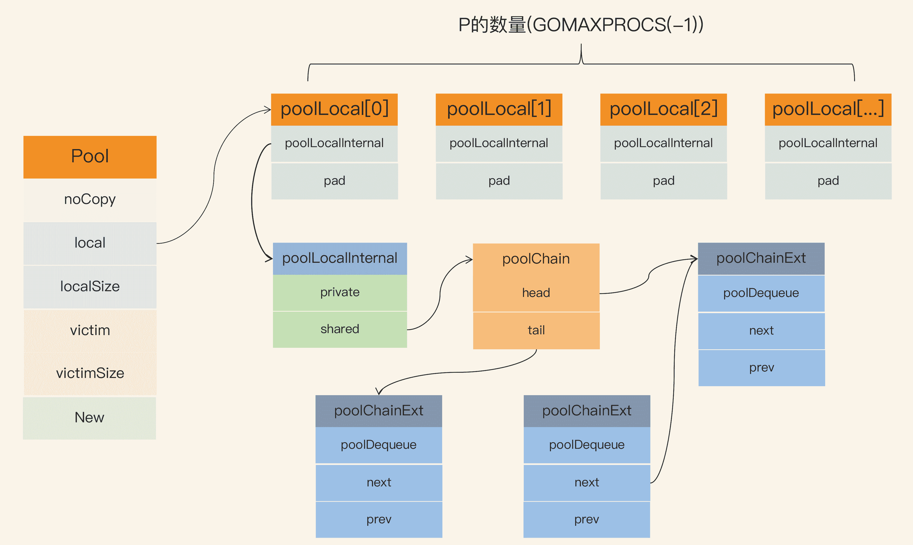
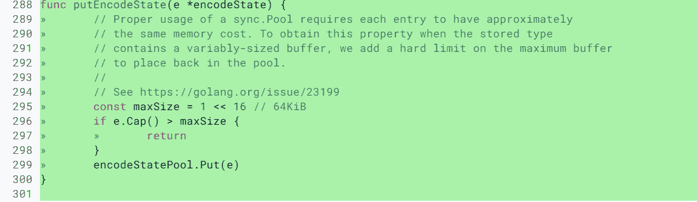
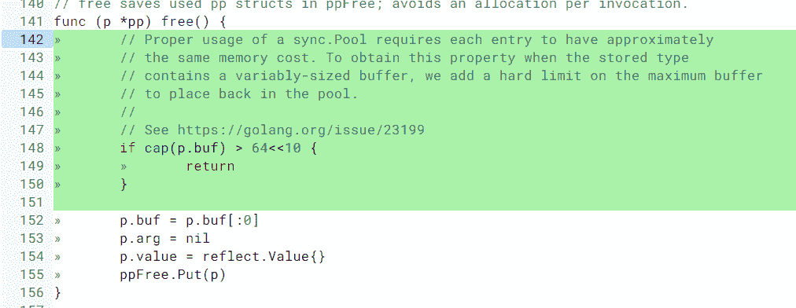

# 10｜Pool：效能提升大殺器

你好，我是鳥窩。

## 本章導讀

```text
                   sync.Pool 物件重用流程

┌──────────────┐    Get()     ┌──────────────┐
│ 業務程式碼     │ ──────────> │  sync.Pool   │
└──────┬───────┘              └──────┬───────┘
       │                              │ 取到既有物件 / New() 建立
       ▼                              ▼
   使用物件 ----------------------> 完成後 Put() 放回池中

重點：減少短命物件配置，降低 GC 壓力（但不保證一定命中）
```

Go 是一個自動垃圾回收的程式語言，採用三色併發標記演算法標記物件並回收。和其它沒有自動垃圾回收的程式語言不同，使用 Go 語言建立物件的時候，我們沒有回收 / 釋放的心理負擔，想用就用，想建立就建立。

但是，**如果你想使用 Go 開發一個高效能的應用程式的話，就必須考慮垃圾回收給效能帶來的影響**，畢竟，Go 的自動垃圾回收機制還是有一個 STW（stop-the-world，程式暫停）的時間，而且，大量地建立在堆上的物件，也會影響垃圾回收標記的時間。

所以，一般我們做效能最佳化的時候，會採用物件池的方式，把不用的物件回收起來，避免被垃圾回收掉，這樣使用的時候就不必在堆上重新建立了。

不止如此，像資料庫連線、TCP 的長連線，這些連線在建立的時候是一個非常耗時的操作。如果每次都建立一個新的連線物件，耗時較長，很可能整個業務的大部分耗時都花在了建立連線上。

所以，如果我們能把這些連線儲存下來，避免每次使用的時候都重新建立，不僅可以大大減少業務的耗時，還能提高應用程式的整體效能。

Go 標準庫中提供了一個通用的 Pool 資料結構，也就是 sync.Pool，我們使用它可以建立池化的物件。這節課我會詳細給你介紹一下 sync.Pool 的使用方法、實作原理以及常見的坑，幫助你全方位地掌握標準庫的 Pool。

不過，這個型別也有一些使用起來不太方便的地方，就是**它池化的物件可能會被垃圾回收掉**，這對於資料庫長連線等場景是不合適的。所以在這一講中，我會專門介紹其它的一些 Pool，包括 TCP 連線池、資料庫連線池等等。

除此之外，我還會專門介紹一個池的應用場景： Worker Pool，或者叫做 goroutine pool，這也是常用的一種併發模式，可以使用有限的 goroutine 資源去處理大量的業務資料。

# sync.Pool

首先，我們來學習下標準庫提供的 sync.Pool 資料型別。

sync.Pool 資料型別用來儲存一組可獨立訪問的**臨時**物件。請注意這裡加粗的“臨時”這兩個字，它說明瞭 sync.Pool 這個資料型別的特點，也就是說，它池化的物件會在未來的某個時候被毫無預兆地移除掉。而且，如果沒有別的物件引用這個被移除的物件的話，這個被移除的物件就會被垃圾回收掉。

因為 Pool 可以有效地減少新物件的申請，從而提高程式效能，所以 Go 內部庫也用到了 sync.Pool，比如 fmt 包，它會使用一個動態大小的 buffer 池做輸出快取，當大量的 goroutine 併發輸出的時候，就會建立比較多的 buffer，並且在不需要的時候回收掉。

有兩個知識點你需要記住：

1.  sync.Pool 本身就是執行緒安全的，多個 goroutine 可以併發地呼叫它的方法存取物件；
2.  sync.Pool 不可在使用之後再複製使用。

## sync.Pool 的使用方法

知道了 sync.Pool 這個資料型別的特點，接下來，我們來學習下它的使用方法。其實，這個資料型別不難，它只提供了三個對外的方法：New、Get 和 Put。

**1.New**

Pool struct 包含一個 New 欄位，這個欄位的型別是函式 func() interface{}。當呼叫 Pool 的 Get 方法從池中獲取元素，沒有更多的空閒元素可返回時，就會呼叫這個 New 方法來建立新的元素。如果你沒有設定 New 欄位，沒有更多的空閒元素可返回時，Get 方法將返回 nil，表明當前沒有可用的元素。

有趣的是，New 是可變的欄位。這就意味著，你可以在程式執行的時候改變建立元素的方法。當然，很少有人會這麼做，因為一般我們建立元素的邏輯都是一致的，要建立的也是同一類的元素，所以你在使用 Pool 的時候也沒必要玩一些“花活”，在程式執行時更改 New 的值。

**2.Get**

如果呼叫這個方法，就會從 Pool**取走**一個元素，這也就意味著，這個元素會從 Pool 中移除，返回給呼叫者。不過，除了返回值是正常例項化的元素，Get 方法的返回值還可能會是一個 nil（Pool.New 欄位沒有設定，又沒有空閒元素可以返回），所以你在使用的時候，可能需要判斷。

**3.Put**

這個方法用於將一個元素返還給 Pool，Pool 會把這個元素儲存到池中，並且可以複用。但如果 Put 一個 nil 值，Pool 就會忽略這個值。

好了，瞭解了這幾個方法，下面我們看看 sync.Pool 最常用的一個場景：buffer 池（緩衝池）。

因為 byte slice 是經常被建立銷燬的一類物件，使用 buffer 池可以快取已經建立的 byte slice，比如，著名的靜態網站生成工具 Hugo 中，就包含這樣的實作bufpool，你可以看一下下面這段程式碼：

```go
var buffers = sync.Pool{
  New: func() interface{} { 
    return new(bytes.Buffer)
  },
}

func GetBuffer() *bytes.Buffer {
  return buffers.Get().(*bytes.Buffer)
}

func PutBuffer(buf *bytes.Buffer) {
  buf.Reset()
  buffers.Put(buf)
}
```

除了 Hugo，這段 buffer 池的程式碼非常常用。很可能你在閱讀其它專案的程式碼的時候就碰到過，或者是你自己實作 buffer 池的時候也會這麼去實作，但是請你注意了，這段程式碼是有問題的，你一定不要將上面的程式碼應用到實際的產品中。它可能會有記憶體洩漏的問題，下面我會重點講這個問題。

## 實作原理

瞭解了 sync.Pool 的基本使用方法，下面我們就來重點學習下它的實作。

Go 1.13 之前的 sync.Pool 的實作有 2 大問題：

**1. 每次 GC 都會回收建立的物件。**

如果快取元素數量太多，就會導致 STW 耗時變長；快取元素都被回收後，會導致 Get 命中率下降，Get 方法不得不新建立很多物件。

**2. 底層實作使用了 Mutex，對這個鎖併發請求競爭激烈的時候，會導致效能的下降。**

在 Go 1.13 中，sync.Pool 做了大量的最佳化。前幾講中我提到過，提高併發程式效能的最佳化點是儘量不要使用鎖，如果不得已使用了鎖，就把鎖 Go 的粒度降到最低。**Go 對 Pool 的最佳化就是避免使用鎖，同時將加鎖的 queue 改成 lock-free 的 queue 的實作，給即將移除的元素再多一次“復活”的機會。**

當前，sync.Pool 的資料結構如下圖所示：



Pool 最重要的兩個欄位是 local 和 victim，因為它們兩個主要用來儲存空閒的元素。弄清楚這兩個欄位的處理邏輯，你就能完全掌握 sync.Pool 的實作了。下面我們來看看這兩個欄位的關係。

每次垃圾回收的時候，Pool 會把 victim 中的物件移除，然後把 local 的資料給 victim，這樣的話，local 就會被清空，而 victim 就像一個垃圾分揀站，裡面的東西可能會被當做垃圾丟棄了，但是裡面有用的東西也可能被撿回來重新使用。

victim 中的元素如果被 Get 取走，那麼這個元素就很幸運，因為它又“活”過來了。但是，如果這個時候 Get 的併發不是很大，元素沒有被 Get 取走，那麼就會被移除掉，因為沒有別人引用它的話，就會被垃圾回收掉。

下面的程式碼是垃圾回收時 sync.Pool 的處理邏輯：

```go
func poolCleanup() {
    // 丟棄當前victim, STW所以不用加鎖
    for _, p := range oldPools {
        p.victim = nil
        p.victimSize = 0
    }

    // 將local複製給victim, 並將原local置為nil
    for _, p := range allPools {
        p.victim = p.local
        p.victimSize = p.localSize
        p.local = nil
        p.localSize = 0
    }

    oldPools, allPools = allPools, nil
}
```

在這段程式碼中，你需要關注一下 local 欄位，因為所有當前主要的空閒可用的元素都存放在 local 欄位中，請求元素時也是優先從 local 欄位中查詢可用的元素。local 欄位包含一個 poolLocalInternal 欄位，並提供 CPU 快取對齊，從而避免 false sharing。

而 poolLocalInternal 也包含兩個欄位：private 和 shared。

1.  private，代表一個快取的元素，而且只能由相應的一個 P 存取。因為一個 P 同時只能執行一個 goroutine，所以不會有併發的問題。
2.  shared，可以由任意的 P 訪問，但是隻有本地的 P 才能 pushHead/popHead，其它 P 可以 popTail，相當於只有一個本地的 P 作為生產者（Producer），多個 P 作為消費者（Consumer），它是使用一個 local-free 的 queue 列表實作的。

### Get 方法

我們來看看 Get 方法的具體實作原理。

```go
func (p *Pool) Get() interface{} {
    // 把當前goroutine固定在當前的P上
    l, pid := p.pin()
    x := l.private // 優先從local的private欄位取，快速
    l.private = nil
    if x == nil {
        // 從當前的local.shared彈出一個，注意是從head讀取並移除
        x, _ = l.shared.popHead()
        if x == nil { // 如果沒有，則去偷一個
            x = p.getSlow(pid) 
        }
    }
    runtime_procUnpin()
    // 如果沒有獲取到，嘗試使用New函式生成一個新的
    if x == nil && p.New != nil {
        x = p.New()
    }
    return x
}
```

我來給你解釋下這段程式碼。首先，從本地的 private 欄位中獲取可用元素，因為沒有鎖，獲取元素的過程會非常快，如果沒有獲取到，就嘗試從本地的 shared 獲取一個，如果還沒有，會使用 getSlow 方法去其它的 shared 中“偷”一個。最後，如果沒有獲取到，就嘗試使用 New 函式建立一個新的。

這裡的重點是 getSlow 方法，我們來分析下。看名字也就知道了，它的耗時可能比較長。它首先要遍歷所有的 local，嘗試從它們的 shared 彈出一個元素。如果還沒找到一個，那麼，就開始對 victim 下手了。

在 vintim 中查詢可用元素的邏輯還是一樣的，先從對應的 victim 的 private 查詢，如果查不到，就再從其它 victim 的 shared 中查詢。

下面的程式碼是 getSlow 方法的主要邏輯：

```go
func (p *Pool) getSlow(pid int) interface{} {

    size := atomic.LoadUintptr(&p.localSize)
    locals := p.local                       
    // 從其它proc中嘗試偷取一個元素
    for i := 0; i < int(size); i++ {
        l := indexLocal(locals, (pid+i+1)%int(size))
        if x, _ := l.shared.popTail(); x != nil {
            return x
        }
    }

    // 如果其它proc也沒有可用元素，那麼嘗試從vintim中獲取
    size = atomic.LoadUintptr(&p.victimSize)
    if uintptr(pid) >= size {
        return nil
    }
    locals = p.victim
    l := indexLocal(locals, pid)
    if x := l.private; x != nil { // 同樣的邏輯，先從vintim中的local private獲取
        l.private = nil
        return x
    }
    for i := 0; i < int(size); i++ { // 從vintim其它proc嘗試偷取
        l := indexLocal(locals, (pid+i)%int(size))
        if x, _ := l.shared.popTail(); x != nil {
            return x
        }
    }

    // 如果victim中都沒有，則把這個victim標記為空，以後的查詢可以快速跳過了
    atomic.StoreUintptr(&p.victimSize, 0)

    return nil
}
```

這裡我沒列出 pin 程式碼的實作，你只需要知道，pin 方法會將此 goroutine 固定在當前的 P 上，避免查詢元素期間被其它的 P 執行。固定的好處就是查詢元素期間直接得到跟這個 P 相關的 local。有一點需要注意的是，pin 方法在執行的時候，如果跟這個 P 相關的 local 還沒有建立，或者執行時 P 的數量被修改了的話，就會新建立 local。

### Put 方法

我們來看看 Put 方法的具體實作原理。

```go
func (p *Pool) Put(x interface{}) {
    if x == nil { // nil值直接丟棄
        return
    }
    l, _ := p.pin()
    if l.private == nil { // 如果本地private沒有值，直接設定這個值即可
        l.private = x
        x = nil
    }
    if x != nil { // 否則加入到本地佇列中
        l.shared.pushHead(x)
    }
    runtime_procUnpin()
}
```

Put 的邏輯相對簡單，優先設定本地 private，如果 private 欄位已經有值了，那麼就把此元素 push 到本地佇列中。

## sync.Pool 的坑

到這裡，我們就掌握了 sync.Pool 的使用方法和實作原理，接下來，我要再和你聊聊容易踩的兩個坑，分別是記憶體洩漏和記憶體浪費。

### 記憶體洩漏

這節課剛開始的時候，我講到，可以使用 sync.Pool 做 buffer 池，但是，如果用剛剛的那種方式做 buffer 池的話，可能會有記憶體洩漏的風險。為啥這麼說呢？我們來分析一下。

取出來的 bytes.Buffer 在使用的時候，我們可以往這個元素中增加大量的 byte 資料，這會導致底層的 byte slice 的容量可能會變得很大。這個時候，即使 Reset 再放回到池子中，這些 byte slice 的容量不會改變，所佔的空間依然很大。而且，因為 Pool 回收的機制，這些大的 Buffer 可能不被回收，而是會一直佔用很大的空間，這屬於記憶體洩漏的問題。

即使是 Go 的標準庫，在記憶體洩漏這個問題上也栽了幾次坑，比如 issue 23199、@dsnet提供了一個簡單的可重現的例子，演示了記憶體洩漏的問題。再比如 encoding、json 中類似的問題：將容量已經變得很大的 Buffer 再放回 Pool 中，導致記憶體洩漏。後來在元素放回時，增加了檢查邏輯，改成放回的超過一定大小的 buffer，就直接丟棄掉，不再放到池子中，如下所示：



package fmt 中也有這個問題，修改方法是一樣的，超過一定大小的 buffer，就直接丟棄了：



在使用 sync.Pool 回收 buffer 的時候，**一定要檢查回收的物件的大小。**如果 buffer 太大，就不要回收了，否則就太浪費了。

### 記憶體浪費

除了記憶體洩漏以外，還有一種浪費的情況，就是池子中的 buffer 都比較大，但在實際使用的時候，很多時候只需要一個小的 buffer，這也是一種浪費現象。接下來，我就講解一下這種情況的處理方法。

要做到物盡其用，儘可能不浪費的話，我們可以將 buffer 池分成幾層。首先，小於 512 byte 的元素的 buffer 佔一個池子；其次，小於 1K byte 大小的元素佔一個池子；再次，小於 4K byte 大小的元素佔一個池子。這樣分成幾個池子以後，就可以根據需要，到所需大小的池子中獲取 buffer 了。

在標準庫 net/http/server.go中的程式碼中，就提供了 2K 和 4K 兩個 writer 的池子。你可以看看下面這段程式碼：


YouTube 開源的知名專案 vitess 中提供了bucketpool的實作，它提供了更加通用的多層 buffer 池。你在使用的時候，只需要指定池子的最大和最小尺寸，vitess 就會自動計算出合適的池子數。而且，當你呼叫 Get 方法的時候，只需要傳入你要獲取的 buffer 的大小，就可以了。下面這段程式碼就描述了這個過程，你可以看看：


# 第三方庫

除了這種分層的為了節省空間的 buffer 設計外，還有其它的一些第三方的庫也會提供 buffer 池的功能。接下來我帶你熟悉幾個常用的第三方的庫。

1.bytebufferpool

這是 fasthttp 作者 valyala 提供的一個 buffer 池，基本功能和 sync.Pool 相同。它的底層也是使用 sync.Pool 實作的，包括會檢測最大的 buffer，超過最大尺寸的 buffer，就會被丟棄。

valyala 一向很擅長挖掘系統的效能，這個庫也不例外。它提供了校準（calibrate，用來動態調整建立元素的權重）的機制，可以“智慧”地調整 Pool 的 defaultSize 和 maxSize。一般來說，我們使用 buffer size 的場景比較固定，所用 buffer 的大小會集中在某個範圍裡。有了校準的特性，bytebufferpool 就能夠偏重於建立這個範圍大小的 buffer，從而節省空間。

2.oxtoacart/bpool

這也是比較常用的 buffer 池，它提供了以下幾種型別的 buffer。

1.  bpool.BufferPool： 提供一個固定元素數量的 buffer 池，元素型別是 bytes.Buffer，如果超過這個數量，Put 的時候就丟棄，如果池中的元素都被取光了，會新建一個返回。Put 回去的時候，不會檢測 buffer 的大小。
2.  bpool.BytesPool：提供一個固定元素數量的 byte slice 池，元素型別是 byte slice。Put 回去的時候不檢測 slice 的大小。
3.  bpool.SizedBufferPool： 提供一個固定元素數量的 buffer 池，如果超過這個數量，Put 的時候就丟棄，如果池中的元素都被取光了，會新建一個返回。Put 回去的時候，會檢測 buffer 的大小，超過指定的大小的話，就會建立一個新的滿足條件的 buffer 放回去。

bpool 最大的特色就是能夠保持池子中元素的數量，一旦 Put 的數量多於它的閾值，就會自動丟棄，而 sync.Pool 是一個沒有限制的池子，只要 Put 就會收進去。

bpool 是基於 Channel 實作的，不像 sync.Pool 為了提高效能而做了很多最佳化，所以，在效能上比不過 sync.Pool。不過，它提供了限制 Pool 容量的功能，所以，如果你想控制 Pool 的容量的話，可以考慮這個庫。

# 連線池

Pool 的另一個很常用的一個場景就是保持 TCP 的連線。一個 TCP 的連線建立，需要三次握手等過程，如果是 TLS 的，還會需要更多的步驟，如果加上身份認證等邏輯的話，耗時會更長。所以，為了避免每次通訊的時候都新建立連線，我們一般會建立一個連線的池子，預先把連線建立好，或者是逐步把連線放在池子中，減少連線建立的耗時，從而提高系統的效能。

事實上，我們很少會使用 sync.Pool 去池化連線物件，原因就在於，sync.Pool 會無通知地在某個時候就把連線移除垃圾回收掉了，而我們的場景是需要長久保持這個連線，所以，我們一般會使用其它方法來池化連線，比如接下來我要講到的幾種需要保持長連線的 Pool。

## 標準庫中的 http client 池

標準庫的 http.Client 是一個 http client 的庫，可以用它來訪問 web 伺服器。為了提高效能，這個 Client 的實作也是透過池的方法來快取一定數量的連線，以便後續重用這些連線。

http.Client 實作連線池的程式碼是在 Transport 型別中，它使用 idleConn 儲存持久化的可重用的長連線：


## TCP 連線池

最常用的一個 TCP 連線池是 fatih 開發的fatih/pool，雖然這個專案已經被 fatih 歸檔（Archived），不再維護了，但是因為它相當穩定了，我們可以開箱即用。即使你有一些特殊的需求，也可以 fork 它，然後自己再做修改。

它的使用套路如下：

```go
// 工廠模式，提供建立連線的工廠方法
factory    := func() (net.Conn, error) { return net.Dial("tcp", "127.0.0.1:4000") }

// 建立一個tcp池，提供初始容量和最大容量以及工廠方法
p, err := pool.NewChannelPool(5, 30, factory)

// 獲取一個連線
conn, err := p.Get()

// Close並不會真正關閉這個連線，而是把它放回池子，所以你不必顯式地Put這個物件到池子中
conn.Close()

// 透過呼叫MarkUnusable, Close的時候就會真正關閉底層的tcp的連線了
if pc, ok := conn.(*pool.PoolConn); ok {
  pc.MarkUnusable()
  pc.Close()
}

// 關閉池子就會關閉=池子中的所有的tcp連線
p.Close()

// 當前池子中的連線的數量
current := p.Len()
```

雖然我一直在說 TCP，但是它管理的是更通用的 net.Conn，不侷限於 TCP 連線。

它透過把 net.Conn 包裝成 PoolConn，實作了攔截 net.Conn 的 Close 方法，避免了真正地關閉底層連線，而是把這個連線放回到池中：

```go
    type PoolConn struct {
    net.Conn
    mu       sync.RWMutex
    c        *channelPool
    unusable bool
  }
  
    //攔截Close
  func (p *PoolConn) Close() error {
    p.mu.RLock()
    defer p.mu.RUnlock()
  
    if p.unusable {
      if p.Conn != nil {
        return p.Conn.Close()
      }
      return nil
    }
    return p.c.put(p.Conn)
  }
```

它的 Pool 是透過 Channel 實作的，空閒的連線放入到 Channel 中，這也是 Channel 的一個應用場景：

```go
    type channelPool struct {
    // 儲存連線池的channel
    mu    sync.RWMutex
    conns chan net.Conn
  

    // net.Conn 的產生器
    factory Factory
  }資料庫連線池標準庫 sql.DB 還提供了一個通用的資料庫的連線池，透過 MaxOpenConns 和 MaxIdleConns 控制最大的連線數和最大的 idle 的連線數。預設的 MaxIdleConns 是 2，這個數對於資料庫相關的應用來說太小了，我們一般都會調整它。
```


DB 的 freeConn 儲存了 idle 的連線，這樣，當我們獲取資料庫連線的時候，它就會優先嚐試從 freeConn 獲取已有的連線（conn）。


## Memcached Client 連線池

Brad Fitzpatrick 是知名快取庫 Memcached 的原作者，前 Go 團隊成員。gomemcache是他使用 Go 開發的 Memchaced 的客戶端，其中也用了連線池的方式池化 Memcached 的連線。接下來讓我們看看它的連線池的實作。

gomemcache Client 有一個 freeconn 的欄位，用來儲存空閒的連線。當一個請求使用完之後，它會呼叫 putFreeConn 放回到池子中，請求的時候，呼叫 getFreeConn 優先查詢 freeConn 中是否有可用的連線。它採用 Mutex+Slice 實作 Pool：

```go
   // 放回一個待重用的連線
   func (c *Client) putFreeConn(addr net.Addr, cn *conn) {
    c.lk.Lock()
    defer c.lk.Unlock()
    if c.freeconn == nil { // 如果物件為空，建立一個map物件
      c.freeconn = make(map[string][]*conn)
    }
    freelist := c.freeconn[addr.String()] //得到此地址的連線列表
    if len(freelist) >= c.maxIdleConns() {//如果連線已滿,關閉，不再放入
      cn.nc.Close()
      return
    }
    c.freeconn[addr.String()] = append(freelist, cn) // 加入到空閒列表中
  }
  
    // 得到一個空閒連線
  func (c *Client) getFreeConn(addr net.Addr) (cn *conn, ok bool) {
    c.lk.Lock()
    defer c.lk.Unlock()
    if c.freeconn == nil { 
      return nil, false
    }
    freelist, ok := c.freeconn[addr.String()]
    if !ok || len(freelist) == 0 { // 沒有此地址的空閒列表，或者列表為空
      return nil, false
    }
    cn = freelist[len(freelist)-1] // 取出尾部的空閒連線
    c.freeconn[addr.String()] = freelist[:len(freelist)-1]
    return cn, true
  }
Worker Pool最後，我再講一個 Pool 應用得非常廣泛的場景。
```

你已經知道，goroutine 是一個很輕量級的“纖程”，在一個伺服器上可以建立十幾萬甚至幾十萬的 goroutine。但是“可以”和“合適”之間還是有區別的，你會在應用中讓幾十萬的 goroutine 一直跑嗎？基本上是不會的。

一個 goroutine 初始的棧大小是 2048 個位元組，並且在需要的時候可以擴充套件到 1GB（具體的內容你可以課下看看程式碼中的配置：不同的架構最大數會不同），所以，大量的 goroutine 還是很耗資源的。同時，大量的 goroutine 對於排程和垃圾回收的耗時還是會有影響的，因此，goroutine 並不是越多越好。

有的時候，我們就會建立一個 Worker Pool 來減少 goroutine 的使用。比如，我們實作一個 TCP 伺服器，如果每一個連線都要由一個獨立的 goroutine 去處理的話，在大量連線的情況下，就會建立大量的 goroutine，這個時候，我們就可以建立一個固定數量的 goroutine（Worker），由這一組 Worker 去處理連線，比如 fasthttp 中的Worker Pool。

Worker 的實作也是五花八門的：

1.  有些是在後臺默默執行的，不需要等待返回結果；
2.  有些需要等待一批任務執行完；
3.  有些 Worker Pool 的生命週期和程式一樣長；
4.  有些只是臨時使用，執行完畢後，Pool 就銷燬了。

大部分的 Worker Pool 都是透過 Channel 來快取任務的，因為 Channel 能夠比較方便地實作併發的保護，有的是多個 Worker 共享同一個任務 Channel，有些是每個 Worker 都有一個獨立的 Channel。

綜合下來，精挑細選，我給你推薦三款易用的 Worker Pool，這三個 Worker Pool 的 API 設計簡單，也比較相似，易於和專案整合，而且提供的功能也是我們常用的功能。

1.  gammazero/workerpool：gammazero/workerpool 可以無限制地提交任務，提供了更便利的 Submit 和 SubmitWait 方法提交任務，還可以提供當前的 worker 數和任務數以及關閉 Pool 的功能。
2.  ivpusic/grpool：grpool 建立 Pool 的時候需要提供 Worker 的數量和等待執行的任務的最大數量，任務的提交是直接往 Channel 放入任務。
3.  dpaks/goworkers：dpaks/goworkers 提供了更便利的 Submi 方法提交任務以及 Worker 數、任務數等查詢方法、關閉 Pool 的方法。它的任務的執行結果需要在 ResultChan 和 ErrChan 中去獲取，沒有提供阻塞的方法，但是它可以在初始化的時候設定 Worker 的數量和任務數。

類似的 Worker Pool 的實作非常多，比如還有panjf2000/ants、Jeffail/tunny 、benmanns/goworker、go-playground/pool、Sherifabdlnaby/gpool等第三方庫。pond也是一個非常不錯的 Worker Pool，關注度目前不是很高，但是功能非常齊全。

其實，你也可以自己去開發自己的 Worker Pool，但是，對於我這種“懶惰”的人來說，只要滿足我的實際需求，我還是傾向於從這個幾個常用的庫中選擇一個來使用。所以，我建議你也從常用的庫中進行選擇。

# 總結

Pool 是一個通用的概念，也是解決物件重用和預先分配的一個常用的最佳化手段。即使你自己沒在專案中直接使用過，但肯定在使用其它庫的時候，就享受到應用 Pool 的好處了，比如資料庫的訪問、http API 的請求等等。

我們一般不會在程式一開始的時候就開始考慮最佳化，而是等專案開發到一個階段，或者快結束的時候，才全面地考慮程式中的最佳化點，而 Pool 就是常用的一個最佳化手段。如果你發現程式中有一種 GC 耗時特別高，有大量的相同型別的臨時物件，不斷地被建立銷燬，這時，你就可以考慮看看，是不是可以透過池化的手段重用這些物件。

另外，在分散式系統或者微服務框架中，可能會有大量的併發 Client 請求，如果 Client 的耗時佔比很大，你也可以考慮池化 Client，以便重用。

如果你發現系統中的 goroutine 數量非常多，程式的記憶體資源佔用比較大，而且整體系統的耗時和 GC 也比較高，我建議你看看，是否能夠透過 Worker Pool 解決大量 goroutine 的問題，從而降低這些指標。


# 思考題

在標準庫 net/rpc 包中，Server 端需要解析大量客戶端的請求（Request），這些短暫使用的 Request 是可以重用的。請你檢查相關的程式碼，看看 Go 開發者都使用了什麼樣的方式來重用這些物件。

歡迎在留言區寫下你的思考和答案，我們一起交流討論。如果你覺得有所收穫，也歡迎你把今天的內容分享給你的朋友或同事。
