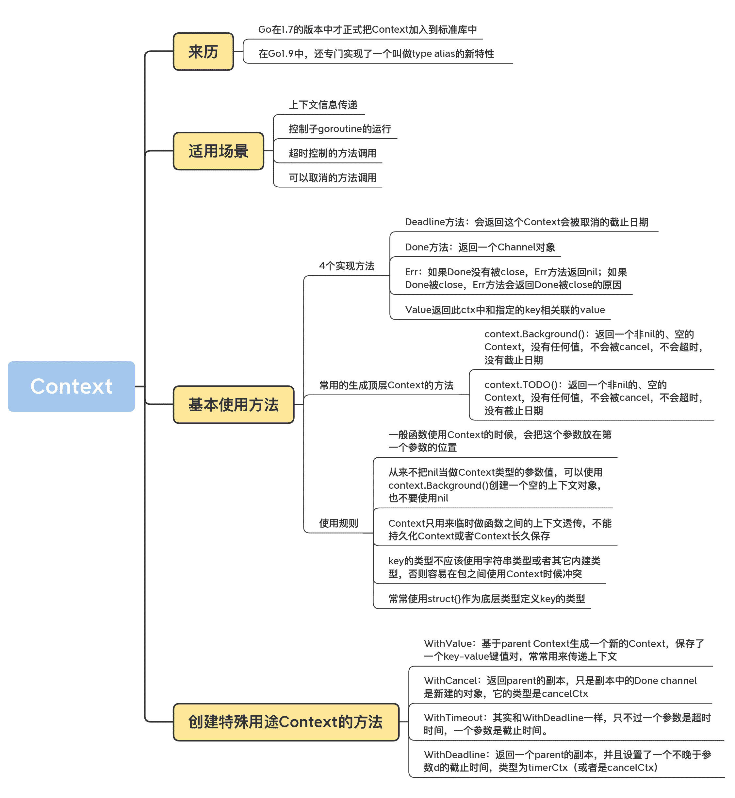

# 11｜Context：資訊穿透上下文

你好，我是鳥窩。

## 本章導讀

```text
               Context 資訊/取消訊號傳遞圖

            ┌────────────────────┐
            │ parent context      │
            │ deadline / cancel / │
            │ values              │
            └─────────┬──────────┘
                      │ 衍生
        ┌─────────────┴─────────────┐
        ▼                           ▼
┌──────────────────┐       ┌──────────────────┐
│ child context A   │       │ child context B   │
└─────────┬────────┘       └─────────┬────────┘
          │                           │
          ▼                           ▼
      goroutine A                 goroutine B

parent cancel -> 子層一起收到取消訊號
```

在這節課正式開始之前，我想先帶你看一個工作中的場景。

假設有一天你進入辦公室，突然同事們都圍住你，然後大喊“小王小王你最帥”，此時你可能一頭霧水，只能尷尬地笑笑。為啥呢？因為你缺少上下文的資訊，不知道之前發生了什麼。

但是，如果同事告訴你，由於你業績突出，一天之內就把雲服務化的主要架構寫好了，因此被評為 9 月份的工作之星，總經理還特意給你發 1 萬元的獎金，那麼，你心裡就很清楚了，原來同事恭喜你，是因為你的工作被表揚了，還獲得了獎金。同事告訴你的這些前因後果，就是上下文資訊，他把上下文傳遞給你，你接收後，就可以獲取之前不瞭解的資訊。

你看，上下文（Context）就是這麼重要。在我們的開發場景中，上下文也是不可或缺的，缺少了它，我們就不能獲取完整的程式資訊。那到底啥是上下文呢？其實，這就是指，在 API 之間或者方法呼叫之間，所傳遞的除了業務引數之外的額外資訊。

比如，服務端接收到客戶端的 HTTP 請求之後，可以把客戶端的 IP 地址和埠、客戶端的身份資訊、請求接收的時間、Trace ID 等資訊放入到上下文中，這個上下文可以在後端的方法呼叫中傳遞，後端的業務方法除了利用正常的引數做一些業務處理（如訂單處理）之外，還可以從上下文讀取到訊息請求的時間、Trace ID 等資訊，把服務處理的時間推送到 Trace 服務中。Trace 服務可以把同一 Trace ID 的不同方法的呼叫順序和呼叫時間展示成流程圖，方便跟蹤。

不過，Go 標準庫中的 Context 功能還不止於此，它還提供了超時（Timeout）和取消（Cancel）的機制，下面就讓我一一道來。

# Context 的來歷

在學習 Context 的功能之前呢，我先帶你瞭解下它的來歷。畢竟，知道了它的來龍去脈，我們才能應用得更加得心應手一些。

Go 在 1.7 的版本中才正式把 Context 加入到標準庫中。在這之前，很多 Web 框架在定義自己的 handler 時，都會傳遞一個自定義的 Context，把客戶端的資訊和客戶端的請求資訊放入到 Context 中。Go 最初提供了 golang.org/x/net/context 庫用來提供上下文資訊，最終還是在 Go1.7 中把此庫提升到標準庫 context 包中。

為啥呢？這是因為，在 Go1.7 之前，有很多庫都依賴 golang.org/x/net/context 中的 Context 實作，這就導致 Go 1.7 釋出之後，出現了標準庫 Context 和 golang.org/x/net/context 並存的狀況。新的程式碼使用標準庫 Context 的時候，沒有辦法使用這個標準庫的 Context 去呼叫舊有的使用 x/net/context 實作的方法。

所以，在 Go1.9 中，還專門實作了一個叫做 type alias 的新特性，然後把 x/net/context 中的 Context 定義成標準庫 Context 的別名，以解決新舊 Context 型別衝突問題，你可以看一下下面這段程式碼：

```go
    // +build go1.9
  package context
  
  import "context"
  
  type Context = context.Context
  type CancelFunc = context.CancelFunc
```

Go 標準庫的 Context 不僅提供了上下文傳遞的資訊，還提供了 cancel、timeout 等其它資訊，這些資訊貌似和 context 這個包名沒關係，但是還是得到了廣泛的應用。所以，你看，context 包中的 Context 不僅僅傳遞上下文資訊，還有 timeout 等其它功能，是不是“名不副實”呢？

其實啊，這也是這個 Context 的一個問題，比較容易誤導人，Go 佈道師 Dave Cheney 還專門寫了一篇文章講述這個問題：Context isn’t for cancellation。

同時，也有一些批評者針對 Context 提出了批評：Context should go away for Go 2，這篇文章把 Context 比作病毒，病毒會傳染，結果把所有的方法都傳染上了病毒（加上 Context 引數），絕對是視覺汙染。

Go 的開發者也注意到了“關於 Context，存在一些爭議”這件事兒，所以，Go 核心開發者 Ian Lance Taylor 專門開了一個issue 28342，用來記錄當前的 Context 的問題：

1.  Context 包名導致使用的時候重複 ctx context.Context；
2.  Context.WithValue 可以接受任何型別的值，非型別安全；
3.  Context 包名容易誤導人，實際上，Context 最主要的功能是取消 goroutine 的執行；
4.  Context 漫天飛，函式汙染。

儘管有很多的爭議，但是，在很多場景下，使用 Context 其實會很方便，所以現在它已經在 Go 生態圈中傳播開來了，包括很多的 Web 應用框架，都切換成了標準庫的 Context。標準庫中的 database/sql、os/exec、net、net/http 等包中都使用到了 Context。而且，如果我們遇到了下面的一些場景，也可以考慮使用 Context：

1.  上下文資訊傳遞 （request-scoped），比如處理 http 請求、在請求處理鏈路上傳遞資訊；
2.  控制子 goroutine 的執行；
3.  超時控制的方法呼叫；
4.  可以取消的方法呼叫。

所以，我們需要掌握 Context 的具體用法，這樣才能在不影響主要業務流程實作的時候，實作一些通用的資訊傳遞，或者是能夠和其它 goroutine 協同工作，提供 timeout、cancel 等機制。

# Context 基本使用方法

首先，我們來學習一下 Context 介面包含哪些方法，這些方法都是幹什麼用的。

包 context 定義了 Context 介面，Context 的具體實作包括 4 個方法，分別是 Deadline、Done、Err 和 Value，如下所示：

```go
type Context interface {
    Deadline() (deadline time.Time, ok bool)
    Done() <-chan struct{}
    Err() error
    Value(key interface{}) interface{}
}
```

下面我來具體解釋下這 4 個方法。

**Deadline** 方法會返回這個 Context 被取消的截止日期。如果沒有設定截止日期，ok 的值是 false。後續每次呼叫這個物件的 Deadline 方法時，都會返回和第一次呼叫相同的結果。

**Done** 方法返回一個 Channel 物件。在 Context 被取消時，此 Channel 會被 close，如果沒被取消，可能會返回 nil。後續的 Done 呼叫總是返回相同的結果。當 Done 被 close 的時候，你可以透過 ctx.Err 獲取錯誤資訊。Done 這個方法名其實起得並不好，因為名字太過籠統，不能明確反映 Done 被 close 的原因，因為 cancel、timeout、deadline 都可能導致 Done 被 close，不過，目前還沒有一個更合適的方法名稱。

關於 Done 方法，你必須要記住的知識點就是：如果 Done 沒有被 close，Err 方法返回 nil；如果 Done 被 close，Err 方法會返回 Done 被 close 的原因。

**Value** 返回此 ctx 中和指定的 key 相關聯的 value。

Context 中實作了 2 個常用的生成頂層 Context 的方法。

1.  context.Background()：返回一個非 nil 的、空的 Context，沒有任何值，不會被 cancel，不會超時，沒有截止日期。一般用在主函式、初始化、測試以及建立根 Context 的時候。
2.  context.TODO()：返回一個非 nil 的、空的 Context，沒有任何值，不會被 cancel，不會超時，沒有截止日期。當你不清楚是否該用 Context，或者目前還不知道要傳遞一些什麼上下文資訊的時候，就可以使用這個方法。

官方文件是這麼講的，你可能會覺得像沒說一樣，因為界限並不是很明顯。其實，你根本不用費腦子去考慮，可以直接使用 context.Background。事實上，它們兩個底層的實作是一模一樣的：

```go
var (
    background = new(emptyCtx)
    todo       = new(emptyCtx)
)

func Background() Context {
    return background
}

func TODO() Context {
    return todo
}
```

在使用 Context 的時候，有一些約定俗成的規則。

1.  一般函式使用 Context 的時候，會把這個引數放在第一個引數的位置。
2.  從來不把 nil 當做 Context 型別的引數值，可以使用 context.Background() 建立一個空的上下文物件，也不要使用 nil。
3.  Context 只用來臨時做函式之間的上下文透傳，不能持久化 Context 或者把 Context 長久儲存。把 Context 持久化到資料庫、本地檔案或者全域性變數、快取中都是錯誤的用法。
4.  key 的型別不應該是字串型別或者其它內建型別，否則容易在包之間使用 Context 時候產生衝突。使用 WithValue 時，key 的型別應該是自己定義的型別。
5.  常常使用 struct{}作為底層型別定義 key 的型別。對於 exported key 的靜態型別，常常是介面或者指標。這樣可以儘量減少記憶體分配。

其實官方的文件也是比較搞笑的，文件中強調 key 的型別不要使用 string，結果接下來的例子中就是用 string 型別作為 key 的型別。你自己把握住這個要點就好，如果你能保證別人使用你的 Context 時不會和你定義的 key 衝突，那麼 key 的型別就比較隨意，因為你自己保證了不同包的 key 不會衝突，否則建議你儘量採用保守的 unexported 的型別。

# 建立特殊用途 Context 的方法

接下來，我會介紹標準庫中幾種建立特殊用途 Context 的方法：WithValue、WithCancel、WithTimeout 和 WithDeadline，包括它們的功能以及實作方式。

## WithValue

WithValue 基於 parent Context 生成一個新的 Context，儲存了一個 key-value 鍵值對。它常常用來傳遞上下文。

WithValue 方法其實是建立了一個型別為 valueCtx 的 Context，它的型別定義如下：

```go
type valueCtx struct {
    Context
    key, val interface{}
}
```

它持有一個 key-value 鍵值對，還持有 parent 的 Context。它覆蓋了 Value 方法，優先從自己的儲存中檢查這個 key，不存在的話會從 parent 中繼續檢查。

Go 標準庫實作的 Context 還實作了鏈式查詢。如果不存在，還會向 parent Context 去查詢，如果 parent 還是 valueCtx 的話，還是遵循相同的原則：valueCtx 會嵌入 parent，所以還是會查詢 parent 的 Value 方法的。

```go
ctx = context.TODO()
ctx = context.WithValue(ctx, "key1", "0001")
ctx = context.WithValue(ctx, "key2", "0001")
ctx = context.WithValue(ctx, "key3", "0001")
ctx = context.WithValue(ctx, "key4", "0004")

fmt.Println(ctx.Value("key1"))
```


## WithCancel

WithCancel 方法返回 parent 的副本，只是副本中的 Done Channel 是新建的物件，它的型別是 cancelCtx。

我們常常在一些需要主動取消長時間的任務時，建立這種型別的 Context，然後把這個 Context 傳給長時間執行任務的 goroutine。當需要中止任務時，我們就可以 cancel 這個 Context，這樣長時間執行任務的 goroutine，就可以透過檢查這個 Context，知道 Context 已經被取消了。

WithCancel 返回值中的第二個值是一個 cancel 函式。其實，這個返回值的名稱（cancel）和型別（Cancel）也非常迷惑人。

記住，不是隻有你想中途放棄，才去呼叫 cancel，只要你的任務正常完成了，就需要呼叫 cancel，這樣，這個 Context 才能釋放它的資源（通知它的 children 處理 cancel，從它的 parent 中把自己移除，甚至釋放相關的 goroutine）。很多同學在使用這個方法的時候，都會忘記呼叫 cancel，切記切記，而且一定儘早釋放。

我們來看下 WithCancel 方法的實作程式碼：

```go
func WithCancel(parent Context) (ctx Context, cancel CancelFunc) {
    c := newCancelCtx(parent)
    propagateCancel(parent, &c)// 把c朝上傳播
    return &c, func() { c.cancel(true, Canceled) }
}

// newCancelCtx returns an initialized cancelCtx.
func newCancelCtx(parent Context) cancelCtx {
    return cancelCtx{Context: parent}
}
```

程式碼中呼叫的 propagateCancel 方法會順著 parent 路徑往上找，直到找到一個 cancelCtx，或者為 nil。如果不為空，就把自己加入到這個 cancelCtx 的 child，以便這個 cancelCtx 被取消的時候通知自己。如果為空，會新起一個 goroutine，由它來監聽 parent 的 Done 是否已關閉。

當這個 cancelCtx 的 cancel 函式被呼叫的時候，或者 parent 的 Done 被 close 的時候，這個 cancelCtx 的 Done 才會被 close。

cancel 是向下傳遞的，如果一個 WithCancel 生成的 Context 被 cancel 時，如果它的子 Context（也有可能是孫，或者更低，依賴子的型別）也是 cancelCtx 型別的，就會被 cancel，但是不會向上傳遞。parent Context 不會因為子 Context 被 cancel 而 cancel。

cancelCtx 被取消時，它的 Err 欄位就是下面這個 Canceled 錯誤：

```go
var Canceled = errors.New("context canceled")WithTimeoutWithTimeout 其實是和 WithDeadline 一樣，只不過一個引數是超時時間，一個引數是截止時間。超時時間加上當前時間，其實就是截止時間，因此，WithTimeout 的實作是：

func WithTimeout(parent Context, timeout time.Duration) (Context, CancelFunc) {
    // 當前時間+timeout就是deadline
    return WithDeadline(parent, time.Now().Add(timeout))
}WithDeadlineWithDeadline 會返回一個 parent 的副本，並且設定了一個不晚於引數 d 的截止時間，型別為 timerCtx（或者是 cancelCtx）。
```

如果它的截止時間晚於 parent 的截止時間，那麼就以 parent 的截止時間為準，並返回一個型別為 cancelCtx 的 Context，因為 parent 的截止時間到了，就會取消這個 cancelCtx。

如果當前時間已經超過了截止時間，就直接返回一個已經被 cancel 的 timerCtx。否則就會啟動一個定時器，到截止時間取消這個 timerCtx。

綜合起來，timerCtx 的 Done 被 Close 掉，主要是由下面的某個事件觸發的：

1.  截止時間到了；
2.  cancel 函式被呼叫；
3.  parent 的 Done 被 close。

下面的程式碼是 WithDeadline 方法的實作：

```go
func WithDeadline(parent Context, d time.Time) (Context, CancelFunc) {
    // 如果parent的截止時間更早，直接返回一個cancelCtx即可
    if cur, ok := parent.Deadline(); ok && cur.Before(d) {
        return WithCancel(parent)
    }
    c := &timerCtx{
        cancelCtx: newCancelCtx(parent),
        deadline:  d,
    }
    propagateCancel(parent, c) // 同cancelCtx的處理邏輯
    dur := time.Until(d)
    if dur <= 0 { //當前時間已經超過了截止時間，直接cancel
        c.cancel(true, DeadlineExceeded)
        return c, func() { c.cancel(false, Canceled) }
    }
    c.mu.Lock()
    defer c.mu.Unlock()
    if c.err == nil {
        // 設定一個定時器，到截止時間後取消
        c.timer = time.AfterFunc(dur, func() {
            c.cancel(true, DeadlineExceeded)
        })
    }
    return c, func() { c.cancel(true, Canceled) }
}
```

和 cancelCtx 一樣，WithDeadline（WithTimeout）返回的 cancel 一定要呼叫，並且要儘可能早地被呼叫，這樣才能儘早釋放資源，不要單純地依賴截止時間被動取消。正確的使用姿勢是啥呢？我們來看一個例子。

```go
func slowOperationWithTimeout(ctx context.Context) (Result, error) {
  ctx, cancel := context.WithTimeout(ctx, 100*time.Millisecond)
  defer cancel() // 一旦慢操作完成就立馬呼叫cancel
  return slowOperation(ctx)
}總結我們經常使用 Context 來取消一個 goroutine 的執行，這是 Context 最常用的場景之一，Context 也被稱為 goroutine 生命週期範圍（goroutine-scoped）的 Context，把 Context 傳遞給 goroutine。但是，goroutine 需要嘗試檢查 Context 的 Done 是否關閉了：

func main() {
    ctx, cancel := context.WithCancel(context.Background())

    go func() {
        defer func() {
            fmt.Println("goroutine exit")
        }()

        for {
            select {
            case <-ctx.Done():
                return
            default:
                time.Sleep(time.Second)
            }
        }
    }()

    time.Sleep(time.Second)
    cancel()
    time.Sleep(2 * time.Second)
}
```

如果你要為 Context 實作一個帶超時功能的呼叫，比如訪問遠端的一個微服務，超時並不意味著你會通知遠端微服務已經取消了這次呼叫，大機率的實作只是避免客戶端的長時間等待，遠端的伺服器依然還執行著你的請求。

所以，有時候，Context 並不會減少對伺服器的請求負擔。如果在 Context 被 cancel 的時候，你能關閉和伺服器的連線，中斷和資料庫伺服器的通訊、停止對本地檔案的讀寫，那麼，這樣的超時處理，同時能減少對服務呼叫的壓力，但是這依賴於你對超時的底層處理機制。



# 思考題

使用 WithCancel 和 WithValue 寫一個級聯的使用 Context 的例子，驗證一下 parent Context 被 cancel 後，子 conext 是否也立刻被 cancel 了。

歡迎在留言區寫下你的思考和答案，我們一起交流討論。如果你覺得有所收穫，也歡迎你把今天的內容分享給你的朋友或同事。
