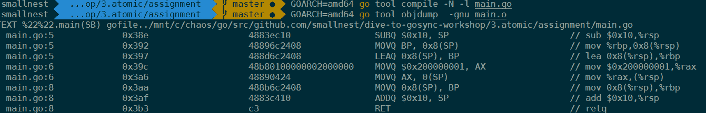
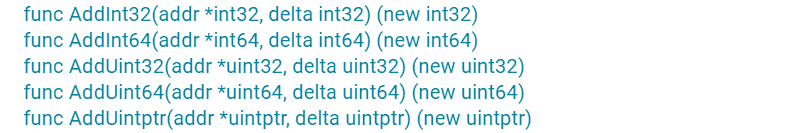
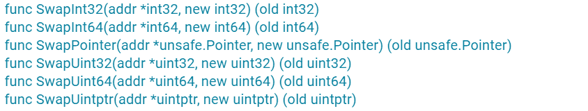

# 12｜atomic：要保證原子操作，一定要使用這幾種方法

你好，我是鳥窩。

## 本章導讀

```text
                 atomic 原子操作定位圖

┌─────────────────┐
│ 共享變數 x        │
└────────┬────────┘
         │ 併發存取
  ┌──────┼───────────────┐
  ▼      ▼               ▼
Load   Store          Add / CAS
(讀)    (寫)        (更新/比較交換)

目的：用不可分割操作避免資料競爭（適合小而簡單的共享狀態）
```

前面我們在學習 Mutex、RWMutex 等併發原語的實作時，你可以看到，最底層是透過 atomic 包中的一些原子操作來實作的。當時，為了讓你的注意力集中在這些原語的功能實作上，我並沒有展開介紹這些原子操作是幹什麼用的。

你可能會說，這些併發原語已經可以應對大多數的併發場景了，為啥還要學習原子操作呢？其實，這是因為，在很多場景中，使用併發原語實作起來比較複雜，而原子操作可以幫助我們更輕鬆地實作底層的最佳化。

所以，現在，我會專門用一節課，帶你仔細地瞭解一下什麼是原子操作，atomic 包都提供了哪些實作原子操作的方法。另外，我還會帶你實作一個基於原子操作的資料結構。好了，接下來我們先來學習下什麼是原子操作。

# 原子操作的基礎知識

Package sync/atomic 實作了同步演算法底層的原子的記憶體操作原語，我們把它叫做原子操作原語，它提供了一些實作原子操作的方法。

之所以叫原子操作，是因為一個原子在執行的時候，其它執行緒不會看到執行一半的操作結果。在其它執行緒看來，原子操作要麼執行完了，要麼還沒有執行，就像一個最小的粒子 - 原子一樣，不可分割。

CPU 提供了基礎的原子操作，不過，不同架構的系統的原子操作是不一樣的。

對於單處理器單核系統來說，如果一個操作是由一個 CPU 指令來實作的，那麼它就是原子操作，比如它的 XCHG 和 INC 等指令。如果操作是基於多條指令來實作的，那麼，執行的過程中可能會被中斷，並執行上下文切換，這樣的話，原子性的保證就被打破了，因為這個時候，操作可能只執行了一半。

在多處理器多核系統中，原子操作的實作就比較複雜了。

由於 cache 的存在，單個核上的單個指令進行原子操作的時候，你要確保其它處理器或者核不訪問此原子操作的地址，或者是確保其它處理器或者核總是訪問原子操作之後的最新的值。x86 架構中提供了指令字首 LOCK，LOCK 保證了指令（比如 LOCK CMPXCHG op1、op2）不會受其它處理器或 CPU 核的影響，有些指令（比如 XCHG）本身就提供 Lock 的機制。不同的 CPU 架構提供的原子操作指令的方式也是不同的，比如對於多核的 MIPS 和 ARM，提供了 LL/SC（Load Link/Store Conditional）指令，可以幫助實作原子操作（ARMLL/SC 指令 LDREX 和 STREX）。

**因為不同的 CPU 架構甚至不同的版本提供的原子操作的指令是不同的，所以，要用一種程式語言實作支援不同架構的原子操作是相當有難度的**。不過，還好這些都不需要你操心，因為 Go 提供了一個通用的原子操作的 API，將更底層的不同的架構下的實作封裝成 atomic 包，提供了修改型別的原子操作（atomic read-modify-write，RMW）和載入儲存型別的原子操作（Load 和 Store）的 API，稍後我會一一介紹。

有的程式碼也會因為架構的不同而不同。有時看起來貌似一個操作是原子操作，但實際上，對於不同的架構來說，情況是不一樣的。比如下面的程式碼的第 4 行，是將一個 64 位的值賦值給變數 i：

```go
const x int64 = 1 + 1<<33

func main() {
    var i = x
    _ = i
}
```

如果你使用 GOARCH=386 的架構去編譯這段程式碼，那麼，第 5 行其實是被拆成了兩個指令，分別操作低 32 位和高 32 位（使用 GOARCH=386 go tool compile -N -l test.go；GOARCH=386 go tool objdump -gnu test.o 反編譯試試）：


如果 GOARCH=amd64 的架構去編譯這段程式碼，那麼，第 5 行其中的賦值操作其實是一條指令：



所以，如果要想保證原子操作，切記一定要使用 atomic 提供的方法。

好了，瞭解了什麼是原子操作以及不同系統的不同原子操作，接下來，我來介紹下 atomic 原子操作的應用場景。

# atomic 原子操作的應用場景

開篇我說過，使用 atomic 的一些方法，我們可以實作更底層的一些最佳化。如果使用 Mutex 等併發原語進行這些最佳化，雖然可以解決問題，但是這些併發原語的實作邏輯比較複雜，對效能還是有一定的影響的。

舉個例子：假設你想在程式中使用一個標誌（flag，比如一個 bool 型別的變數），來標識一個定時任務是否已經啟動執行了，你會怎麼做呢？

我們先來看看加鎖的方法。如果使用 Mutex 和 RWMutex，在讀取和設定這個標誌的時候加鎖，是可以做到互斥的、保證同一時刻只有一個定時任務在執行的，所以使用 Mutex 或者 RWMutex 是一種解決方案。

其實，這個場景中的問題不涉及到對資源複雜的競爭邏輯，只是會併發地讀寫這個標誌，這類場景就適合使用 atomic 的原子操作。具體怎麼做呢？你可以使用一個 uint32 型別的變數，如果這個變數的值是 0，就標識沒有任務在執行，如果它的值是 1，就標識已經有任務在完成了。你看，是不是很簡單呢？

再來看一個例子。假設你在開發應用程式的時候，需要從配置伺服器中讀取一個節點的配置資訊。而且，在這個節點的配置發生變更的時候，你需要重新從配置伺服器中拉取一份新的配置並更新。你的程式中可能有多個 goroutine 都依賴這份配置，涉及到對這個配置物件的併發讀寫，你可以使用讀寫鎖實作對配置物件的保護。在大部分情況下，你也可以利用 atomic 實作配置物件的更新和載入。

分析到這裡，可以看到，這兩個例子都可以使用基本併發原語來實作的，只不過，我們不需要這些基本併發原語裡面的複雜邏輯，而是隻需要其中的簡單原子操作，所以，這些場景可以直接使用 atomic 包中的方法去實作。

**有時候，你也可以使用 atomic 實作自己定義的基本併發原語**，比如 Go issue 有人提議的 CondMutex、Mutex.LockContext、WaitGroup.Go 等，我們可以使用 atomic 或者基於它的更高一級的併發原語去實作。我先前講的幾種基本併發原語的底層（比如 Mutex），就是基於透過 atomic 的方法實作的。

除此之外，atomic 原子操作還是實作 lock-free 資料結構的基石。

在實作 lock-free 的資料結構時，我們可以不使用互斥鎖，這樣就不會讓執行緒因為等待互斥鎖而阻塞休眠，而是讓執行緒保持繼續處理的狀態。另外，不使用互斥鎖的話，lock-free 的資料結構還可以提供併發的效能。

不過，lock-free 的資料結構實作起來比較複雜，需要考慮的東西很多，有興趣的同學可以看一位微軟專家寫的一篇經驗分享：Lockless Programming Considerations for Xbox 360 and Microsoft Windows，這裡我們不細談了。不過，這節課的最後我會帶你開發一個 lock-free 的 queue，來學習下使用 atomic 操作實作 lock-free 資料結構的方法，你可以拿它和使用互斥鎖實作的 queue 做效能對比，看看在效能上是否有所提升。

看到這裡，你是不是覺得 atomic 非常重要呢？不過，要想能夠靈活地應用 atomic，我們首先得知道 atomic 提供的所有方法。

# atomic 提供的方法

目前的 Go 的泛型的特性還沒有釋出，Go 的標準庫中的很多實作會顯得非常囉嗦，多個型別會實作很多類似的方法，尤其是 atomic 包，最為明顯。相信泛型支援之後，atomic 的 API 會清爽很多。

atomic 為了支援 int32、int64、uint32、uint64、uintptr、Pointer（Add 方法不支援）型別，分別提供了 AddXXX、CompareAndSwapXXX、SwapXXX、LoadXXX、StoreXXX 等方法。不過，你也不要擔心，你只要記住了一種資料型別的方法的意義，其它資料型別的方法也是一樣的。

關於 atomic，還有一個地方你一定要記住，**atomic 操作的物件是一個地址，你需要把可定址的變數的地址作為引數傳遞給方法，而不是把變數的值傳遞給方法**。

好了，下面我就來給你介紹一下 atomic 提供的方法。掌握了這些，你就可以說完全掌握了 atomic 包。

## Add

首先，我們來看 Add 方法的簽名：



其實，Add 方法就是給第一個引數地址中的值增加一個 delta 值。

對於有符號的整數來說，delta 可以是一個負數，相當於減去一個值。對於無符號的整數和 uinptr 型別來說，怎麼實作減去一個值呢？畢竟，atomic 並沒有提供單獨的減法操作。

我來跟你說一種方法。你可以利用計算機補碼的規則，把減法變成加法。以 uint32 型別為例：

```go
AddUint32(&x, ^uint32(c-1)).
```

如果是對 uint64 的值進行操作，那麼，就把上面的程式碼中的 uint32 替換成 uint64。

尤其是減 1 這種特殊的操作，我們可以簡化為：

```go
AddUint32(&x, ^uint32(0))
```

好了，我們再來看看 CAS 方法。

## CAS （CompareAndSwap）

以 int32 為例，我們學習一下 CAS 提供的功能。在 CAS 的方法簽名中，需要提供要操作的地址、原資料值、新值，如下所示：

```go
func CompareAndSwapInt32(addr *int32, old, new int32) (swapped bool)
```

我們來看下這個方法的功能。

這個方法會比較當前 addr 地址裡的值是不是 old，如果不等於 old，就返回 false；如果等於 old，就把此地址的值替換成 new 值，返回 true。這就相當於“判斷相等才替換”。

如果使用偽程式碼來表示這個原子操作，程式碼如下：

```go
if *addr == old {
  *addr = new
  return true
}
return false
```

它支援的型別和方法如圖所示：


## Swap

如果不需要比較舊值，只是比較粗暴地替換的話，就可以使用 Swap 方法，它替換後還可以返回舊值，偽程式碼如下：

```go
old = *addr
*addr = new
return old
```

它支援的資料型別和方法如圖所示：



## Load

Load 方法會取出 addr 地址中的值，即使在多處理器、多核、有 CPU cache 的情況下，這個操作也能保證 Load 是一個原子操作。

它支援的資料型別和方法如圖所示：


## Store

Store 方法會把一個值存入到指定的 addr 地址中，即使在多處理器、多核、有 CPU cache 的情況下，這個操作也能保證 Store 是一個原子操作。別的 goroutine 透過 Load 讀取出來，不會看到存取了一半的值。

它支援的資料型別和方法如圖所示：


## Value 型別

剛剛說的都是一些比較常見的型別，其實，atomic 還提供了一個特殊的型別：Value。它可以原子地存取物件型別，但也只能存取，不能 CAS 和 Swap，常常用在配置變更等場景中。


接下來，我以一個配置變更的例子，來演示 Value 型別的使用。這裡定義了一個 Value 型別的變數 config， 用來儲存配置資訊。

首先，我們啟動一個 goroutine，然後讓它隨機 sleep 一段時間，之後就變更一下配置，並透過我們前面學到的 Cond 併發原語，通知其它的 reader 去載入新的配置。

接下來，我們啟動一個 goroutine 等待配置變更的訊號，一旦有變更，它就會載入最新的配置。

透過這個例子，你可以瞭解到 Value 的 Store/Load 方法的使用，因為它只有這兩個方法，只要掌握了它們的使用，你就完全掌握了 Value 型別。

```go
type Config struct {
    NodeName string
    Addr     string
    Count    int32
}

func loadNewConfig() Config {
    return Config{
        NodeName: "北京",
        Addr:     "10.77.95.27",
        Count:    rand.Int31(),
    }
}
func main() {
    var config atomic.Value
    config.Store(loadNewConfig())
    var cond = sync.NewCond(&sync.Mutex{})

    // 設定新的config
    go func() {
        for {
            time.Sleep(time.Duration(5+rand.Int63n(5)) * time.Second)
            config.Store(loadNewConfig())
            cond.Broadcast() // 通知等待著配置已變更
        }
    }()

    go func() {
        for {
            cond.L.Lock()
            cond.Wait()                 // 等待變更訊號
            c := config.Load().(Config) // 讀取新的配置
            fmt.Printf("new config: %+v\n", c)
            cond.L.Unlock()
        }
    }()

    select {}
}
```

好了，關於標準庫的 atomic 提供的方法，到這裡我們就學完了。事實上，atomic 包提供了非常好的支援各種平臺的一致性的 API，絕大部分專案都是直接使用它。接下來，我再給你介紹一下第三方庫，幫助你稍微開拓一下思維。

# 第三方庫的擴充套件

其實，atomic 的 API 已經算是很簡單的了，它提供了包一級的函式，可以對幾種型別的資料執行原子操作。

不過有一點讓人覺得不爽的是，或者是讓熟悉面向物件程式設計的程式設計師不爽的是，函式呼叫有一點點麻煩。所以，有些人就對這些函式做了進一步的包裝，跟 atomic 中的 Value 型別類似，這些型別也提供了面向物件的使用方式，比如關注度比較高的uber-go/atomic，它定義和封裝了幾種與常見型別相對應的原子操作型別，這些型別提供了原子操作的方法。這些型別包括 Bool、Duration、Error、Float64、Int32、Int64、String、Uint32、Uint64 等。

比如 Bool 型別，提供了 CAS、Store、Swap、Toggle 等原子方法，還提供 String、MarshalJSON、UnmarshalJSON 等輔助方法，確實是一個精心設計的 atomic 擴充套件庫。關於這些方法，你一看名字就能猜出來它們的功能，我就不多說了。

其它的資料型別也和 Bool 型別相似，使用起來就像面向物件的程式設計一樣，你可以看下下面的這段程式碼。

```go
    var running atomic.Bool
    running.Store(true)
    running.Toggle()
    fmt.Println(running.Load()) // false使用 atomic 實作 Lock-Free queueatomic 常常用來實作 Lock-Free 的資料結構，這次我會給你展示一個 Lock-Free queue 的實作。
```

Lock-Free queue 最出名的就是 Maged M. Michael 和 Michael L. Scott 1996 年發表的論文中的演算法，演算法比較簡單，容易實作，偽程式碼的每一行都提供了註釋，我就不在這裡貼出偽程式碼了，因為我們使用 Go 實作這個資料結構的程式碼幾乎和偽程式碼一樣：

```go
package queue
import (
  "sync/atomic"
  "unsafe"
)
// lock-free的queue
type LKQueue struct {
  head unsafe.Pointer
  tail unsafe.Pointer
}
// 透過連結串列實作，這個資料結構代表連結串列中的節點
type node struct {
  value interface{}
  next  unsafe.Pointer
}
func NewLKQueue() *LKQueue {
  n := unsafe.Pointer(&node{})
  return &LKQueue{head: n, tail: n}
}
// 入隊
func (q *LKQueue) Enqueue(v interface{}) {
  n := &node{value: v}
  for {
    tail := load(&q.tail)
    next := load(&tail.next)
    if tail == load(&q.tail) { // 尾還是尾
      if next == nil { // 還沒有新資料入隊
        if cas(&tail.next, next, n) { //增加到隊尾
          cas(&q.tail, tail, n) //入隊成功，移動尾巴指標
          return
        }
      } else { // 已有新資料加到佇列後面，需要移動尾指標
        cas(&q.tail, tail, next)
      }
    }
  }
}
// 出隊，沒有元素則返回nil
func (q *LKQueue) Dequeue() interface{} {
  for {
    head := load(&q.head)
    tail := load(&q.tail)
    next := load(&head.next)
    if head == load(&q.head) { // head還是那個head
      if head == tail { // head和tail一樣
        if next == nil { // 說明是空佇列
          return nil
        }
        // 只是尾指標還沒有調整，嘗試調整它指向下一個
        cas(&q.tail, tail, next)
      } else {
        // 讀取出隊的資料
        v := next.value
                // 既然要出隊了，頭指標移動到下一個
        if cas(&q.head, head, next) {
          return v // Dequeue is done.  return
        }
      }
    }
  }
}

// 將unsafe.Pointer原子載入轉換成node
func load(p *unsafe.Pointer) (n *node) {
  return (*node)(atomic.LoadPointer(p))
}

// 封裝CAS,避免直接將*node轉換成unsafe.Pointer
func cas(p *unsafe.Pointer, old, new *node) (ok bool) {
  return atomic.CompareAndSwapPointer(
    p, unsafe.Pointer(old), unsafe.Pointer(new))
}
```

我來給你介紹下這裡的主要邏輯。

這個 lock-free 的實作使用了一個輔助頭指標（head），頭指標不包含有意義的資料，只是一個輔助的節點，這樣的話，出隊入隊中的節點會更簡單。

入隊的時候，透過 CAS 操作將一個元素新增到隊尾，並且移動尾指標。

出隊的時候移除一個節點，並透過 CAS 操作移動 head 指標，同時在必要的時候移動尾指標。

# 總結

好了，我們來小結一下。這節課，我們學習了 atomic 的基本使用方法，以及它提供的幾種方法，包括 Add、CAS、Swap、Load、Store、Value 型別。除此之外，我還介紹了一些第三方庫，並且帶你實作了 Lock-free queue。到這裡，相信你已經掌握了 atomic 提供的各種方法，並且能夠應用到實踐中了。

最後，我還想和你討論一個額外的問題：對一個地址的賦值是原子操作嗎？

這是一個很有趣的問題，如果是原子操作，還要 atomic 包乾什麼？官方的文件中並沒有特意的介紹，不過，在一些 issue 或者論壇中，每當有人談到這個問題時，總是會被建議用 atomic 包。

Dave Cheney就談到過這個問題，講得非常好。我來給你總結一下他講的知識點，這樣你就比較容易理解使用 atomic 和直接記憶體操作的區別了。

在現在的系統中，write 的地址基本上都是對齊的（aligned）。 比如，32 位的作業系統、CPU 以及編譯器，write 的地址總是 4 的倍數，64 位的系統總是 8 的倍數（還記得 WaitGroup 針對 64 位系統和 32 位系統對 state1 的欄位不同的處理嗎）。對齊地址的寫，不會導致其他人看到只寫了一半的資料，因為它透過一個指令就可以實作對地址的操作。如果地址不是對齊的話，那麼，處理器就需要分成兩個指令去處理，如果執行了一個指令，其它人就會看到更新了一半的錯誤的資料，這被稱做撕裂寫（torn write） 。所以，你可以認為賦值操作是一個原子操作，這個“原子操作”可以認為是保證資料的完整性。

但是，對於現代的多處理多核的系統來說，由於 cache、指令重排，可見性等問題，我們對原子操作的意義有了更多的追求。在多核系統中，一個核對地址的值的更改，在更新到主記憶體中之前，是在多級快取中存放的。這時，多個核看到的資料可能是不一樣的，其它的核可能還沒有看到更新的資料，還在使用舊的資料。

多處理器多核心繫統為了處理這類問題，使用了一種叫做記憶體屏障（memory fence 或 memory barrier）的方式。一個寫記憶體屏障會告訴處理器，必須要等到它管道中的未完成的操作（特別是寫操作）都被重新整理到記憶體中，再進行操作。此操作還會讓相關的處理器的 CPU 快取失效，以便讓它們從主存中拉取最新的值。

atomic 包提供的方法會提供記憶體屏障的功能，所以，atomic 不僅僅可以保證賦值的資料完整性，還能保證資料的可見性，一旦一個核更新了該地址的值，其它處理器總是能讀取到它的最新值。但是，需要注意的是，因為需要處理器之間保證資料的一致性，atomic 的操作也是會降低效能的。


# 思考題

atomic.Value 只有 Load/Store 方法，你是不是感覺意猶未盡？你可以嘗試為 Value 型別增加 Swap 和 CompareAndSwap 方法（可以參考一下這份資料）。

歡迎在留言區寫下你的思考和答案，我們一起交流討論。如果你覺得有所收穫，也歡迎你把今天的內容分享給你的朋友或同事。
