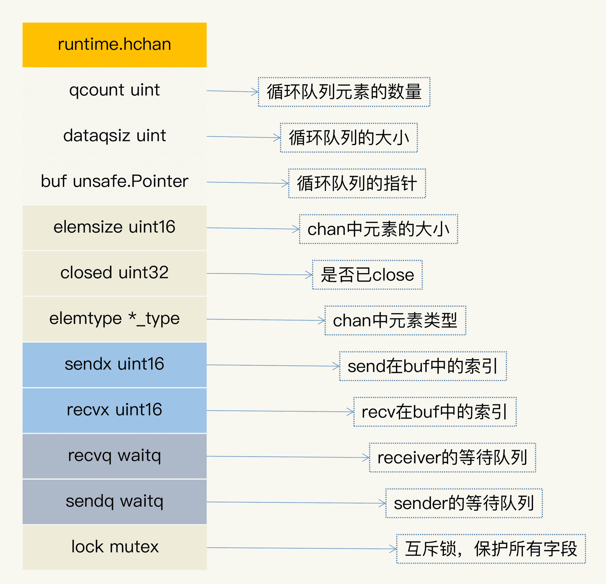
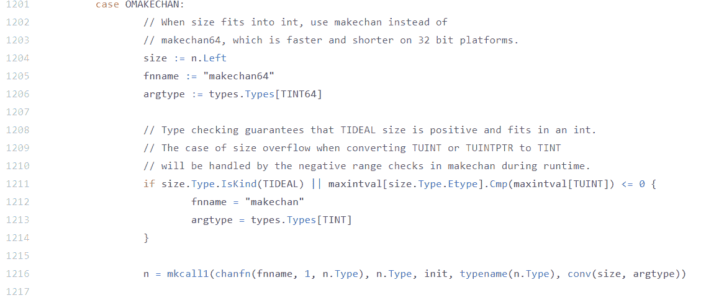
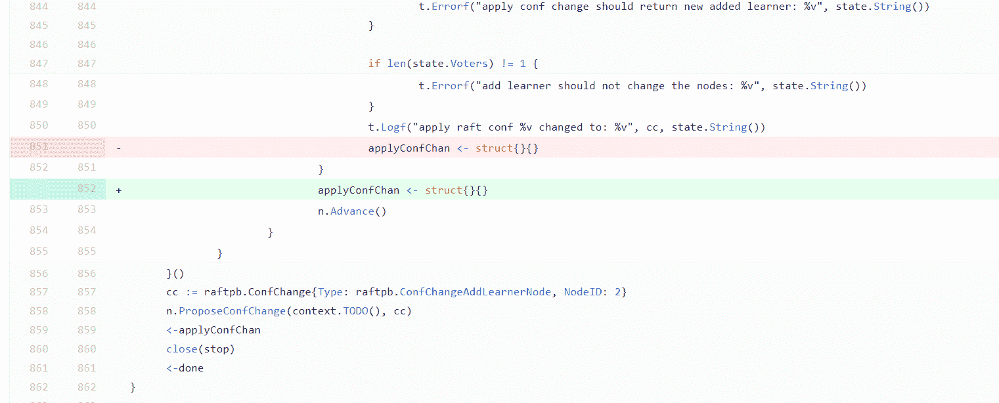
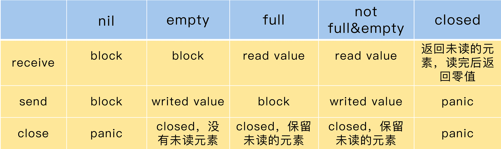

# 13 \| Channel：另闢蹊徑，解決併發問題

你好，我是鳥窩。

Channel 是 Go 語言內建的 first-class 類型，也是 Go 語言與眾不同的特性之一。Go 語言的 Channel 設計精巧簡單，以至於也有人用其它語言編寫了類似 Go 風格的 Channel 庫，比如docker/libchan、tylertreat/chan，但是並不像 Go 語言一樣把 Channel 內置到了語言規範中。從這一點，你也可以看出來，Channel 的地位在編程語言中的地位之高，比較罕見。

所以，這節課，我們就來學習下 Channel。

# Channel 的發展

要想了解 Channel 這種 Go 編程語言中的特有的數據結構，我們要追溯到 CSP 模型，學習一下它的歷史，以及它對 Go 創始人設計 Channel 類型的影響。

CSP 是 Communicating Sequential Process 的簡稱，中文直譯為通信順序進程，或者叫做交換信息的循序進程，是用來描述併發系統中進行交互的一種模式。

CSP 最早出現於計算機科學家 Tony Hoare 在 1978 年發表的論文中（你可能不熟悉 Tony Hoare 這個名字，但是你一定很熟悉排序算法中的 Quicksort 算法，他就是 Quicksort 算法的作者，圖靈獎的獲得者）。最初，論文中提出的 CSP 版本在本質上不是一種進程演算，而是一種併發編程語言，但之後又經過了一系列的改進，最終發展並精煉出 CSP 的理論。**CSP 允許使用進程組件來描述系統，它們獨立運行，並且只通過消息傳遞的方式通信。**

就像 Go 的創始人之一 Rob Pike 所說的：“每一個計算機程序員都應該讀一讀 Tony Hoare 1978 年的關於 CSP 的論文。”他和 Ken Thompson 在設計 Go 語言的時候也深受此論文的影響，並將 CSP 理論真正應用於語言本身（Russ Cox 專門寫了一篇文章記錄這個歷史），通過引入 Channel 這個新的類型，來實現 CSP 的思想。

**Channel 類型是 Go 語言內置的類型，你無需引入某個包，就能使用它**。雖然 Go 也提供了傳統的併發原語，但是它們都是通過庫的方式提供的，你必須要引入 sync 包或者 atomic 包才能使用它們，而 Channel 就不一樣了，它是內置類型，使用起來非常方便。

Channel 和 Go 的另一個獨特的特性 goroutine 一起為併發編程提供了優雅的、便利的、與傳統併發控制不同的方案，並演化出很多併發模式。接下來，我們就來看一看 Channel 的應用場景。

# Channel 的應用場景

首先，我想先帶你看一條 Go 語言中流傳很廣的諺語：

> Don’t communicate by sharing memory, share memory by communicating.

> Go Proverbs by Rob Pike

這是 Rob Pike 在 2015 年的一次 Gopher 會議中提到的一句話，雖然有一點繞，但也指出了使用 Go 語言的哲學，我嘗試著來翻譯一下：“**執行業務處理的 goroutine 不要通過共享內存的方式通信，而是要通過 Channel 通信的方式分享數據。**”

“communicate by sharing memory”和“share memory by communicating”是兩種不同的併發處理模式。“communicate by sharing memory”是傳統的併發編程處理方式，就是指，共享的數據需要用鎖進行保護，goroutine 需要獲取到鎖，才能併發訪問數據。

“share memory by communicating”則是類似於 CSP 模型的方式，通過通信的方式，一個 goroutine 可以把數據的“所有權”交給另外一個 goroutine（雖然 Go 中沒有“所有權”的概念，但是從邏輯上說，你可以把它理解為是所有權的轉移）。

從 Channel 的歷史和設計哲學上，我們就可以瞭解到，Channel 類型和基本併發原語是有競爭關係的，它應用於併發場景，涉及到 goroutine 之間的通訊，可以提供併發的保護，等等。

綜合起來，我把 Channel 的應用場景分為五種類型。這裡你先有個印象，這樣你可以有目的地去學習 Channel 的基本原理。下節課我會藉助具體的例子，來帶你掌握這幾種類型。

1.  **數據交流**：當作併發的 buffer 或者 queue，解決生產者 - 消費者問題。多個 goroutine 可以併發當作生產者（Producer）和消費者（Consumer）。
2.  **數據傳遞**：一個 goroutine 將數據交給另一個 goroutine，相當於把數據的擁有權 (引用) 託付出去。
3.  **信號通知**：一個 goroutine 可以將信號 (closing、closed、data ready 等) 傳遞給另一個或者另一組 goroutine 。
4.  **任務編排**：可以讓一組 goroutine 按照一定的順序併發或者串行的執行，這就是編排的功能。
5.  **鎖**：利用 Channel 也可以實現互斥鎖的機制。

下面，我們來具體學習下 Channel 的基本用法。

# Channel 基本用法

你可以往 Channel 中發送數據，也可以從 Channel 中接收數據，所以，Channel 類型（為了說起來方便，我們下面都把 Channel 叫做 chan）分為**只能接收**、**只能發送**、**既可以接收又可以發送**三種類型。下面是它的語法定義：

    ChannelType = ( "chan" | "chan" "<-" | "<-" "chan" ) ElementType .

相應地，Channel 的正確語法如下：

    chan string          // 可以發送接收string
    chan<- struct{}      // 只能發送struct{}
    <-chan int           // 只能從chan接收int

我們把既能接收又能發送的 chan 叫做雙向的 chan，把只能發送和只能接收的 chan 叫做單向的 chan。其中，“\<-”表示單向的 chan，如果你記不住，我告訴你一個簡便的方法：**這個箭頭總是射向左邊的，元素類型總在最右邊。如果箭頭指向 chan，就表示可以往 chan 中塞數據；如果箭頭遠離 chan，就表示 chan 會往外吐數據**。

chan 中的元素是任意的類型，所以也可能是 chan 類型，我來舉個例子，比如下面的 chan 類型也是合法的：

    chan<- chan int   
    chan<- <-chan int  
    <-chan <-chan int
    chan (<-chan int)

可是，怎麼判定箭頭符號屬於哪個 chan 呢？其實，“\<-”有個規則，總是儘量和左邊的 chan 結合（The `<-` operator associates with the leftmost `chan` possible:），因此，上面的定義和下面的使用括號的劃分是一樣的：

    chan<- （chan int） // <- 和第一個chan結合
    chan<- （<-chan int） // 第一個<-和最左邊的chan結合，第二個<-和左邊第二個chan結合
    <-chan （<-chan int） // 第一個<-和最左邊的chan結合，第二個<-和左邊第二個chan結合 
    chan (<-chan int) // 因為括號的原因，<-和括號內第一個chan結合

通過 make，我們可以初始化一個 chan，未初始化的 chan 的零值是 nil。你可以設置它的容量，比如下面的 chan 的容量是 9527，我們把這樣的 chan 叫做 buffered chan；如果沒有設置，它的容量是 0，我們把這樣的 chan 叫做 unbuffered chan。

    make(chan int, 9527)

如果 chan 中還有數據，那麼，從這個 chan 接收數據的時候就不會阻塞，如果 chan 還未滿（“滿”指達到其容量），給它發送數據也不會阻塞，否則就會阻塞。unbuffered chan 只有讀寫都準備好之後才不會阻塞，這也是很多使用 unbuffered chan 時的常見 Bug。

還有一個知識點需要你記住：nil 是 chan 的零值，是一種特殊的 chan，對值是 nil 的 chan 的發送接收調用者總是會阻塞。

下面，我來具體給你介紹幾種基本操作，分別是發送數據、接收數據，以及一些其它操作。學會了這幾種操作，你就能真正地掌握 Channel 的用法了。

**1. 發送數據**

往 chan 中發送一個數據使用“ch\<-”，發送數據是一條語句:

    ch <- 2000

這裡的 ch 是 chan int 類型或者是 chan \<-int。

**2. 接收數據**

從 chan 中接收一條數據使用“\<-ch”，接收數據也是一條語句：

      x := <-ch // 把接收的一條數據賦值給變量x
      foo(<-ch) // 把接收的一個的數據作為參數傳給函數
      <-ch // 丟棄接收的一條數據

這裡的 ch 類型是 chan T 或者 \<-chan T。

接收數據時，還可以返回兩個值。第一個值是返回的 chan 中的元素，很多人不太熟悉的是第二個值。第二個值是 bool 類型，代表是否成功地從 chan 中讀取到一個值，如果第二個參數是 false，chan 已經被 close 而且 chan 中沒有緩存的數據，這個時候，第一個值是零值。所以，如果從 chan 讀取到一個零值，可能是 sender 真正發送的零值，也可能是 closed 的並且沒有緩存元素產生的零值。

**3. 其它操作**

Go 內建的函數 close、cap、len 都可以操作 chan 類型：close 會把 chan 關閉掉，cap 返回 chan 的容量，len 返回 chan 中緩存的還未被取走的元素數量。

send 和 recv 都可以作為 select 語句的 case clause，如下面的例子：

    func main() {
        var ch = make(chan int, 10)
        for i := 0; i < 10; i++ {
            select {
            case ch <- i:
            case v := <-ch:
                fmt.Println(v)
            }
        }
    }

chan 還可以應用於 for-range 語句中，比如：

        for v := range ch {
            fmt.Println(v)
        }

或者是忽略讀取的值，只是清空 chan：

        for range ch {
        }

好了，到這裡，Channel 的基本用法，我們就學完了。下面我從代碼實現的角度分析 chan 類型的實現。畢竟，只有掌握了原理，你才能真正地用好它。

# Channel 的實現原理

接下來，我會給你介紹 chan 的數據結構、初始化的方法以及三個重要的操作方法，分別是 send、recv 和 close。通過學習 Channel 的底層實現，你會對 Channel 的功能和異常情況有更深的理解。

## chan 數據結構

chan 類型的數據結構如下圖所示，它的數據類型是runtime.hchan。

下面我來具體解釋各個字段的意義。

1.  qcount：代表 chan 中已經接收但還沒被取走的元素的個數。內建函數 len 可以返回這個字段的值。
2.  dataqsiz：隊列的大小。chan 使用一個循環隊列來存放元素，循環隊列很適合這種生產者 - 消費者的場景（我很好奇為什麼這個字段省略 size 中的 e）。
3.  buf：存放元素的循環隊列的 buffer。
4.  elemtype 和 elemsize：chan 中元素的類型和 size。因為 chan 一旦聲明，它的元素類型是固定的，即普通類型或者指針類型，所以元素大小也是固定的。
5.  sendx：處理發送數據的指針在 buf 中的位置。一旦接收了新的數據，指針就會加上 elemsize，移向下一個位置。buf 的總大小是 elemsize 的整數倍，而且 buf 是一個循環列表。
6.  recvx：處理接收請求時的指針在 buf 中的位置。一旦取出數據，此指針會移動到下一個位置。
7.  recvq：chan 是多生產者多消費者的模式，如果消費者因為沒有數據可讀而被阻塞了，就會被加入到 recvq 隊列中。
8.  sendq：如果生產者因為 buf 滿了而阻塞，會被加入到 sendq 隊列中。

## 初始化

Go 在編譯的時候，會根據容量的大小選擇調用 makechan64，還是 makechan。

下面的代碼是處理 make chan 的邏輯，它會決定是使用 makechan 還是 makechan64 來實現 chan 的初始化：

**我們只關注 makechan 就好了，因為 makechan64 只是做了 size 檢查，底層還是調用 makechan 實現的**。makechan 的目標就是生成 hchan 對象。

那麼，接下來，就讓我們來看一下 makechan 的主要邏輯。主要的邏輯我都加上了註釋，它會根據 chan 的容量的大小和元素的類型不同，初始化不同的存儲空間：

    func makechan(t *chantype, size int) *hchan {
        elem := t.elem
      
            // 略去檢查代碼
            mem, overflow := math.MulUintptr(elem.size, uintptr(size))
            
        //
        var c *hchan
        switch {
        case mem == 0:
          // chan的size或者元素的size是0，不必創建buf
          c = (*hchan)(mallocgc(hchanSize, nil, true))
          c.buf = c.raceaddr()
        case elem.ptrdata == 0:
          // 元素不是指針，分配一塊連續的內存給hchan數據結構和buf
          c = (*hchan)(mallocgc(hchanSize+mem, nil, true))
                // hchan數據結構後面緊接著就是buf
          c.buf = add(unsafe.Pointer(c), hchanSize)
        default:
          // 元素包含指針，那麼單獨分配buf
          c = new(hchan)
          c.buf = mallocgc(mem, elem, true)
        }
      
            // 元素大小、類型、容量都記錄下來
        c.elemsize = uint16(elem.size)
        c.elemtype = elem
        c.dataqsiz = uint(size)
        lockInit(&c.lock, lockRankHchan)

        return c
      }

最終，針對不同的容量和元素類型，這段代碼分配了不同的對象來初始化 hchan 對象的字段，返回 hchan 對象。

## send

Go 在編譯發送數據給 chan 的時候，會把 send 語句轉換成 chansend1 函數，chansend1 函數會調用 chansend，我們分段學習它的邏輯：

    func chansend1(c *hchan, elem unsafe.Pointer) {
        chansend(c, elem, true, getcallerpc())
    }
    func chansend(c *hchan, ep unsafe.Pointer, block bool, callerpc uintptr) bool {
            // 第一部分
        if c == nil {
          if !block {
            return false
          }
          gopark(nil, nil, waitReasonChanSendNilChan, traceEvGoStop, 2)
          throw("unreachable")
        }
          ......
      }

最開始，第一部分是進行判斷：如果 chan 是 nil 的話，就把調用者 goroutine park（阻塞休眠）， 調用者就永遠被阻塞住了，所以，第 11 行是不可能執行到的代碼。

      // 第二部分，如果chan沒有被close,並且chan滿了，直接返回
        if !block && c.closed == 0 && full(c) {
          return false
      }

第二部分的邏輯是當你往一個已經滿了的 chan 實例發送數據時，並且想不阻塞當前調用，那麼這裡的邏輯是直接返回。chansend1 方法在調用 chansend 的時候設置了阻塞參數，所以不會執行到第二部分的分支裡。

      // 第三部分，chan已經被close的情景
        lock(&c.lock) // 開始加鎖
        if c.closed != 0 {
          unlock(&c.lock)
          panic(plainError("send on closed channel"))
      }

第三部分顯示的是，如果 chan 已經被 close 了，再往裡面發送數據的話會 panic。

          // 第四部分，從接收隊列中出隊一個等待的receiver
            if sg := c.recvq.dequeue(); sg != nil {
          // 
          send(c, sg, ep, func() { unlock(&c.lock) }, 3)
          return true
        }

第四部分，如果等待隊列中有等待的 receiver，那麼這段代碼就把它從隊列中彈出，然後直接把數據交給它（通過 memmove(dst, src, t.size)），而不需要放入到 buf 中，速度可以更快一些。

        // 第五部分，buf還沒滿
          if c.qcount < c.dataqsiz {
          qp := chanbuf(c, c.sendx)
          if raceenabled {
            raceacquire(qp)
            racerelease(qp)
          }
          typedmemmove(c.elemtype, qp, ep)
          c.sendx++
          if c.sendx == c.dataqsiz {
            c.sendx = 0
          }
          c.qcount++
          unlock(&c.lock)
          return true
        }

第五部分說明當前沒有 receiver，需要把數據放入到 buf 中，放入之後，就成功返回了。

          // 第六部分，buf滿。
            // chansend1不會進入if塊裡，因為chansend1的block=true
            if !block {
          unlock(&c.lock)
          return false
        }
            ......

第六部分是處理 buf 滿的情況。如果 buf 滿了，發送者的 goroutine 就會加入到發送者的等待隊列中，直到被喚醒。這個時候，數據或者被取走了，或者 chan 被 close 了。

## recv

在處理從 chan 中接收數據時，Go 會把代碼轉換成 chanrecv1 函數，如果要返回兩個返回值，會轉換成 chanrecv2，chanrecv1 函數和 chanrecv2 會調用 chanrecv。我們分段學習它的邏輯：

        func chanrecv1(c *hchan, elem unsafe.Pointer) {
        chanrecv(c, elem, true)
      }
      func chanrecv2(c *hchan, elem unsafe.Pointer) (received bool) {
        _, received = chanrecv(c, elem, true)
        return
      }

        func chanrecv(c *hchan, ep unsafe.Pointer, block bool) (selected, received bool) {
            // 第一部分，chan為nil
        if c == nil {
          if !block {
            return
          }
          gopark(nil, nil, waitReasonChanReceiveNilChan, traceEvGoStop, 2)
          throw("unreachable")
        }

chanrecv1 和 chanrecv2 傳入的 block 參數的值是 true，都是阻塞方式，所以我們分析 chanrecv 的實現的時候，不考慮 block=false 的情況。

第一部分是 chan 為 nil 的情況。和 send 一樣，從 nil chan 中接收（讀取、獲取）數據時，調用者會被永遠阻塞。

      // 第二部分, block=false且c為空
        if !block && empty(c) {
          ......
        }

第二部分你可以直接忽略，因為不是我們這次要分析的場景。

            // 加鎖，返回時釋放鎖
          lock(&c.lock)
          // 第三部分，c已經被close,且chan為空empty
        if c.closed != 0 && c.qcount == 0 {
          unlock(&c.lock)
          if ep != nil {
            typedmemclr(c.elemtype, ep)
          }
          return true, false
        }

第三部分是 chan 已經被 close 的情況。如果 chan 已經被 close 了，並且隊列中沒有緩存的元素，那麼返回 true、false。

          // 第四部分，如果sendq隊列中有等待發送的sender
            if sg := c.sendq.dequeue(); sg != nil {
          recv(c, sg, ep, func() { unlock(&c.lock) }, 3)
          return true, true
        }

第四部分是處理 sendq 隊列中有等待者的情況。這個時候，如果 buf 中有數據，優先從 buf 中讀取數據，否則直接從等待隊列中彈出一個 sender，把它的數據複製給這個 receiver。

          // 第五部分, 沒有等待的sender, buf中有數據
        if c.qcount > 0 {
          qp := chanbuf(c, c.recvx)
          if ep != nil {
            typedmemmove(c.elemtype, ep, qp)
          }
          typedmemclr(c.elemtype, qp)
          c.recvx++
          if c.recvx == c.dataqsiz {
            c.recvx = 0
          }
          c.qcount--
          unlock(&c.lock)
          return true, true
        }

        if !block {
          unlock(&c.lock)
          return false, false
        }

            // 第六部分， buf中沒有元素，阻塞
            ......

第五部分是處理沒有等待的 sender 的情況。這個是和 chansend 共用一把大鎖，所以不會有併發的問題。如果 buf 有元素，就取出一個元素給 receiver。

第六部分是處理 buf 中沒有元素的情況。如果沒有元素，那麼當前的 receiver 就會被阻塞，直到它從 sender 中接收了數據，或者是 chan 被 close，才返回。

## close

通過 close 函數，可以把 chan 關閉，編譯器會替換成 closechan 方法的調用。

下面的代碼是 close chan 的主要邏輯。如果 chan 為 nil，close 會 panic；如果 chan 已經 closed，再次 close 也會 panic。否則的話，如果 chan 不為 nil，chan 也沒有 closed，就把等待隊列中的 sender（writer）和 receiver（reader）從隊列中全部移除並喚醒。

下面的代碼就是 close chan 的邏輯:

        func closechan(c *hchan) {
        if c == nil { // chan為nil, panic
          panic(plainError("close of nil channel"))
        }
      
        lock(&c.lock)
        if c.closed != 0 {// chan已經closed, panic
          unlock(&c.lock)
          panic(plainError("close of closed channel"))
        }

        c.closed = 1  

        var glist gList

        // 釋放所有的reader
        for {
          sg := c.recvq.dequeue()
          ......
          gp := sg.g
          ......
          glist.push(gp)
        }
      
        // 釋放所有的writer (它們會panic)
        for {
          sg := c.sendq.dequeue()
          ......
          gp := sg.g
          ......
          glist.push(gp)
        }
        unlock(&c.lock)
      
        for !glist.empty() {
          gp := glist.pop()
          gp.schedlink = 0
          goready(gp, 3)
        }
      }

掌握了 Channel 的基本用法和實現原理，下面我再來給你講一講容易犯的錯誤。你一定要認真看，畢竟，這些可都是幫助你避坑的。

# 使用 Channel 容易犯的錯誤

根據 2019 年第一篇全面分析 Go 併發 Bug 的論文，那些知名的 Go 項目中使用 Channel 所犯的 Bug 反而比傳統的併發原語的 Bug 還要多。主要有兩個原因：一個是，Channel 的概念還比較新，程序員還不能很好地掌握相應的使用方法和最佳實踐；第二個是，Channel 有時候比傳統的併發原語更復雜，使用起來很容易顧此失彼。

**使用 Channel 最常見的錯誤是 panic 和 goroutine 洩漏**。

首先，我們來總結下會 panic 的情況，總共有 3 種：

1.  close 為 nil 的 chan；
2.  send 已經 close 的 chan；
3.  close 已經 close 的 chan。

goroutine 洩漏的問題也很常見，下面的代碼也是一個實際項目中的例子：

    func process(timeout time.Duration) bool {
        ch := make(chan bool)

        go func() {
            // 模擬處理耗時的業務
            time.Sleep((timeout + time.Second))
            ch <- true // block
            fmt.Println("exit goroutine")
        }()
        select {
        case result := <-ch:
            return result
        case <-time.After(timeout):
            return false
        }
    }

在這個例子中，process 函數會啟動一個 goroutine，去處理需要長時間處理的業務，處理完之後，會發送 true 到 chan 中，目的是通知其它等待的 goroutine，可以繼續處理了。

我們來看一下第 10 行到第 15 行，主 goroutine 接收到任務處理完成的通知，或者超時後就返回了。這段代碼有問題嗎？

如果發生超時，process 函數就返回了，這就會導致 unbuffered 的 chan 從來就沒有被讀取。我們知道，unbuffered chan 必須等 reader 和 writer 都準備好了才能交流，否則就會阻塞。超時導致未讀，結果就是子 goroutine 就阻塞在第 7 行永遠結束不了，進而導致 goroutine 洩漏。

解決這個 Bug 的辦法很簡單，就是將 unbuffered chan 改成容量為 1 的 chan，這樣第 7 行就不會被阻塞了。

Go 的開發者極力推薦使用 Channel，不過，這兩年，大家意識到，Channel 並不是處理併發問題的“銀彈”，有時候使用併發原語更簡單，而且不容易出錯。所以，我給你提供一套選擇的方法:

1.  共享資源的併發訪問使用傳統併發原語；
2.  複雜的任務編排和消息傳遞使用 Channel；
3.  消息通知機制使用 Channel，除非只想 signal 一個 goroutine，才使用 Cond；
4.  簡單等待所有任務的完成用 WaitGroup，也有 Channel 的推崇者用 Channel，都可以；
5.  需要和 Select 語句結合，使用 Channel；
6.  需要和超時配合時，使用 Channel 和 Context。

# 它們踩過的坑

接下來，我帶你圍觀下知名 Go 項目的 Channel 相關的 Bug。

etcd issue 6857是一個程序 hang 住的問題：在異常情況下，沒有往 chan 實例中填充所需的元素，導致等待者永遠等待。具體來說，Status 方法的邏輯是生成一個 chan Status，然後把這個 chan 交給其它的 goroutine 去處理和寫入數據，最後，Status 返回獲取的狀態信息。

不幸的是，如果正好節點停止了，沒有 goroutine 去填充這個 chan，會導致方法 hang 在返回的那一行上（下面的截圖中的第 466 行）。解決辦法就是，在等待 status chan 返回元素的同時，也檢查節點是不是已經停止了（done 這個 chan 是不是 close 了）。

當前的 etcd 的代碼就是修復後的代碼，如下所示：

其實，我感覺這個修改還是有問題的。問題就在於，如果程序執行了 466 行，成功地把 c 寫入到 Status 待處理隊列後，執行到第 467 行時，如果停止了這個節點，那麼，這個 Status 方法還是會阻塞在第 467 行。你可以自己研究研究，看看是不是這樣。

etcd issue 5505 雖然沒有任何的 Bug 描述，但是從修復內容上看，它是一個往已經 close 的 chan 寫數據導致 panic 的問題。

etcd issue 11256 是因為 unbuffered chan goroutine 洩漏的問題。TestNodeProposeAddLearnerNode 方法中一開始定義了一個 unbuffered 的 chan，也就是 applyConfChan，然後啟動一個子 goroutine，這個子 goroutine 會在循環中執行業務邏輯，並且不斷地往這個 chan 中添加一個元素。TestNodeProposeAddLearnerNode 方法的末尾處會從這個 chan 中讀取一個元素。

這段代碼在 for 循環中就往此 chan 中寫入了一個元素，結果導致 TestNodeProposeAddLearnerNode 從這個 chan 中讀取到元素就返回了。悲劇的是，子 goroutine 的 for 循環還在執行，阻塞在下圖中紅色的第 851 行，並且一直 hang 在那裡。

這個 Bug 的修復也很簡單，只要改動一下 applyConfChan 的處理邏輯就可以了：只有子 goroutine 的 for 循環中的主要邏輯完成之後，才往 applyConfChan 發送一個元素，這樣，TestNodeProposeAddLearnerNode 收到通知繼續執行，子 goroutine 也不會被阻塞住了。

etcd issue 9956 是往一個已 close 的 chan 發送數據，其實它是 grpc 的一個 bug（grpc issue 2695），修復辦法就是不 close 這個 chan 就好了：

# 總結

chan 的值和狀態有多種情況，而不同的操作（send、recv、close）又可能得到不同的結果，這是使用 chan 類型時經常讓人困惑的地方。

為了幫助你快速地瞭解不同狀態下各種操作的結果，我總結了一個表格，你一定要特別關注下那些 panic 的情況，另外還要掌握那些會 block 的場景，它們是導致死鎖或者 goroutine 洩露的罪魁禍首。

還有一個值得注意的點是，只要一個 chan 還有未讀的數據，即使把它 close 掉，你還是可以繼續把這些未讀的數據消費完，之後才是讀取零值數據。

# 思考題

1.  有一道經典的使用 Channel 進行任務編排的題，你可以嘗試做一下：有四個 goroutine，編號為 1、2、3、4。每秒鐘會有一個 goroutine 打印出它自己的編號，要求你編寫一個程序，讓輸出的編號總是按照 1、2、3、4、1、2、3、4、……的順序打印出來。
2.  chan T 是否可以給 \<- chan T 和 chan\<- T 類型的變量賦值？反過來呢？

歡迎在留言區寫下你的思考和答案，我們一起交流討論。如果你覺得有所收穫，也歡迎你把今天的內容分享給你的朋友或同事。
