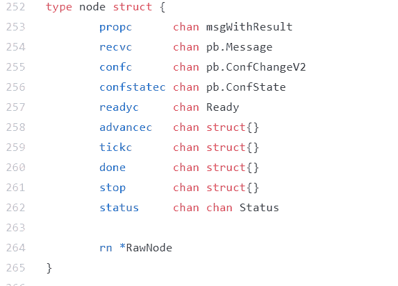
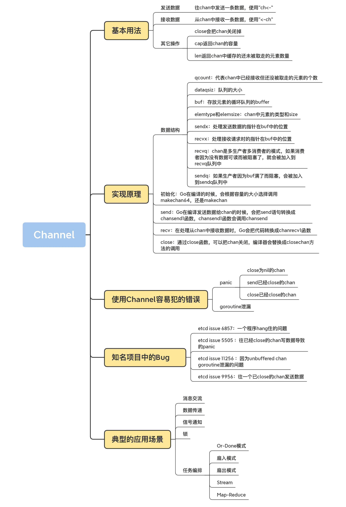

# 14 \| Channel：透過代碼看典型的應用模式

你好，我是鳥窩。

前一講，我介紹了 Channel 的基礎知識，並且總結了幾種應用場景。這一講，我將通過實例的方式，帶你逐個學習 Channel 解決這些問題的方法，幫你鞏固和完全掌握它的用法。

在開始上課之前，我先補充一個知識點：通過反射的方式執行 select 語句，在處理很多的 case clause，尤其是不定長的 case clause 的時候，非常有用。而且，在後面介紹任務編排的實現時，我也會採用這種方法，所以，我先帶你具體學習下 Channel 的反射用法。

# 使用反射操作 Channel

select 語句可以處理 chan 的 send 和 recv，send 和 recv 都可以作為 case clause。如果我們同時處理兩個 chan，就可以寫成下面的樣子：

```go
    select {
    case v := <-ch1:
        fmt.Println(v)
    case v := <-ch2:
        fmt.Println(v)
    }
```

如果需要處理三個 chan，你就可以再添加一個 case clause，用它來處理第三個 chan。可是，如果要處理 100 個 chan 呢？一萬個 chan 呢？

或者是，chan 的數量在編譯的時候是不定的，在運行的時候需要處理一個 slice of chan，這個時候，也沒有辦法在編譯前寫成字面意義的 select。那該怎麼辦？

這個時候，就要“祭”出我們的反射大法了。

通過 reflect.Select 函數，你可以將一組運行時的 case clause 傳入，當作參數執行。Go 的 select 是偽隨機的，它可以在執行的 case 中隨機選擇一個 case，並把選擇的這個 case 的索引（chosen）返回，如果沒有可用的 case 返回，會返回一個 bool 類型的返回值，這個返回值用來表示是否有 case 成功被選擇。如果是 recv case，還會返回接收的元素。Select 的方法簽名如下：

```go
func Select(cases []SelectCase) (chosen int, recv Value, recvOK bool)
```

下面，我來藉助一個例子，來演示一下，動態處理兩個 chan 的情形。因為這樣的方式可以動態處理 case 數據，所以，你可以傳入幾百幾千幾萬的 chan，這就解決了不能動態處理 n 個 chan 的問題。

首先，createCases 函數分別為每個 chan 生成了 recv case 和 send case，並返回一個 reflect.SelectCase 數組。

然後，通過一個循環 10 次的 for 循環執行 reflect.Select，這個方法會從 cases 中選擇一個 case 執行。第一次肯定是 send case，因為此時 chan 還沒有元素，recv 還不可用。等 chan 中有了數據以後，recv case 就可以被選擇了。這樣，你就可以處理不定數量的 chan 了。

```go
func main() {
    var ch1 = make(chan int, 10)
    var ch2 = make(chan int, 10)

    // 創建SelectCase
    var cases = createCases(ch1, ch2)

    // 執行10次select
    for i := 0; i < 10; i++ {
        chosen, recv, ok := reflect.Select(cases)
        if recv.IsValid() { // recv case
            fmt.Println("recv:", cases[chosen].Dir, recv, ok)
        } else { // send case
            fmt.Println("send:", cases[chosen].Dir, ok)
        }
    }
}

func createCases(chs ...chan int) []reflect.SelectCase {
    var cases []reflect.SelectCase

    // 創建recv case
    for _, ch := range chs {
        cases = append(cases, reflect.SelectCase{
            Dir:  reflect.SelectRecv,
            Chan: reflect.ValueOf(ch),
        })
    }

    // 創建send case
    for i, ch := range chs {
        v := reflect.ValueOf(i)
        cases = append(cases, reflect.SelectCase{
            Dir:  reflect.SelectSend,
            Chan: reflect.ValueOf(ch),
            Send: v,
        })
    }

    return cases
}典型的應用場景瞭解剛剛的反射用法，我們就解決了今天的基礎知識問題，接下來，我就帶你具體學習下 Channel 的應用場景。
```

首先來看消息交流。

## 消息交流

從 chan 的內部實現看，它是以一個循環隊列的方式存放數據，所以，它有時候也會被當成線程安全的隊列和 buffer 使用。一個 goroutine 可以安全地往 Channel 中塞數據，另外一個 goroutine 可以安全地從 Channel 中讀取數據，goroutine 就可以安全地實現信息交流了。

我們來看幾個例子。

第一個例子是 worker 池的例子。Marcio Castilho 在 使用 Go 每分鐘處理百萬請求 這篇文章中，就介紹了他們應對大併發請求的設計。他們將用戶的請求放在一個 chan Job 中，這個 chan Job 就相當於一個待處理任務隊列。除此之外，還有一個 chan chan Job 隊列，用來存放可以處理任務的 worker 的緩存隊列。

dispatcher 會把待處理任務隊列中的任務放到一個可用的緩存隊列中，worker 會一直處理它的緩存隊列。通過使用 Channel，實現了一個 worker 池的任務處理中心，並且解耦了前端 HTTP 請求處理和後端任務處理的邏輯。

我在講 Pool 的時候，提到了一些第三方實現的 worker 池，它們全部都是通過 Channel 實現的，這是 Channel 的一個常見的應用場景。worker 池的生產者和消費者的消息交流都是通過 Channel 實現的。

第二個例子是 etcd 中的 node 節點的實現，包含大量的 chan 字段，比如 recvc 是消息處理的 chan，待處理的 protobuf 消息都扔到這個 chan 中，node 有一個專門的 run goroutine 處理這些消息。



## 數據傳遞

“擊鼓傳花”的遊戲很多人都玩過，花從一個人手中傳給另外一個人，就有點類似流水線的操作。這個花就是數據，花在遊戲者之間流轉，這就類似編程中的數據傳遞。

還記得上節課我給你留了一道任務編排的題嗎？其實它就可以用數據傳遞的方式實現。

> 有 4 個 goroutine，編號為 1、2、3、4。每秒鐘會有一個 goroutine 打印出它自己的編號，要求你編寫程序，讓輸出的編號總是按照 1、2、3、4、1、2、3、4……這個順序打印出來。

為了實現順序的數據傳遞，我們可以定義一個令牌的變量，誰得到令牌，誰就可以打印一次自己的編號，同時將令牌**傳遞**給下一個 goroutine，我們嘗試使用 chan 來實現，可以看下下面的代碼。

```go
type Token struct{}

func newWorker(id int, ch chan Token, nextCh chan Token) {
    for {
        token := <-ch         // 取得令牌
        fmt.Println((id + 1)) // id從1開始
        time.Sleep(time.Second)
        nextCh <- token
    }
}
func main() {
    chs := []chan Token{make(chan Token), make(chan Token), make(chan Token), make(chan Token)}

    // 創建4個worker
    for i := 0; i < 4; i++ {
        go newWorker(i, chs[i], chs[(i+1)%4])
    }

    //首先把令牌交給第一個worker
    chs[0] <- struct{}{}
  
    select {}
}
```

我來給你具體解釋下這個實現方式。

首先，我們定義一個令牌類型（Token），接著定義一個創建 worker 的方法，這個方法會從它自己的 chan 中讀取令牌。哪個 goroutine 取得了令牌，就可以打印出自己編號，因為需要每秒打印一次數據，所以，我們讓它休眠 1 秒後，再把令牌交給它的下家。

接著，在第 16 行啟動每個 worker 的 goroutine，並在第 20 行將令牌先交給第一個 worker。

如果你運行這個程序，就會在命令行中看到每一秒就會輸出一個編號，而且編號是以 1、2、3、4 這樣的順序輸出的。

這類場景有一個特點，就是當前持有數據的 goroutine 都有一個信箱，信箱使用 chan 實現，goroutine 只需要關注自己的信箱中的數據，處理完畢後，就把結果發送到下一家的信箱中。

## 信號通知

chan 類型有這樣一個特點：chan 如果為空，那麼，receiver 接收數據的時候就會阻塞等待，直到 chan 被關閉或者有新的數據到來。利用這個機制，我們可以實現 wait/notify 的設計模式。

傳統的併發原語 Cond 也能實現這個功能，但是，Cond 使用起來比較複雜，容易出錯，而使用 chan 實現 wait/notify 模式就方便很多了。

除了正常的業務處理時的 wait/notify，我們經常碰到的一個場景，就是程序關閉的時候，我們需要在退出之前做一些清理（doCleanup 方法）的動作。這個時候，我們經常要使用 chan。

比如，使用 chan 實現程序的 graceful shutdown，在退出之前執行一些連接關閉、文件 close、緩存落盤等一些動作。

```go
func main() {
  go func() {
      ...... // 執行業務處理
    }()

  // 處理CTRL+C等中斷信號
  termChan := make(chan os.Signal)
  signal.Notify(termChan, syscall.SIGINT, syscall.SIGTERM)
  <-termChan 

  // 執行退出之前的清理動作
    doCleanup()
  
  fmt.Println("優雅退出")
}
```

有時候，doCleanup 可能是一個很耗時的操作，比如十幾分鍾才能完成，如果程序退出需要等待這麼長時間，用戶是不能接受的，所以，在實踐中，我們需要設置一個最長的等待時間。只要超過了這個時間，程序就不再等待，可以直接退出。所以，退出的時候分為兩個階段：

1.  closing，代表程序退出，但是清理工作還沒做；
2.  closed，代表清理工作已經做完。

所以，上面的例子可以改寫如下：

```go
func main() {
    var closing = make(chan struct{})
    var closed = make(chan struct{})

    go func() {
        // 模擬業務處理
        for {
            select {
            case <-closing:
                return
            default:
                // ....... 業務計算
                time.Sleep(100 * time.Millisecond)
            }
        }
    }()

    // 處理CTRL+C等中斷信號
    termChan := make(chan os.Signal)
    signal.Notify(termChan, syscall.SIGINT, syscall.SIGTERM)
    <-termChan

    close(closing)
    // 執行退出之前的清理動作
    go doCleanup(closed)

    select {
    case <-closed:
    case <-time.After(time.Second):
        fmt.Println("清理超時，不等了")
    }
    fmt.Println("優雅退出")
}

func doCleanup(closed chan struct{}) {
    time.Sleep((time.Minute))
    close(closed)
}鎖使用 chan 也可以實現互斥鎖。
```

在 chan 的內部實現中，就有一把互斥鎖保護著它的所有字段。從外在表現上，chan 的發送和接收之間也存在著 happens-before 的關係，保證元素放進去之後，receiver 才能讀取到（關於 happends-before 的關係，是指事件發生的先後順序關係，我會在下一講詳細介紹，這裡你只需要知道它是一種描述事件先後順序的方法）。

要想使用 chan 實現互斥鎖，至少有兩種方式。一種方式是先初始化一個 capacity 等於 1 的 Channel，然後再放入一個元素。這個元素就代表鎖，誰取得了這個元素，就相當於獲取了這把鎖。另一種方式是，先初始化一個 capacity 等於 1 的 Channel，它的“空槽”代表鎖，誰能成功地把元素髮送到這個 Channel，誰就獲取了這把鎖。

這是使用 Channel 實現鎖的兩種不同實現方式，我重點介紹下第一種。理解了這種實現方式，第二種方式也就很容易掌握了，我就不多說了。

```go
// 使用chan實現互斥鎖
type Mutex struct {
    ch chan struct{}
}

// 使用鎖需要初始化
func NewMutex() *Mutex {
    mu := &Mutex{make(chan struct{}, 1)}
    mu.ch <- struct{}{}
    return mu
}

// 請求鎖，直到獲取到
func (m *Mutex) Lock() {
    <-m.ch
}

// 解鎖
func (m *Mutex) Unlock() {
    select {
    case m.ch <- struct{}{}:
    default:
        panic("unlock of unlocked mutex")
    }
}

// 嘗試獲取鎖
func (m *Mutex) TryLock() bool {
    select {
    case <-m.ch:
        return true
    default:
    }
    return false
}

// 加入一個超時的設置
func (m *Mutex) LockTimeout(timeout time.Duration) bool {
    timer := time.NewTimer(timeout)
    select {
    case <-m.ch:
        timer.Stop()
        return true
    case <-timer.C:
    }
    return false
}

// 鎖是否已被持有
func (m *Mutex) IsLocked() bool {
    return len(m.ch) == 0
}

func main() {
    m := NewMutex()
    ok := m.TryLock()
    fmt.Printf("locked v %v\n", ok)
    ok = m.TryLock()
    fmt.Printf("locked %v\n", ok)
}
```

你可以用 buffer 等於 1 的 chan 實現互斥鎖，在初始化這個鎖的時候往 Channel 中先塞入一個元素，誰把這個元素取走，誰就獲取了這把鎖，把元素放回去，就是釋放了鎖。元素在放回到 chan 之前，不會有 goroutine 能從 chan 中取出元素的，這就保證了互斥性。

在這段代碼中，還有一點需要我們注意下：利用 select+chan 的方式，很容易實現 TryLock、Timeout 的功能。具體來說就是，在 select 語句中，我們可以使用 default 實現 TryLock，使用一個 Timer 來實現 Timeout 的功能。

## 任務編排

前面所說的消息交流的場景是一個特殊的任務編排的場景，這個“擊鼓傳花”的模式也被稱為流水線模式。

在第 6 講，我們學習了 WaitGroup，我們可以利用它實現等待模式：啟動一組 goroutine 執行任務，然後等待這些任務都完成。其實，我們也可以使用 chan 實現 WaitGroup 的功能。這個比較簡單，我就不舉例子了，接下來我介紹幾種更復雜的編排模式。

這裡的編排既指安排 goroutine 按照指定的順序執行，也指多個 chan 按照指定的方式組合處理的方式。goroutine 的編排類似“擊鼓傳花”的例子，我們通過編排數據在 chan 之間的流轉，就可以控制 goroutine 的執行。接下來，我來重點介紹下多個 chan 的編排方式，總共 5 種，分別是 Or-Done 模式、扇入模式、扇出模式、Stream 和 Map-Reduce。

### Or-Done 模式

首先來看 Or-Done 模式。Or-Done 模式是信號通知模式中更寬泛的一種模式。這裡提到了“信號通知模式”，我先來解釋一下。

我們會使用“信號通知”實現某個任務執行完成後的通知機制，在實現時，我們為這個任務定義一個類型為 chan struct{}類型的 done 變量，等任務結束後，我們就可以 close 這個變量，然後，其它 receiver 就會收到這個通知。

這是有一個任務的情況，如果有多個任務，只要有任意一個任務執行完，我們就想獲得這個信號，這就是 Or-Done 模式。

比如，你發送同一個請求到多個微服務節點，只要任意一個微服務節點返回結果，就算成功，這個時候，就可以參考下面的實現：

```go
func or(channels ...<-chan interface{}) <-chan interface{} {
    // 特殊情況，只有零個或者1個chan
    switch len(channels) {
    case 0:
        return nil
    case 1:
        return channels[0]
    }

    orDone := make(chan interface{})
    go func() {
        defer close(orDone)

        switch len(channels) {
        case 2: // 2個也是一種特殊情況
            select {
            case <-channels[0]:
            case <-channels[1]:
            }
        default: //超過兩個，二分法遞歸處理
            m := len(channels) / 2
            select {
            case <-or(channels[:m]...):
            case <-or(channels[m:]...):
            }
        }
    }()

    return orDone
}
```

我們可以寫一個測試程序測試它：

```go
func sig(after time.Duration) <-chan interface{} {
    c := make(chan interface{})
    go func() {
        defer close(c)
        time.Sleep(after)
    }()
    return c
}

func main() {
    start := time.Now()

    <-or(
        sig(10*time.Second),
        sig(20*time.Second),
        sig(30*time.Second),
        sig(40*time.Second),
        sig(50*time.Second),
        sig(01*time.Minute),
    )

    fmt.Printf("done after %v", time.Since(start))
}
```

這裡的實現使用了一個巧妙的方式，**當 chan 的數量大於 2 時，使用遞歸的方式等待信號**。

在 chan 數量比較多的情況下，遞歸併不是一個很好的解決方式，根據這一講最開始介紹的反射的方法，我們也可以實現 Or-Done 模式：

```go
func or(channels ...<-chan interface{}) <-chan interface{} {
    //特殊情況，只有0個或者1個
    switch len(channels) {
    case 0:
        return nil
    case 1:
        return channels[0]
    }

    orDone := make(chan interface{})
    go func() {
        defer close(orDone)
        // 利用反射構建SelectCase
        var cases []reflect.SelectCase
        for _, c := range channels {
            cases = append(cases, reflect.SelectCase{
                Dir:  reflect.SelectRecv,
                Chan: reflect.ValueOf(c),
            })
        }

        // 隨機選擇一個可用的case
        reflect.Select(cases)
    }()

    return orDone
}
```

這是遞歸和反射兩種方法實現 Or-Done 模式的代碼。反射方式避免了深層遞歸的情況，可以處理有大量 chan 的情況。其實最笨的一種方法就是為每一個 Channel 啟動一個 goroutine，不過這會啟動非常多的 goroutine，太多的 goroutine 會影響性能，所以不太常用。你只要知道這種用法就行了，不用重點掌握。

### 扇入模式

扇入借鑑了數字電路的概念，它定義了單個邏輯門能夠接受的數字信號輸入最大量的術語。一個邏輯門可以有多個輸入，一個輸出。

在軟件工程中，模塊的扇入是指有多少個上級模塊調用它。而對於我們這裡的 Channel 扇入模式來說，就是指有多個源 Channel 輸入、一個目的 Channel 輸出的情況。扇入比就是源 Channel 數量比 1。

每個源 Channel 的元素都會發送給目標 Channel，相當於目標 Channel 的 receiver 只需要監聽目標 Channel，就可以接收所有發送給源 Channel 的數據。

扇入模式也可以使用反射、遞歸，或者是用最笨的每個 goroutine 處理一個 Channel 的方式來實現。

這裡我列舉下遞歸和反射的方式，幫你加深一下對這個技巧的理解。

反射的代碼比較簡短，易於理解，主要就是構造出 SelectCase slice，然後傳遞給 reflect.Select 語句。

```go
func fanInReflect(chans ...<-chan interface{}) <-chan interface{} {
    out := make(chan interface{})
    go func() {
        defer close(out)
        // 構造SelectCase slice
        var cases []reflect.SelectCase
        for _, c := range chans {
            cases = append(cases, reflect.SelectCase{
                Dir:  reflect.SelectRecv,
                Chan: reflect.ValueOf(c),
            })
        }
        
        // 循環，從cases中選擇一個可用的
        for len(cases) > 0 {
            i, v, ok := reflect.Select(cases)
            if !ok { // 此channel已經close
                cases = append(cases[:i], cases[i+1:]...)
                continue
            }
            out <- v.Interface()
        }
    }()
    return out
}
```

遞歸模式也是在 Channel 大於 2 時，採用二分法遞歸 merge。

```go
func fanInRec(chans ...<-chan interface{}) <-chan interface{} {
    switch len(chans) {
    case 0:
        c := make(chan interface{})
        close(c)
        return c
    case 1:
        return chans[0]
    case 2:
        return mergeTwo(chans[0], chans[1])
    default:
        m := len(chans) / 2
        return mergeTwo(
            fanInRec(chans[:m]...),
            fanInRec(chans[m:]...))
    }
}
```

這裡有一個 mergeTwo 的方法，是將兩個 Channel 合併成一個 Channel，是扇入形式的一種特例（只處理兩個 Channel）。 下面我來藉助一段代碼幫你理解下這個方法。

```go
func mergeTwo(a, b <-chan interface{}) <-chan interface{} {
    c := make(chan interface{})
    go func() {
        defer close(c)
        for a != nil || b != nil { //只要還有可讀的chan
            select {
            case v, ok := <-a:
                if !ok { // a 已關閉，設置為nil
                    a = nil
                    continue
                }
                c <- v
            case v, ok := <-b:
                if !ok { // b 已關閉，設置為nil
                    b = nil
                    continue
                }
                c <- v
            }
        }
    }()
    return c
}扇出模式有扇入模式，就有扇出模式，扇出模式是和扇入模式相反的。
```

扇出模式只有一個輸入源 Channel，有多個目標 Channel，扇出比就是 1 比目標 Channel 數的值，經常用在設計模式中的觀察者模式中（觀察者設計模式定義了對象間的一種一對多的組合關係。這樣一來，一個對象的狀態發生變化時，所有依賴於它的對象都會得到通知並自動刷新）。在觀察者模式中，數據變動後，多個觀察者都會收到這個變更信號。

下面是一個扇出模式的實現。從源 Channel 取出一個數據後，依次發送給目標 Channel。在發送給目標 Channel 的時候，可以同步發送，也可以異步發送：

```go
func fanOut(ch <-chan interface{}, out []chan interface{}, async bool) {
    go func() {
        defer func() { //退出時關閉所有的輸出chan
            for i := 0; i < len(out); i++ {
                close(out[i])
            }
        }()

        for v := range ch { // 從輸入chan中讀取數據
            v := v
            for i := 0; i < len(out); i++ {
                i := i
                if async { //異步
                    go func() {
                        out[i] <- v // 放入到輸出chan中,異步方式
                    }()
                } else {
                    out[i] <- v // 放入到輸出chan中，同步方式
                }
            }
        }
    }()
}
```

你也可以嘗試使用反射的方式來實現，我就不列相關代碼了，希望你課後可以自己思考下。

### Stream

這裡我來介紹一種把 Channel 當作流式管道使用的方式，也就是把 Channel 看作流（Stream），提供跳過幾個元素，或者是隻取其中的幾個元素等方法。

首先，我們提供創建流的方法。這個方法把一個數據 slice 轉換成流：

```go
func asStream(done <-chan struct{}, values ...interface{}) <-chan interface{} {
    s := make(chan interface{}) //創建一個unbuffered的channel
    go func() { // 啟動一個goroutine，往s中塞數據
        defer close(s) // 退出時關閉chan
        for _, v := range values { // 遍歷數組
            select {
            case <-done:
                return
            case s <- v: // 將數組元素塞入到chan中
            }
        }
    }()
    return s
}
```

流創建好以後，該咋處理呢？下面我再給你介紹下實現流的方法。

1.  takeN：只取流中的前 n 個數據；
2.  takeFn：篩選流中的數據，只保留滿足條件的數據；
3.  takeWhile：只取前面滿足條件的數據，一旦不滿足條件，就不再取；
4.  skipN：跳過流中前幾個數據；
5.  skipFn：跳過滿足條件的數據；
6.  skipWhile：跳過前面滿足條件的數據，一旦不滿足條件，當前這個元素和以後的元素都會輸出給 Channel 的 receiver。

這些方法的實現很類似，我們以 takeN 為例來具體解釋一下。

```go
func takeN(done <-chan struct{}, valueStream <-chan interface{}, num int) <-chan interface{} {
    takeStream := make(chan interface{}) // 創建輸出流
    go func() {
        defer close(takeStream)
        for i := 0; i < num; i++ { // 只讀取前num個元素
            select {
            case <-done:
                return
            case takeStream <- <-valueStream: //從輸入流中讀取元素
            }
        }
    }()
    return takeStream
}Map-Reducemap-reduce 是一種處理數據的方式，最早是由 Google 公司研究提出的一種面向大規模數據處理的並行計算模型和方法，開源的版本是 hadoop，前幾年比較火。
```

不過，我要講的並不是分佈式的 map-reduce，而是單機單進程的 map-reduce 方法。

map-reduce 分為兩個步驟，第一步是映射（map），處理隊列中的數據，第二步是規約（reduce），把列表中的每一個元素按照一定的處理方式處理成結果，放入到結果隊列中。

就像做漢堡一樣，map 就是單獨處理每一種食材，reduce 就是從每一份食材中取一部分，做成一個漢堡。

我們先來看下 map 函數的處理邏輯:

```go
func mapChan(in <-chan interface{}, fn func(interface{}) interface{}) <-chan interface{} {
    out := make(chan interface{}) //創建一個輸出chan
    if in == nil { // 異常檢查
        close(out)
        return out
    }

    go func() { // 啟動一個goroutine,實現map的主要邏輯
        defer close(out)
        for v := range in { // 從輸入chan讀取數據，執行業務操作，也就是map操作
            out <- fn(v)
        }
    }()

    return out
}
```

reduce 函數的處理邏輯如下：

```go
func reduce(in <-chan interface{}, fn func(r, v interface{}) interface{}) interface{} {
    if in == nil { // 異常檢查
        return nil
    }

    out := <-in // 先讀取第一個元素
    for v := range in { // 實現reduce的主要邏輯
        out = fn(out, v)
    }

    return out
}
```

我們可以寫一個程序，這個程序使用 map-reduce 模式處理一組整數，map 函數就是為每個整數乘以 10，reduce 函數就是把 map 處理的結果累加起來：

```go
// 生成一個數據流
func asStream(done <-chan struct{}) <-chan interface{} {
    s := make(chan interface{})
    values := []int{1, 2, 3, 4, 5}
    go func() {
        defer close(s)
        for _, v := range values { // 從數組生成
            select {
            case <-done:
                return
            case s <- v:
            }
        }
    }()
    return s
}

func main() {
    in := asStream(nil)

    // map操作: 乘以10
    mapFn := func(v interface{}) interface{} {
        return v.(int) * 10
    }

    // reduce操作: 對map的結果進行累加
    reduceFn := func(r, v interface{}) interface{} {
        return r.(int) + v.(int)
    }

    sum := reduce(mapChan(in, mapFn), reduceFn) //返回累加結果
    fmt.Println(sum)
}總結這節課，我藉助代碼示例，帶你學習了 Channel 的應用場景和應用模式。這幾種模式不是我們學習的終點，而是學習的起點。掌握了這幾種模式之後，我們可以延伸出更多的模式。
```

雖然 Channel 最初是基於 CSP 設計的用於 goroutine 之間的消息傳遞的一種數據類型，但是，除了消息傳遞這個功能之外，大家居然還演化出了各式各樣的應用模式。我不確定 Go 的創始人在設計這個類型的時候，有沒有想到這一點，但是，我確實被各位大牛利用 Channel 的各種點子折服了，比如有人實現了一個基於 TCP 網絡的分佈式的 Channel。

在使用 Go 開發程序的時候，你也不妨多考慮考慮是否能夠使用 chan 類型，看看你是不是也能創造出別具一格的應用模式。



# 思考題

想一想，我們在利用 chan 實現互斥鎖的時候，如果 buffer 設置的不是 1，而是一個更大的值，會出現什麼狀況嗎？能解決什麼問題嗎？

歡迎在留言區寫下你的思考和答案，我們一起交流討論。如果你覺得有所收穫，也歡迎你把今天的內容分享給你的朋友或同事。
