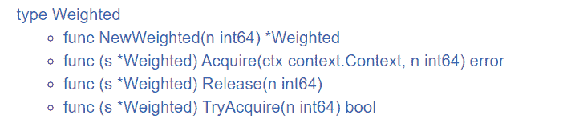

# 16 \| Semaphore：一篇文章搞懂信號量

你好，我是鳥窩。

在前面的課程裡，我們學習了標準庫的併發原語、原子操作和 Channel，掌握了這些，你就可以解決 80% 的併發編程問題了。但是，如果你要想進一步提升你的併發編程能力，就需要學習一些第三方庫。

所以，在接下來的幾節課裡，我會給你分享 Go 官方或者其他人提供的第三方庫，這節課我們先來學習信號量，信號量（Semaphore）是用來控制多個 goroutine 同時訪問多個資源的併發原語。

# 信號量是什麼？都有什麼操作？

信號量的概念是荷蘭計算機科學家 Edsger Dijkstra 在 1963 年左右提出來的，廣泛應用在不同的操作系統中。在系統中，會給每一個進程一個信號量，代表每個進程目前的狀態。未得到控制權的進程，會在特定的地方被迫停下來，等待可以繼續進行的信號到來。

最簡單的信號量就是一個變量加一些併發控制的能力，這個變量是 0 到 n 之間的一個數值。當 goroutine 完成對此信號量的等待（wait）時，該計數值就減 1，當 goroutine 完成對此信號量的釋放（release）時，該計數值就加 1。當計數值為 0 的時候，goroutine 調用 wait 等待該信號量是不會成功的，除非計數器又大於 0，等待的 goroutine 才有可能成功返回。

更復雜的信號量類型，就是使用抽象數據類型代替變量，用來代表複雜的資源類型。實際上，大部分的信號量都使用一個整型變量來表示一組資源，並沒有實現太複雜的抽象數據類型，所以你只要知道有更復雜的信號量就行了，我們這節課主要是學習最簡單的信號量。

說到這兒呢，我想借助一個生活中的例子，來幫你進一步理解信號量。

舉個例子，圖書館新購買了 10 本《Go 併發編程的獨家秘籍》，有 1 萬個學生都想讀這本書，“僧多粥少”。所以，圖書館管理員先會讓這 1 萬個同學進行登記，按照登記的順序，借閱此書。如果書全部被借走，那麼，其他想看此書的同學就需要等待，如果有人還書了，圖書館管理員就會通知下一位同學來借閱這本書。這裡的資源是《Go 併發編程的獨家秘籍》這十本書，想讀此書的同學就是 goroutine，圖書管理員就是信號量。

怎麼樣，現在是不是很好理解了？那麼，接下來，我們來學習下信號量的 P/V 操作。

## P/V 操作

Dijkstra 在他的論文中為信號量定義了兩個操作 P 和 V。P 操作（descrease、wait、acquire）是減少信號量的計數值，而 V 操作（increase、signal、release）是增加信號量的計數值。

使用偽代碼表示如下（中括號代表原子操作）：

```go
function V(semaphore S, integer I):
    [S ← S + I]

function P(semaphore S, integer I):
    repeat:
        [if S ≥ I:
        S ← S − I
        break]
```

可以看到，初始化信號量 S 有一個指定數量（**n**）的資源，它就像是一個有 n 個資源的池子。P 操作相當於請求資源，如果資源可用，就立即返回；如果沒有資源或者不夠，那麼，它可以不斷嘗試或者阻塞等待。V 操作會釋放自己持有的資源，把資源返還給信號量。信號量的值除了初始化的操作以外，只能由 P/V 操作改變。

現在，我們來總結下信號量的實現。

1.  初始化信號量：設定初始的資源的數量。
2.  P 操作：將信號量的計數值減去 1，如果新值已經為負，那麼調用者會被阻塞並加入到等待隊列中。否則，調用者會繼續執行，並且獲得一個資源。
3.  V 操作：將信號量的計數值加 1，如果先前的計數值為負，就說明有等待的 P 操作的調用者。它會從等待隊列中取出一個等待的調用者，喚醒它，讓它繼續執行。

講到這裡，我想再稍微說一個題外話，我們在第 2 講提到過飢餓，就是說在高併發的極端場景下，會有些 goroutine 始終搶不到鎖。為了處理飢餓的問題，你可以在等待隊列中做一些“文章”。比如實現一個優先級的隊列，或者先入先出的隊列，等等，保持公平性，並且照顧到優先級。

在正式進入實現信號量的具體實現原理之前，我想先講一個知識點，就是信號量和互斥鎖的區別與聯繫，這有助於我們掌握接下來的內容。

其實，信號量可以分為計數信號量（counting semaphre）和二進位信號量（binary semaphore）。剛剛所說的圖書館借書的例子就是一個計數信號量，它的計數可以是任意一個整數。在特殊的情況下，如果計數值只能是 0 或者 1，那麼，這個信號量就是二進位信號量，提供了互斥的功能（要麼是 0，要麼是 1），所以，有時候互斥鎖也會使用二進位信號量來實現。

我們一般用信號量保護一組資源，比如數據庫連接池、一組客戶端的連接、幾個打印機資源，等等。如果信號量蛻變成二進位信號量，那麼，它的 P/V 就和互斥鎖的 Lock/Unlock 一樣了。

有人會很細緻地區分二進位信號量和互斥鎖。比如說，有人提出，在 Windows 系統中，互斥鎖只能由持有鎖的線程釋放鎖，而二進位信號量則沒有這個限制（Stack Overflow上也有相關的討論）。實際上，雖然在 Windows 系統中，它們的確有些區別，但是對 Go 語言來說，互斥鎖也可以由非持有的 goroutine 來釋放，所以，從行為上來說，它們並沒有嚴格的區別。

我個人認為，沒必要進行細緻的區分，因為互斥鎖並不是一個很嚴格的定義。實際在遇到互斥併發的問題時，我們一般選用互斥鎖。

好了，言歸正傳，剛剛我們掌握了信號量的含義和具體操作方式，下面，我們就來具體瞭解下官方擴展庫的實現。

# Go 官方擴展庫的實現

在運行時，Go 內部使用信號量來控制 goroutine 的阻塞和喚醒。我們在學習基本併發原語的實現時也看到了，比如互斥鎖的第二個字段：

```go
type Mutex struct {
    state int32
    sema  uint32
}
```

信號量的 P/V 操作是通過函數實現的：

```go
func runtime_Semacquire(s *uint32)
func runtime_SemacquireMutex(s *uint32, lifo bool, skipframes int)
func runtime_Semrelease(s *uint32, handoff bool, skipframes int)
```

遺憾的是，它是 Go 運行時內部使用的，並沒有封裝暴露成一個對外的信號量併發原語，原則上我們沒有辦法使用。不過沒關係，Go 在它的擴展包中提供了信號量semaphore，不過這個信號量的類型名並不叫 Semaphore，而是叫 Weighted。

之所以叫做 Weighted，我想，應該是因為可以在初始化創建這個信號量的時候設置權重（初始化的資源數），其實我覺得叫 Semaphore 或許會更好。



我們來分析下這個信號量的幾個實現方法。

1.  **Acquire 方法**：相當於 P 操作，你可以一次獲取多個資源，如果沒有足夠多的資源，調用者就會被阻塞。它的第一個參數是 Context，這就意味著，你可以通過 Context 增加超時或者 cancel 的機制。如果是正常獲取了資源，就返回 nil；否則，就返回 ctx.Err()，信號量不改變。
2.  **Release 方法**：相當於 V 操作，可以將 n 個資源釋放，返還給信號量。
3.  **TryAcquire 方法**：嘗試獲取 n 個資源，但是它不會阻塞，要麼成功獲取 n 個資源，返回 true，要麼一個也不獲取，返回 false。

知道了信號量的實現方法，在實際的場景中，我們應該怎麼用呢？我來舉個 Worker Pool 的例子，來幫助你理解。

我們創建和 CPU 核數一樣多的 Worker，讓它們去處理一個 4 倍數量的整數 slice。每個 Worker 一次只能處理一個整數，處理完之後，才能處理下一個。

當然，這個問題的解決方案有很多種，這一次我們使用信號量，代碼如下：

```go
var (
    maxWorkers = runtime.GOMAXPROCS(0)                    // worker數量
    sema       = semaphore.NewWeighted(int64(maxWorkers)) //信號量
    task       = make([]int, maxWorkers*4)                // 任務數，是worker的四倍
)

func main() {
    ctx := context.Background()

    for i := range task {
        // 如果沒有worker可用，會阻塞在這裡，直到某個worker被釋放
        if err := sema.Acquire(ctx, 1); err != nil {
            break
        }

        // 啟動worker goroutine
        go func(i int) {
            defer sema.Release(1)
            time.Sleep(100 * time.Millisecond) // 模擬一個耗時操作
            task[i] = i + 1
        }(i)
    }

    // 請求所有的worker,這樣能確保前面的worker都執行完
    if err := sema.Acquire(ctx, int64(maxWorkers)); err != nil {
        log.Printf("獲取所有的worker失敗: %v", err)
    }

    fmt.Println(task)
}
```

在這段代碼中，main goroutine 相當於一個 dispacher，負責任務的分發。它先請求信號量，如果獲取成功，就會啟動一個 goroutine 去處理計算，然後，這個 goroutine 會釋放這個信號量（有意思的是，信號量的獲取是在 main goroutine，信號量的釋放是在 worker goroutine 中），如果獲取不成功，就等到有信號量可以使用的時候，再去獲取。

需要提醒你的是，其實，在這個例子中，還有一個值得我們學習的知識點，就是最後的那一段處理（第 25 行）。**如果在實際應用中，你想等所有的 Worker 都執行完，就可以獲取最大計數值的信號量**。

Go 擴展庫中的信號量是使用互斥鎖 +List 實現的。互斥鎖實現其它字段的保護，而 List 實現了一個等待隊列，等待者的通知是通過 Channel 的通知機制實現的。

我們來看一下信號量 Weighted 的數據結構：

```go
type Weighted struct {
    size    int64         // 最大資源數
    cur     int64         // 當前已被使用的資源
    mu      sync.Mutex    // 互斥鎖，對字段的保護
    waiters list.List     // 等待隊列
}
```

在信號量的幾個實現方法裡，Acquire 是代碼最複雜的一個方法，它不僅僅要監控資源是否可用，而且還要檢測 Context 的 Done 是否已關閉。我們來看下它的實現代碼。

```go
func (s *Weighted) Acquire(ctx context.Context, n int64) error {
    s.mu.Lock()
        // fast path, 如果有足夠的資源，都不考慮ctx.Done的狀態，將cur加上n就返回
    if s.size-s.cur >= n && s.waiters.Len() == 0 {
      s.cur += n
      s.mu.Unlock()
      return nil
    }
  
        // 如果是不可能完成的任務，請求的資源數大於能提供的最大的資源數
    if n > s.size {
      s.mu.Unlock()
            // 依賴ctx的狀態返回，否則一直等待
      <-ctx.Done()
      return ctx.Err()
    }
  
        // 否則就需要把調用者加入到等待隊列中
        // 創建了一個ready chan,以便被通知喚醒
    ready := make(chan struct{})
    w := waiter{n: n, ready: ready}
    elem := s.waiters.PushBack(w)
    s.mu.Unlock()
  

        // 等待
    select {
    case <-ctx.Done(): // context的Done被關閉
      err := ctx.Err()
      s.mu.Lock()
      select {
      case <-ready: // 如果被喚醒了，忽略ctx的狀態
        err = nil
      default: 通知waiter
        isFront := s.waiters.Front() == elem
        s.waiters.Remove(elem)
        // 通知其它的waiters,檢查是否有足夠的資源
        if isFront && s.size > s.cur {
          s.notifyWaiters()
        }
      }
      s.mu.Unlock()
      return err
    case <-ready: // 被喚醒了
      return nil
    }
  }
```

其實，為了提高性能，這個方法中的 fast path 之外的代碼，可以抽取成 acquireSlow 方法，以便其它 Acquire 被內聯。

Release 方法將當前計數值減去釋放的資源數 n，並喚醒等待隊列中的調用者，看是否有足夠的資源被獲取。

```go
func (s *Weighted) Release(n int64) {
    s.mu.Lock()
    s.cur -= n
    if s.cur < 0 {
      s.mu.Unlock()
      panic("semaphore: released more than held")
    }
    s.notifyWaiters()
    s.mu.Unlock()
}
```

notifyWaiters 方法就是逐個檢查等待的調用者，如果資源不夠，或者是沒有等待者了，就返回：

```go
func (s *Weighted) notifyWaiters() {
    for {
      next := s.waiters.Front()
      if next == nil {
        break // No more waiters blocked.
      }
  

      w := next.Value.(waiter)
      if s.size-s.cur < w.n {
        //避免飢餓，這裡還是按照先入先出的方式處理
        break
      }

      s.cur += w.n
      s.waiters.Remove(next)
      close(w.ready)
    }
  }
```

notifyWaiters 方法是按照先入先出的方式喚醒調用者。當釋放 100 個資源的時候，如果第一個等待者需要 101 個資源，那麼，隊列中的所有等待者都會繼續等待，即使有的等待者只需要 1 個資源。這樣做的目的是避免飢餓，否則的話，資源可能總是被那些請求資源數小的調用者獲取，這樣一來，請求資源數巨大的調用者，就沒有機會獲得資源了。

好了，到這裡，你就知道了官方擴展庫的信號量實現方法，接下來你就可以使用信號量了。不過，在此之前呢，我想給你講幾個使用時的常見錯誤。這部分內容可是幫助你避坑的，我建議你好好學習。

# 使用信號量的常見錯誤

保證信號量不出錯的前提是正確地使用它，否則，公平性和安全性就會受到損害，導致程序 panic。

在使用信號量時，最常見的幾個錯誤如下：

1.  請求了資源，但是忘記釋放它；
2.  釋放了從未請求的資源；
3.  長時間持有一個資源，即使不需要它；
4.  不持有一個資源，卻直接使用它。

不過，即使你規避了這些坑，在同時使用多種資源，不同的信號量控制不同的資源的時候，也可能會出現死鎖現象，比如哲學家就餐問題。

就 Go 擴展庫實現的信號量來說，在調用 Release 方法的時候，你可以傳遞任意的整數。但是，如果你傳遞一個比請求到的數量大的錯誤的數值，程序就會 panic。如果傳遞一個負數，會導致資源永久被持有。如果你請求的資源數比最大的資源數還大，那麼，調用者可能永遠被阻塞。

所以，**使用信號量遵循的原則就是請求多少資源，就釋放多少資源**。你一定要注意，必須使用正確的方法傳遞整數，不要“耍小聰明”，而且，請求的資源數一定不要超過最大資源數。

# 其它信號量的實現

除了官方擴展庫的實現，實際上，我們還有很多方法實現信號量，比較典型的就是使用 Channel 來實現。

根據之前的 Channel 類型的介紹以及 Go 內存模型的定義，你應該能想到，使用一個 buffer 為 n 的 Channel 很容易實現信號量，比如下面的代碼，我們就是使用 chan struct{}類型來實現的。

在初始化這個信號量的時候，我們設置它的初始容量，代表有多少個資源可以使用。它使用 Lock 和 Unlock 方法實現請求資源和釋放資源，正好實現了 Locker 接口。

```go
  // Semaphore 數據結構，並且還實現了Locker接口
  type semaphore struct {
    sync.Locker
    ch chan struct{}
  }
  
  // 創建一個新的信號量
  func NewSemaphore(capacity int) sync.Locker {
    if capacity <= 0 {
      capacity = 1 // 容量為1就變成了一個互斥鎖
    }
    return &semaphore{ch: make(chan struct{}, capacity)}
  }
  
  // 請求一個資源
  func (s *semaphore) Lock() {
    s.ch <- struct{}{}
  }
  
  // 釋放資源
  func (s *semaphore) Unlock() {
    <-s.ch
  }
```

當然，你還可以自己擴展一些方法，比如在請求資源的時候使用 Context 參數（Acquire(ctx)）、實現 TryLock 等功能。

看到這裡，你可能會問，這個信號量的實現看起來非常簡單，而且也能應對大部分的信號量的場景，為什麼官方擴展庫的信號量的實現不採用這種方法呢？其實，具體是什麼原因，我也不知道，但是我必須要強調的是，官方的實現方式有這樣一個功能：**它可以一次請求多個資源，這是通過 Channel 實現的信號量所不具備的**。

除了 Channel，marusama/semaphore也實現了一個可以動態更改資源容量的信號量，也是一個非常有特色的實現。如果你的資源數量並不是固定的，而是動態變化的，我建議你考慮一下這個信號量庫。

# 總結

這是一個很奇怪的現象：標準庫中實現基本併發原語（比如 Mutex）的時候，強烈依賴信號量實現等待隊列和通知喚醒，但是，標準庫中卻沒有把這個實現直接暴露出來放到標準庫，而是通過第三庫提供。

不管怎樣，信號量這個併發原語在多資源共享的併發控制的場景中被廣泛使用，有時候也會被 Channel 類型所取代，因為一個 buffered chan 也可以代表 n 個資源。

但是，官方擴展的信號量也有它的優勢，就是可以一次獲取多個資源。**在批量獲取資源的場景中，我建議你嘗試使用官方擴展的信號量**。


# 思考題

1.  你能用 Channel 實現信號量併發原語嗎？你能想到幾種實現方式？
2.  為什麼信號量的資源數設計成 int64 而不是 uint64 呢？

歡迎在留言區寫下你的思考和答案，我們一起交流討論。如果你覺得有所收穫，也歡迎你把今天的內容分享給你的朋友或同事。
