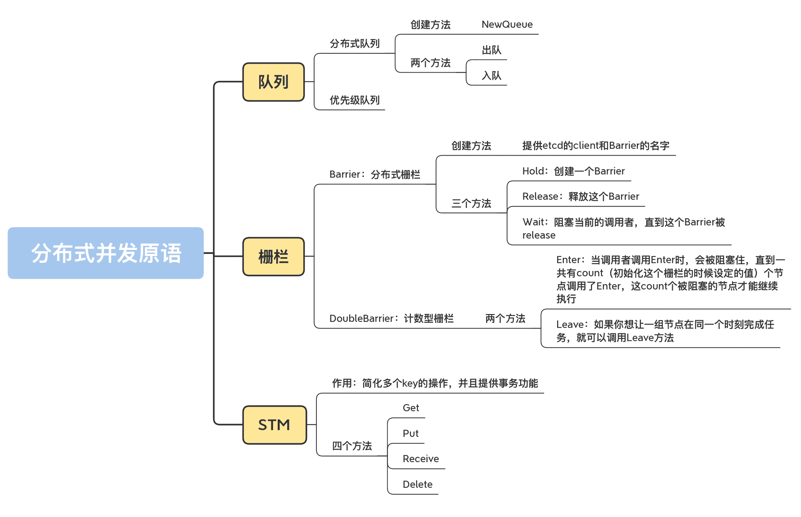

# 20 \| 在分佈式環境中，隊列、柵欄和STM該如何實現？

你好，我是鳥窩。

上一講，我已經帶你認識了基於 etcd 實現的 Leader 選舉、互斥鎖和讀寫鎖，今天，我們來學習下基於 etcd 的分佈式隊列、柵欄和 STM。

只要你學過計算機算法和數據結構相關的知識， 隊列這種數據結構你一定不陌生，它是一種先進先出的類型，有出隊（dequeue）和入隊（enqueue）兩種操作。在第 12 講中，我專門講到了一種叫做 lock-free 的隊列。隊列在單機的應用程序中常常使用，但是在分佈式環境中，多節點如何併發地執行入隊和出隊的操作呢？這一講，我會帶你認識一下基於 etcd 實現的分佈式隊列。

除此之外，我還會講用分佈式柵欄編排一組分佈式節點同時執行的方法，以及簡化多個 key 的操作並且提供事務功能的 STM（Software Transactional Memory，軟件事務內存）。

# 分佈式隊列和優先級隊列

前一講我也講到，我們並不是從零開始實現一個分佈式隊列，而是站在 etcd 的肩膀上，利用 etcd 提供的功能實現分佈式隊列。

etcd 集群的可用性由 etcd 集群的維護者來保證，我們不用擔心網絡分區、節點宕機等問題。我們可以把這些通通交給 etcd 的運維人員，把我們自己的關注點放在使用上。

下面，我們就來了解下 etcd 提供的分佈式隊列。etcd 通過 github.com/coreos/etcd/contrib/recipes 包提供了分佈式隊列這種數據結構。

創建分佈式隊列的方法非常簡單，只有一個，即 NewQueue，你只需要傳入 etcd 的 client 和這個隊列的名字，就可以了。代碼如下：

    func NewQueue(client *v3.Client, keyPrefix string) *Queue

**這個隊列只有兩個方法，分別是出隊和入隊，隊列中的元素是字符串類型**。這兩個方法的簽名如下所示：

    // 入隊
    func (q *Queue) Enqueue(val string) error
    //出隊
    func (q *Queue) Dequeue() (string, error)

需要注意的是，如果這個分佈式隊列當前為空，調用 Dequeue 方法的話，會被阻塞，直到有元素可以出隊才返回。

既然是分佈式的隊列，那就意味著，我們可以在一個節點將元素放入隊列，在另外一個節點把它取出。

在我接下來講的例子中，你就可以啟動兩個節點，一個節點往隊列中放入元素，一個節點從隊列中取出元素，看看是否能正常取出來。etcd 的分佈式隊列是一種多讀多寫的隊列，所以，你也可以啟動多個寫節點和多個讀節點。

下面我們來藉助代碼，看一下如何實現分佈式隊列。

首先，我們啟動一個程序，它會從命令行讀取你的命令，然後執行。你可以輸入`push <value>`，將一個元素入隊，輸入`pop`，將一個元素彈出。另外，你還可以使用這個程序啟動多個實例，用來模擬分佈式的環境：

    package main

    import (
        "bufio"
        "flag"
        "fmt"
        "log"
        "os"
        "strings"

        "github.com/coreos/etcd/clientv3"
        recipe "github.com/coreos/etcd/contrib/recipes"
    )

    var (
        addr      = flag.String("addr", "http://127.0.0.1:2379", "etcd addresses")
        queueName = flag.String("name", "my-test-queue", "queue name")
    )

    func main() {
        flag.Parse()

        // 解析etcd地址
        endpoints := strings.Split(*addr, ",")

        // 創建etcd的client
        cli, err := clientv3.New(clientv3.Config{Endpoints: endpoints})
        if err != nil {
            log.Fatal(err)
        }
        defer cli.Close()

        // 創建/獲取隊列
        q := recipe.NewQueue(cli, *queueName)

        // 從命令行讀取命令
        consolescanner := bufio.NewScanner(os.Stdin)
        for consolescanner.Scan() {
            action := consolescanner.Text()
            items := strings.Split(action, " ")
            switch items[0] {
            case "push": // 加入隊列
                if len(items) != 2 {
                    fmt.Println("must set value to push")
                    continue
                }
                q.Enqueue(items[1]) // 入隊
            case "pop": // 從隊列彈出
                v, err := q.Dequeue() // 出隊
                if err != nil {
                    log.Fatal(err)
                }
                fmt.Println(v) // 輸出出隊的元素
            case "quit", "exit": //退出
                return
            default:
                fmt.Println("unknown action")
            }
        }
    }

我們可以打開兩個終端，分別執行這個程序。在第一個終端中執行入隊操作，在第二個終端中執行出隊操作，並且觀察一下出隊、入隊是否正常。

除了剛剛說的分佈式隊列，etcd 還提供了優先級隊列（PriorityQueue）。

它的用法和隊列類似，也提供了出隊和入隊的操作，只不過，在入隊的時候，除了需要把一個值加入到隊列，我們還需要提供 uint16 類型的一個整數，作為此值的優先級，優先級高的元素會優先出隊。

優先級隊列的測試程序如下，你可以在一個節點輸入一些不同優先級的元素，在另外一個節點讀取出來，看看它們是不是按照優先級順序彈出的：

    package main

    import (
        "bufio"
        "flag"
        "fmt"
        "log"
        "os"
        "strconv"
        "strings"

        "github.com/coreos/etcd/clientv3"
        recipe "github.com/coreos/etcd/contrib/recipes"
    )

    var (
        addr      = flag.String("addr", "http://127.0.0.1:2379", "etcd addresses")
        queueName = flag.String("name", "my-test-queue", "queue name")
    )

    func main() {
        flag.Parse()

        // 解析etcd地址
        endpoints := strings.Split(*addr, ",")

        // 創建etcd的client
        cli, err := clientv3.New(clientv3.Config{Endpoints: endpoints})
        if err != nil {
            log.Fatal(err)
        }
        defer cli.Close()

        // 創建/獲取隊列
        q := recipe.NewPriorityQueue(cli, *queueName)

        // 從命令行讀取命令
        consolescanner := bufio.NewScanner(os.Stdin)
        for consolescanner.Scan() {
            action := consolescanner.Text()
            items := strings.Split(action, " ")
            switch items[0] {
            case "push": // 加入隊列
                if len(items) != 3 {
                    fmt.Println("must set value and priority to push")
                    continue
                }
                pr, err := strconv.Atoi(items[2]) // 讀取優先級
                if err != nil {
                    fmt.Println("must set uint16 as priority")
                    continue
                }
                q.Enqueue(items[1], uint16(pr)) // 入隊
            case "pop": // 從隊列彈出
                v, err := q.Dequeue() // 出隊
                if err != nil {
                    log.Fatal(err)
                }
                fmt.Println(v) // 輸出出隊的元素
            case "quit", "exit": //退出
                return
            default:
                fmt.Println("unknown action")
            }
        }
    }

你看，利用 etcd 實現分佈式隊列和分佈式優先隊列，就是這麼簡單。所以，在實際項目中，如果有這類需求的話，你就可以選擇用 etcd 實現。

不過，在使用分佈式併發原語時，除了需要考慮可用性和數據一致性，還需要考慮分佈式設計帶來的性能損耗問題。所以，在使用之前，你一定要做好性能的評估。

# 分佈式柵欄

在第 17 講中，我們學習了循環柵欄 CyclicBarrier，它和第 6 講的標準庫中的 WaitGroup，本質上是同一類併發原語，都是等待同一組 goroutine 同時執行，或者是等待同一組 goroutine 都完成。

在分佈式環境中，我們也會遇到這樣的場景：一組節點協同工作，共同等待一個信號，在信號未出現前，這些節點會被阻塞住，而一旦信號出現，這些阻塞的節點就會同時開始繼續執行下一步的任務。

etcd 也提供了相應的分佈式併發原語。

1.  **Barrier：分佈式柵欄**。如果持有 Barrier 的節點釋放了它，所有等待這個 Barrier 的節點就不會被阻塞，而是會繼續執行。
2.  **DoubleBarrier：計數型柵欄**。在初始化計數型柵欄的時候，我們就必須提供參與節點的數量，當這些數量的節點都 Enter 或者 Leave 的時候，這個柵欄就會放開。所以，我們把它稱為計數型柵欄。

## Barrier：分佈式柵欄

我們先來學習下分佈式 Barrier。

分佈式 Barrier 的創建很簡單，你只需要提供 etcd 的 Client 和 Barrier 的名字就可以了，如下所示：

    func NewBarrier(client *v3.Client, key string) *Barrier

Barrier 提供了三個方法，分別是 Hold、**Release 和 Wait，**代碼如下：

    func (b *Barrier) Hold() error
    func (b *Barrier) Release() error
    func (b *Barrier) Wait() error

1.  **Hold 方法**是創建一個 Barrier。如果 Barrier 已經創建好了，有節點調用它的 Wait 方法，就會被阻塞。
2.  **Release 方法**是釋放這個 Barrier，也就是打開柵欄。如果使用了這個方法，所有被阻塞的節點都會被放行，繼續執行。
3.  **Wait 方法**會阻塞當前的調用者，直到這個 Barrier 被 release。如果這個柵欄不存在，調用者不會被阻塞，而是會繼續執行。

**學習併發原語最好的方式就是使用它**。下面我們就來藉助一個例子，來看看 Barrier 該怎麼用。

你可以在一個終端中運行這個程序，執行"hold""release"命令，模擬柵欄的持有和釋放。在另外一個終端中運行這個程序，不斷調用"wait"方法，看看是否能正常地跳出阻塞繼續執行：

    package main

    import (
        "bufio"
        "flag"
        "fmt"
        "log"
        "os"
        "strings"

        "github.com/coreos/etcd/clientv3"
        recipe "github.com/coreos/etcd/contrib/recipes"
    )

    var (
        addr        = flag.String("addr", "http://127.0.0.1:2379", "etcd addresses")
        barrierName = flag.String("name", "my-test-queue", "barrier name")
    )

    func main() {
        flag.Parse()

        // 解析etcd地址
        endpoints := strings.Split(*addr, ",")

        // 創建etcd的client
        cli, err := clientv3.New(clientv3.Config{Endpoints: endpoints})
        if err != nil {
            log.Fatal(err)
        }
        defer cli.Close()

        // 創建/獲取柵欄
        b := recipe.NewBarrier(cli, *barrierName)

        // 從命令行讀取命令
        consolescanner := bufio.NewScanner(os.Stdin)
        for consolescanner.Scan() {
            action := consolescanner.Text()
            items := strings.Split(action, " ")
            switch items[0] {
            case "hold": // 持有這個barrier
                b.Hold()
                fmt.Println("hold")
            case "release": // 釋放這個barrier
                b.Release()
                fmt.Println("released")
            case "wait": // 等待barrier被釋放
                b.Wait()
                fmt.Println("after wait")
            case "quit", "exit": //退出
                return
            default:
                fmt.Println("unknown action")
            }
        }
    }DoubleBarrier：計數型柵欄etcd 還提供了另外一種柵欄，叫做 DoubleBarrier，這也是一種非常有用的柵欄。這個柵欄初始化的時候需要提供一個計數 count，如下所示：

    func NewDoubleBarrier(s *concurrency.Session, key string, count int) *DoubleBarrier

同時，它還提供了兩個方法，分別是 Enter 和 Leave，代碼如下：

    func (b *DoubleBarrier) Enter() error
    func (b *DoubleBarrier) Leave() error

我來解釋下這兩個方法的作用。

當調用者調用 Enter 時，會被阻塞住，直到一共有 count（初始化這個柵欄的時候設定的值）個節點調用了 Enter，這 count 個被阻塞的節點才能繼續執行。所以，你可以利用它編排一組節點，讓這些節點在同一個時刻開始執行任務。

同理，如果你想讓一組節點在同一個時刻完成任務，就可以調用 Leave 方法。節點調用 Leave 方法的時候，會被阻塞，直到有 count 個節點，都調用了 Leave 方法，這些節點才能繼續執行。

我們再來看一下 DoubleBarrier 的使用例子。你可以起兩個節點，同時執行 Enter 方法，看看這兩個節點是不是先阻塞，之後才繼續執行。然後，你再執行 Leave 方法，也觀察一下，是不是先阻塞又繼續執行的。

    package main

    import (
        "bufio"
        "flag"
        "fmt"
        "log"
        "os"
        "strings"

        "github.com/coreos/etcd/clientv3"
        "github.com/coreos/etcd/clientv3/concurrency"
        recipe "github.com/coreos/etcd/contrib/recipes"
    )

    var (
        addr        = flag.String("addr", "http://127.0.0.1:2379", "etcd addresses")
        barrierName = flag.String("name", "my-test-doublebarrier", "barrier name")
        count       = flag.Int("c", 2, "")
    )

    func main() {
        flag.Parse()

        // 解析etcd地址
        endpoints := strings.Split(*addr, ",")

        // 創建etcd的client
        cli, err := clientv3.New(clientv3.Config{Endpoints: endpoints})
        if err != nil {
            log.Fatal(err)
        }
        defer cli.Close()
        // 創建session
        s1, err := concurrency.NewSession(cli)
        if err != nil {
            log.Fatal(err)
        }
        defer s1.Close()

        // 創建/獲取柵欄
        b := recipe.NewDoubleBarrier(s1, *barrierName, *count)

        // 從命令行讀取命令
        consolescanner := bufio.NewScanner(os.Stdin)
        for consolescanner.Scan() {
            action := consolescanner.Text()
            items := strings.Split(action, " ")
            switch items[0] {
            case "enter": // 持有這個barrier
                b.Enter()
                fmt.Println("enter")
            case "leave": // 釋放這個barrier
                b.Leave()
                fmt.Println("leave")
            case "quit", "exit": //退出
                return
            default:
                fmt.Println("unknown action")
            }
        }
    }

好了，我們先來簡單總結一下。我們在第 17 講學習的循環柵欄，控制的是同一個進程中的不同 goroutine 的執行，而**分佈式柵欄和計數型柵欄控制的是不同節點、不同進程的執行**。當你需要協調一組分佈式節點在某個時間點同時運行的時候，可以考慮 etcd 提供的這組併發原語。

# STM

提到事務，你肯定不陌生。在開發基於數據庫的應用程序的時候，我們經常用到事務。事務就是要保證一組操作要麼全部成功，要麼全部失敗。

在學習 STM 之前，我們要先了解一下 etcd 的事務以及它的問題。

etcd 提供了在一個事務中對多個 key 的更新功能，這一組 key 的操作要麼全部成功，要麼全部失敗。etcd 的事務實現方式是基於 CAS 方式實現的，融合了 Get、Put 和 Delete 操作。

etcd 的事務操作如下，分為條件塊、成功塊和失敗塊，條件塊用來檢測事務是否成功，如果成功，就執行 Then(...)，如果失敗，就執行 Else(...)：

    Txn().If(cond1, cond2, ...).Then(op1, op2, ...,).Else(op1’, op2’, …)

我們來看一個利用 etcd 的事務實現轉賬的小例子。我們從賬戶 from 向賬戶 to 轉賬 amount，代碼如下：

    func doTxnXfer(etcd *v3.Client, from, to string, amount uint) (bool, error) {
        // 一個查詢事務
        getresp, err := etcd.Txn(ctx.TODO()).Then(OpGet(from), OpGet(to)).Commit()
        if err != nil {
             return false, err
        }
        // 獲取轉賬賬戶的值
        fromKV := getresp.Responses[0].GetRangeResponse().Kvs[0]
        toKV := getresp.Responses[1].GetRangeResponse().Kvs[1]
        fromV, toV := toUInt64(fromKV.Value), toUint64(toKV.Value)
        if fromV < amount {
            return false, fmt.Errorf(“insufficient value”)
        }
        // 轉賬事務
        // 條件塊
        txn := etcd.Txn(ctx.TODO()).If(
            v3.Compare(v3.ModRevision(from), “=”, fromKV.ModRevision),
            v3.Compare(v3.ModRevision(to), “=”, toKV.ModRevision))
        // 成功塊
        txn = txn.Then(
            OpPut(from, fromUint64(fromV - amount)),
            OpPut(to, fromUint64(toV + amount))
        //提交事務 
        putresp, err := txn.Commit()
        // 檢查事務的執行結果
        if err != nil {
            return false, err
        }
        return putresp.Succeeded, nil
    }

從剛剛的這段代碼中，我們可以看到，雖然可以利用 etcd 實現事務操作，但是邏輯還是比較複雜的。

因為事務使用起來非常麻煩，所以 etcd 又在這些基礎 API 上進行了封裝，新增了一種叫做 STM 的操作，提供了更加便利的方法。

下面我們來看一看 STM 怎麼用。

要使用 STM，你需要先編寫一個 apply 函數，這個函數的執行是在一個事務之中的：

    apply func(STM) error

這個方法包含一個 STM 類型的參數，它提供了對 key 值的讀寫操作。

STM 提供了 4 個方法，分別是 Get、Put、Receive 和 Delete，代碼如下：

    type STM interface {
      Get(key ...string) string
      Put(key, val string, opts ...v3.OpOption)
      Rev(key string) int64
      Del(key string)
    }

使用 etcd STM 的時候，我們只需要定義一個 apply 方法，比如說轉賬方法 exchange，然後通過 concurrency.NewSTM(cli, exchange)，就可以完成轉賬事務的執行了。

STM 咋用呢？我們還是藉助一個例子來學習下。

下面這個例子創建了 5 個銀行賬號，然後隨機選擇一些賬號兩兩轉賬。在轉賬的時候，要把源賬號一半的錢要轉給目標賬號。這個例子啟動了 10 個 goroutine 去執行這些事務，每個 goroutine 要完成 100 個事務。

為了確認事務是否出錯了，我們最後要校驗每個賬號的錢數和總錢數。總錢數不變，就代表執行成功了。這個例子的代碼如下：

    package main

    import (
        "context"
        "flag"
        "fmt"
        "log"
        "math/rand"
        "strings"
        "sync"

        "github.com/coreos/etcd/clientv3"
        "github.com/coreos/etcd/clientv3/concurrency"
    )

    var (
        addr = flag.String("addr", "http://127.0.0.1:2379", "etcd addresses")
    )

    func main() {
        flag.Parse()

        // 解析etcd地址
        endpoints := strings.Split(*addr, ",")

        cli, err := clientv3.New(clientv3.Config{Endpoints: endpoints})
        if err != nil {
            log.Fatal(err)
        }
        defer cli.Close()

        // 設置5個賬戶，每個賬號都有100元，總共500元
        totalAccounts := 5
        for i := 0; i < totalAccounts; i++ {
            k := fmt.Sprintf("accts/%d", i)
            if _, err = cli.Put(context.TODO(), k, "100"); err != nil {
                log.Fatal(err)
            }
        }

        // STM的應用函數，主要的事務邏輯
        exchange := func(stm concurrency.STM) error {
            // 隨機得到兩個轉賬賬號
            from, to := rand.Intn(totalAccounts), rand.Intn(totalAccounts)
            if from == to {
                // 自己不和自己轉賬
                return nil
            }
            // 讀取賬號的值
            fromK, toK := fmt.Sprintf("accts/%d", from), fmt.Sprintf("accts/%d", to)
            fromV, toV := stm.Get(fromK), stm.Get(toK)
            fromInt, toInt := 0, 0
            fmt.Sscanf(fromV, "%d", &fromInt)
            fmt.Sscanf(toV, "%d", &toInt)

            // 把源賬號一半的錢轉賬給目標賬號
            xfer := fromInt / 2
            fromInt, toInt = fromInt-xfer, toInt+xfer

            // 把轉賬後的值寫回
            stm.Put(fromK, fmt.Sprintf("%d", fromInt))
            stm.Put(toK, fmt.Sprintf("%d", toInt))
            return nil
        }

        // 啟動10個goroutine進行轉賬操作
        var wg sync.WaitGroup
        wg.Add(10)
        for i := 0; i < 10; i++ {
            go func() {
                defer wg.Done()
                for j := 0; j < 100; j++ {
                    if _, serr := concurrency.NewSTM(cli, exchange); serr != nil {
                        log.Fatal(serr)
                    }
                }
            }()
        }
        wg.Wait()

        // 檢查賬號最後的數目
        sum := 0
        accts, err := cli.Get(context.TODO(), "accts/", clientv3.WithPrefix()) // 得到所有賬號
        if err != nil {
            log.Fatal(err)
        }
        for _, kv := range accts.Kvs { // 遍歷賬號的值
            v := 0
            fmt.Sscanf(string(kv.Value), "%d", &v)
            sum += v
            log.Printf("account %s: %d", kv.Key, v)
        }

        log.Println("account sum is", sum) // 總數
    }

總結一下，當你利用 etcd 做存儲時，是可以利用 STM 實現事務操作的，一個事務可以包含多個賬號的數據更改操作，事務能夠保證這些更改要麼全成功，要麼全失敗。

# 總結

如果我們把眼光放得更寬廣一些，其實並不只是 etcd 提供了這些併發原語，比如我上節課一開始就提到了，Zookeeper 很早也提供了類似的併發原語，只不過只提供了 Java 的庫，並沒有提供合適的 Go 庫。另外，根據 Consul 官方的反饋，他們並沒有開發這些併發原語的計劃，所以，從目前來看，etcd 是個不錯的選擇。

當然，也有一些其它不太知名的分佈式原語庫，但是活躍度不高，可用性低，所以我們也不需要去了解了。

其實，你也可以使用 Redis 實現分佈式鎖，或者是基於 MySQL 實現分佈式鎖，這也是常用的選擇。對於大廠來說，選擇起來是非常簡單的，只需要看看廠內提供了哪個基礎服務，哪個更穩定些。對於沒有 etcd、Redis 這些基礎服務的公司來說，很重要的一點，就是自己搭建一套這樣的基礎服務，並且運維好，這就需要考察你們對 etcd、Redis、MySQL 的技術把控能力了，哪個用得更順手，就用哪個。

一般來說，我不建議你自己去實現分佈式原語，最好是直接使用 etcd、Redis 這些成熟的軟件提供的功能，這也意味著，我們將程序的風險轉嫁到了這些基礎服務上，這些基礎服務必須要能夠提供足夠的服務保障。

# 思考題

1.  部署一個 3 節點的 etcd 集群，測試一下分佈式隊列的性能。
2.  etcd 提供的 STM 是分佈式事務嗎？

歡迎在留言區寫下你的思考和答案，我們一起交流討論。如果你覺得有所收穫，也歡迎你把今天的內容分享給你的朋友或同事。
